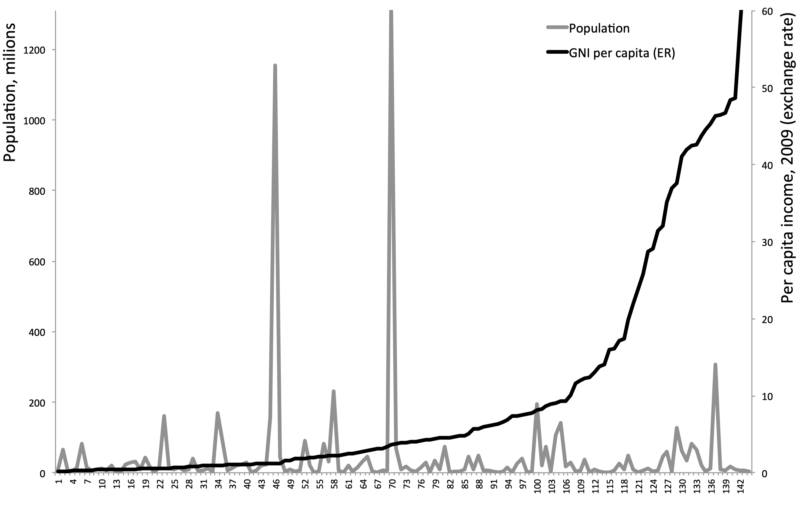
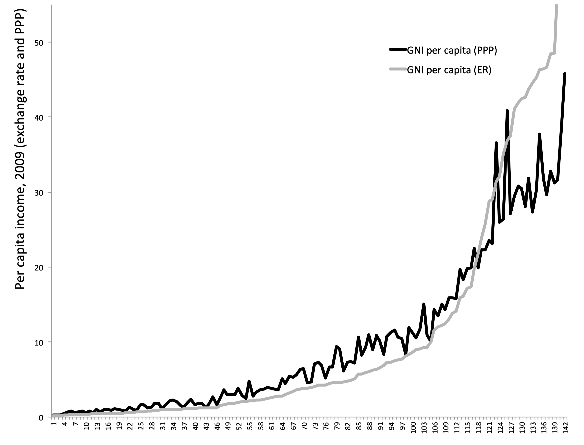
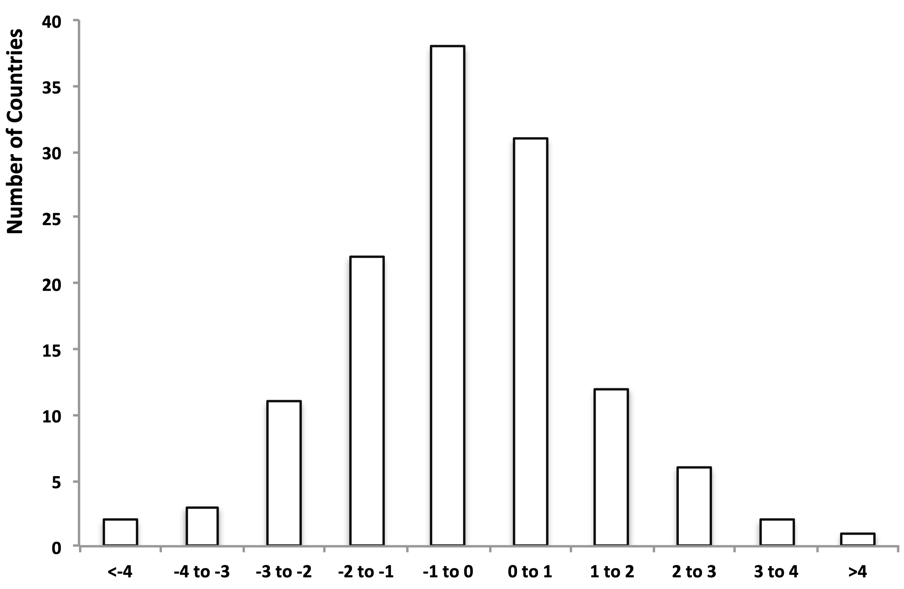
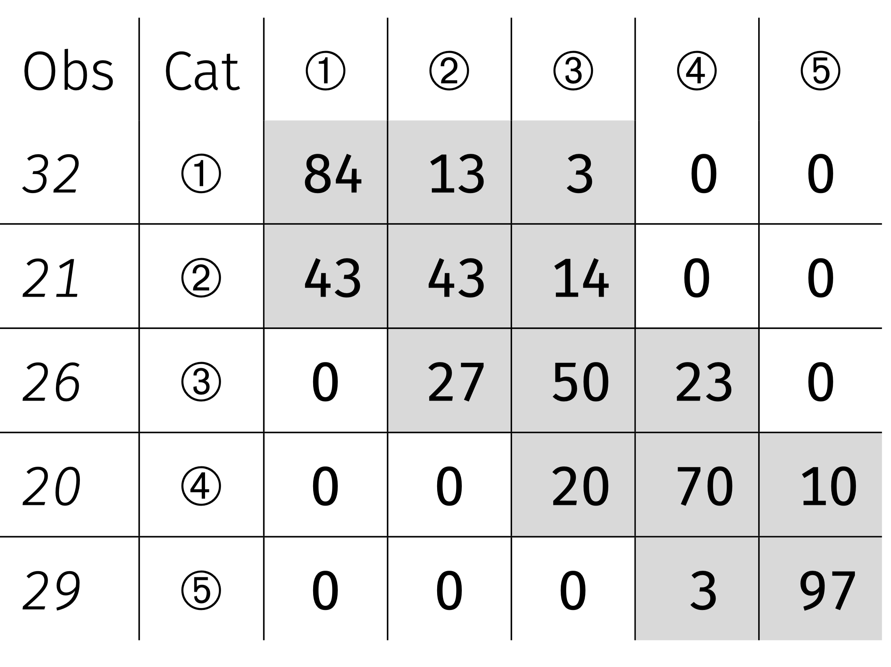

layout: true

<div class="my-footer"></div> 

---

```{r setup, include=FALSE}
knitr::opts_chunk$set(echo = FALSE, fig.align = "center",
                      message = FALSE, warning = FALSE)
knitr::opts_chunk$set(fig.dim=c(9, 6), fig.retina=2, out.width="100%")
```

```{r xaringan-themer, include=FALSE, warning=FALSE}
library(xaringanthemer)
library(readxl)

style_duo_accent(primary_color = "#3d5a80", 
                 secondary_color = "#dedede",
                 text_bold_color = "#ee6c4d",
                 text_font_family = "Droid Serif",
                 text_font_url = "https://fonts.googleapis.com/css?family=Droid+Serif:400,700,400italic",
                 header_font_google = google_font("Yanone Kaffeesatz"),
                 base_font_size = "20px",
                 code_font_size = "0.9rem")

```


class: separator-blue, middle

# ¿Qué entendemos por desarrollo económico?

---

## ¿Qué vamos a estudiar en este curso?

Partamos por una **definición** de Economía del Desarrollo: 

  .content-box-red[
    *La Economía del Desarrollo estudia la transformación económica de los países en vías de desarrollo*
    ]

Tres aspectos en los que vamos a poner énfasis en nuestro estudio de la Economía del Desarrollo:

- Rol de la **estructura interna** de los países: 

  *La descripción del subdesarrollo es una descripción del modo en que las instituciones formales son sustituidas por instituciones informales.*

- Importancia de la **fallas del mercado** y la posibilidad de intervención del Estado (teoría del segundo mejor): 

  *La ausencia de mercados o su mal funcionamiento da origen a (1) externalidades y (2) amplifica el papel funcional desigualdad (con consecuencias para otros parámetros económicos)*.

- Tratar de **integrar** de una manera intuitiva la **literatura teórica y empírica** más moderna.

---

## ¿Qué entendemos por Desarrollo Económico?

- El **desarrollo económico** es el **principal objetivo** de la mayoría de los países del mundo. Ocupa gran parte de la agenda de sus gobiernos.

- ¿Qué significa esto? **Concenso** en la literatura: **Mejorar el ingreso, el bienestar y la capacidad económica**.

- ¿Cómo medimos y evaluamos el desarrollo?

  - **Nivel de bienestar material alto (calidad física de vida) y accesible a todos**: entorno saludable, vivienda, buena alimentación, acceso a diversidad de productos, ocio y entretenimiento, ....

  - **Intangibles**: libertades y los derechos políticos, desarrollo intelectual y cultural, estabilidad de la familia, baja tasa de delincuencia, no discriminación, ...

- ¿Por donde empezamos? **PIB (o PNB)**. Conexiones importante con el desarrollo:

  - Impacto de los niveles medios de logros económicos.

  - Influencia de la distribución de los logros económicos entre los ciudadanos de un país.

---

## ¿Qué estudia el desarrollo económico?

Dos **destacados economistas** hablando sobre el desarrollo económico:

.blockquote[
  Por problema de desarrollo económico entendemos simplemente el problema de explicar los niveles de renta per cápita y sus tasas de crecimiento que observamos en los distintos países y a lo largo del tiempo. Es posible que esta definición parezca alicorta y quizá lo sea, pero analizando la renta inevitablemente analizaremos también otros muchos aspectos de las sociedades, por lo que sugeriría que renunciásemos a juzgar el alcance de esta definición hasta tener una idea más clara de adónde nos lleva.

.right[-Robert Lucas (1998)]
]

.bigskip[

]

*Los rasgos universales del desarrollo económico (la salud, la esperanza de vida, la alfabetización, etc.) derivan de una manera natural del crecimiento del PNB per cápita quizá con el simple paso del tiempo.*

---

## ¿Qué estudia el desarrollo económico?

Dos **destacados economistas** hablando sobre el desarrollo económico:

.blockquote[
  Nunca deberíamos perder de vista el fin último del ejercicio, tratar a los hombres y a las mujeres como un fin, mejorar la condición humana, aumentar las opciones de los individuos... Existiría una unidad de intereses si hubiera una rígida conexión entre la producción económica (medida por medio de la renta per cápita) y el desarrollo humano (reflejado en los indicadores humanos, como la esperanza de vida o la tasa de alfabetización o en logros como el respeto a uno mismo, que no son fáciles de medir). Pero estos dos grupos de indicadores no están muy relacionados entre sí.

.right[-Paul Streeten (1994)]
]

.bigskip[

]

*La correlación entre el PNB y otros aspectos deseados del desarrollo no es automática (o puede no existir). El PNB per cápita debe complementarse con otros indicadores directamente para tomar en cuenta el carácter "multidimensional" del desarrollo.*

---

class: separator-blue, middle

# Crecimiento y distribución del ingreso mundial

---

## Distribución del ingreso mundial

.content-box-red[ 
  .center[**2020**: Mundo 84.4t US$, población 7.75b personas, ingreso promedio 10,900 US$]
]

Clasificaciones (Banco Mundial, 2020) https://data.worldbank.org/

- **Países de bajos ingresos**: $<$ 1,035 US$. Muchos países africanos (como Afganistán, Myanmar y Nepal). Alrededor del borde superior: Tayikistán, Tanzania.
  - 665m personas, ingreso total 0.55t US$, ingreso promedio 827 US$.

- **Países de ingreso medio bajo**: 1,035 - 4,045 US$. Sus miembros incluyen India, Nicaragua, Nigeria y Tailandia. Alrededor del borde superior: Indonesia o Filipinas.
  - 3.33b personas, ingreso total 7.33t US$, ingreso promedio 2,200 US$. 


---

## Distribución del ingreso mundial

- **Países de ingreso medio alto**: 4,046 - 12,535 US$. Sus miembros incluyen China, los países más ricos de América Latina (Argentina, Chile, Brasil), Líbano, Sudáfrica, Turquía. Alrededor del borde superior: Costa Rica, Mauricio.

  - 2.510m personas, ingreso total 23.10t US$, ingreso promedio 9,200 US$.

- **Países de altos ingresos**: $>$ 12,535 US$. Sus miembros incluyen EE.UU., Europa occidental y del norte, Japón, Singapur, algunos países de Medio Oriente.
  
  - 1210m personas, ingreso total 53.26t, ingreso promedio 44,020$ US.

.content-box-red[
Más de **50%** de la población mundial (ingreso bajo + ingreso medio bajo) tienen el **9.3%** del ingreso mundial.

Suiza (86,601 US$) es más de **150 veces** más rico que la República Democrática del Congo (557 US$), más de **44 veces** más rico que Bangladesh (1.968 US$).
]
---

## Población y PIB per cápita (método TC) 2009

```{r fig1, echo=FALSE, out.width="75%"}

```

---

## Problemas de medición

*Expresar el ingreso en una moneda común (US$) y en términos per cápita (misma escala) facilita la comparación. No obstante, esta medida no es fiable ya que estima de una manera sesgada la realidad*.

- **Subdeclaración de ingresos** (Parente, Rogerson y Wright, 2000): 

  - Incentivos al subreporte de ingresos para evasión de impuestos (monitoreo imperfecto).
  
  - Producción de subsistencia en áreas rurales y principalmente para autoconsumo.

- **Precios no reflejados en los tipos de cambio**:

  - Bienes no transables (servicios e infraestructura).

- **Precios distorsionados** (no reflejan preferencias ni escaseces relativas): 

  - Poder de mercado (monopolios u oligopolios) y empresas del sector público.

- **Externalidades** (valor de mercado $\neq$ valor social): 

  - Contaminación, daño ambiental, agotamiento de recursos.

---

## Correcciones a Paridad del Poder Adquisitivo (PPA)

.content-box-red[ 
El **Programa de Comparación Internacional** busca eliminar diferencia en precios de los mismos bienes en diferentes países mediante el cálculo del precio "correcto" (a PPA) de los bienes y servicios incluidos en el PIB o PNB.
]

- 5 rondas: 1980, 1985, 1993, 2005 y 2011, y cuenta con 180 países.

- Versión simplificada de la **Metodología**:

  - Se recogen datos de precios de una canasta de $N_i$ bienes y servicios en cada uno de los $N_j$ países de referencia y se calcula el precio relativo con EE.UU.
  $$p_{i,j}/p_{i,EEUU}$$

  - Se estima la cantidad de cada bien o servicio valorada a su precio de EE.UU. 
  $$\frac{q_{i,j} p_{i,j}}{p_{i,j}/p_{i,EEUU}} \rightarrow q_{i,j} p_{i,EEUU}$$

---

## Corrección a Paridad del Poder Adquisitivo (PPA)

- Versión simplificada de la **Metodología** (cont...):

  - Se construyen precios internacionales de una canasta de bienes y servicios promediando los precios en los diferentes países. (expresados en dólares).
  $$(p_{i,j}/p_{i,EEUU})_{int} = \sum_{j=1}^{N_j} w_j (p_{i,j}/p_{i,EEUU})$$

  - Se estima el ingreso nacional de los países valorando su producción a estos precios internacionales.
  $$PIB_{PPA} = \sum_{i=1}^{N_i} (q_{i,j} p_{i,EEUU}) (p_{i,j}/p_{i,EEUU})_{int}$$

- Para detalles de la metodología de ajuste PPA ver: https://www.worldbank.org/en/programs/icp 

---

## PIB per cápita (PPA vs. TC) 2009

```{r fig2, echo=FALSE, out.width="65%"}

```

---

## La distribución mundial del ingreso

.content-box-red[ 
La **distribución mundial del ingreso** se ha mantenido más o menos **estable**. El 10% más rico y más pobre relativo al promedio mundial apenas ha cambiado en los últimos 30 años.
]

.center[**PIB per cápita PPA**]

|  | 1990 | 1995 | 2000 | 2005 | 2010 | 2015 | 2020 |
|--|--|--|--|--|--|--|--|
| $10\%$ más rico / Prom. Mundial    | $4.03$ | $4.10$ | $3.81$ | $3.93$ | $3.50$ | $3.41$ | $3.48$
| $10\%$ más pobre / Prom. Mundial | $0.14$ | $0.14$ | $0.13$ | $0.13$ | $0.13$ | $0.13$ | $0.14$ 

- Las disparidades entre estados dentro EE.UU. no se aproximan ni siquiera a estas cifras internacionales (Parente y Prescott,  2000)
  
  - En 2010, el estado más rico de los EE. UU. fue Alaska y el más pobre fue Mississippi, y la proporción de ingresos per cápita resultó en un poco más de 2! 

---

## La distribución mundial del ingreso

.content-box-red[ 
PIB mundial per cápita creció 1.5% anual durante 1970-2010 y 2.0% durante 2010-2015. Hubo **bastante movimiento dentro de la distribución** de ingresos mundial.
]

El **Este Asiático** baila a su propio ritmo.

- 1960-1990: *Japón* 5.3%, *Corea* 6.1%, *Hong Kong* 6.6%, *Indonesia* 3.8%, *Malasia* 4.2%, *Singapur* 6.4%, *Tailandia* 5.1%

- 1990-2010 algo más lento: *Japón* $<$1% (menos que el promedio mundial), el resto se quedó entre 3 y 4%.

- 2011-2015: *Japón* 1.05%, *Indonesia* 4%, *Malasia* 3.7%, *Tailandia* 3%, resto entre 1 y 2%.

- *China!* 1980-1990: 7.6%; 1990-2010: 9.5%; 2011-2016: 6.9%.

- *India*, otro de rápido crecimiento. 1960-1990: 2.6%; 1990-2000: 3.6%; 2000-2010: 6.2%; 2011-2015: 5.4%. 
  
---

## La distribución mundial del ingreso

En **América Latina** no se ve mucho dinamismo:

- 1960-1980: crecimiento en torno al 2.9% anual.

- 1980-1990, la *década perdida* para América Latina: Caídas de más de 0.7% año tras año, caída general de alrededor de 10%. 

  - *Argentina* -2.9%$, *Brasil* -0.5%, *México* -0.3%, *Perú* -3.0%, *Uruguay* -0.7%.

  - Sólo *Chile* (2.1%) y *Colombia* (1.4%) tuvieron un PIB per cápita superior en 1990 que en 1980.

- 1990-2010 todavía lento: crecimiento en torno al promedio mundial (excepto *Chile* 4.7% y *Argentina* 3.6%).

- 2000-2010 mucho mejor (el super ciclo del precio de los *commodities*): crecimiento promedio muy superior a 2%.

  - *Argentina* 3.3%, *Brasil* 2.4%, *Chile* 2.6%, *Perú* 4.3%, *Uruguay* 3.0%. *México* aún rezagado, 0.8%.
  
---

## La distribución mundial del ingreso

En **África Subsahariana** se ve estancamiento:

- 1980-1990 caídas al 1% anual.

- 1990-2000 caídas al 0.4% anual.

- 2000-2010 algo mejor. Crecimiento promedio de 2.2%.

- 2011-2015 crecimiento promedio de 1.4%. 
  
- Algunos ejemplos:
 
  - *Nigeria* (-1.6%) y *Tanzania* (-2.0%) en los 1980s, estancamiento 1990s y sólida recuperación durante 2000-2010 (3.9 y 4.0%, respectivamente).

  - *Kenia* apenas creció en la década de 1980, mostró caídas en la década de los 1990s, y alguna recuperación entre 2000-2010; en general, 0.2% durante 30 años. 
  
---

## La distribución mundial del ingreso

- Algunos ejemplos (cont...): 

  - *Uganda* se estancó durante la década de 1980 (-0.1%), antes de acelerar el ritmo y hacer progreso sustancial durante 1990-2010, creciendo a más de 3.5% anualmente.

  - *Ruanda*, paralizada por un crecimiento negativo en los 1980s (-1.2%) y 1990 (-0.7%), antes de una notable recuperación en 2000-2010 (4.8%)

  - La tasa de crecimiento negativa de *Burundi* de 3.2% en la década de 1990 apenas se vio compensada por el casi estancamiento de 2000-2010 (0.4%).

  - La *República Democrática del Congo* en caída libre entre 1980-1990 (-2.2%) y 1990-2000 (-8.5%!), antes del modesto 1.8% durante 2000-2010.

  - *Zimbabue* se estancó en los 1980s (0.7%) y 1990s (-0.3%), antes de entrar en caída libre (-4.8%) durante 2000-2010.

---

## La distribución mundial del ingreso

- **OCDE**: 20 miembros originales y 14 adiciones. Todos los países desarrollados y algunos países de ingresos medios.

  - 1970-1990: crecimiento de la OCDE un poco más de 2.4%.

  - 1990-2000: 1.8%, algo superior a la media mundial

  - 2000-2010: por debajo de la media mundial, 0.8%.

  - 2010-2015: de nuevo por debajo del promedio mundial,  1%.

- *Estados Unidos* refleja razonablemente bien a la OCDE:

  - 2.2% durante 1970-1990.

  - Un poco menos de 2.2% en 1990-2000.

  - 0.7% en 2000-2010.
  
---

## Movimiento relativo a los Estados Unidos

.center[**Variación porcentual anual del ingreso PPA de diferentes países en relación con la de EE.UU.**]
```{r fig3, echo=FALSE, out.width="70%"}

```

---

## ¿Cuánto tiempo se requiere para duplicar el ingreso?

Por definición, duplicar una variable que crece a tasa $x \%$ en $T$ periodos requiere:
$$[1+(x / 100)]^{T}=2$$

Entonces:
$$T \ln _{e}[1+(x / 100)]=\ln _{e} 2$$

Pero como $\ln _{e} 2 \simeq 0.7$, y para $x/100$ pequeño $\ln _{e}(1+x/100) \simeq x/100$, por tanto:
$$T \simeq 70/x$$

.content-box-red[ 
Una buena aproximación: toma **70 dividido la tasa de crecimiento anual** años para duplicar el ingreso.
]
---

## ¿Cuánto tiempo se requiere para duplicar el ingreso?

Algunos ejemplos:

- *Holanda*: creciendo al 0.2% durante 1347-1807 se duplicaría cada **350** años.

- *Reino Unido* se duplicaría cada **150** años (1700-1870)

- *Estados Unidos* tardó **47** años a mediados del siglo XIX, y tomó menos de **35** años a mediados del siglo XX.

- *Brasil* se duplicó en **18** años (desde 1961)

- *Corea* se duplicó en **11** años (desde 1966)

- *China* se duplica cada **7-9** años (desde 1980)

---

## Matriz de movilidad 1982-2009

.pull-left[

Siguiendo a Quah (1993):

**Cat 1**: ingreso $<1/4$ prom. mundial

**Cat 2**: ingreso entre $1/4$ y $1/2$ prom. mundial

**Cat 3**: ingreso entre $1/2$ y $1$ prom. mundial 

**Cat 4**: ingreso entre $1$ y $2$ prom. mundial  

**Cat 5**: ingreso $>2$ prom. mundial

]
.pull-rght[

```{r fig4, echo=FALSE, out.width="50%"}

```
]

---
class: separator-blue, middle

# Resumen

---

## Resumen

- Durante 1980-2010, la distribución relativa del ingreso mundial se mantuvo más o menos estable.

  - Ingreso del 10% de las naciones más ricas: 4 veces el promedio mundial

  - Ingreso 10% de las naciones más pobres: 14% del promedio mundial.

- Pero mucho movimiento dentro de la distribución.

  - Ascenso de Asia: Japón, luego China y ahora India.

  - Se debilita el África Subsahariana.

  - Crecimiento relativamente lento en muchas partes de América Latina.

---

## Resumen

- Sin trampas definitivas para el desarrollo:

  - 60 de 128 países subieron o bajaron 1% o más por año entre 1982 y 2009 (en relación con EE.UU.).

  - Pero se observa persistencia en los extremos: matriz de movilidad.

- Que la historia importe tanto merece una explicación: Convergencia vs divergencia.
