layout: true

<div class="my-footer"></div> 

---

```{r setup, include=FALSE}
knitr::opts_chunk$set(echo = FALSE, fig.align = "center",
                      message = FALSE, warning = FALSE)
knitr::opts_chunk$set(fig.dim=c(9, 6), fig.retina=2, out.width="100%")
```

```{r xaringan-themer, include=FALSE, warning=FALSE}
library(xaringanthemer)
library(readxl)

style_duo_accent(primary_color = "#3d5a80", 
                 secondary_color = "#dedede",
                 text_bold_color = "#ee6c4d",
                 text_font_family = "Droid Serif",
                 text_font_url = "https://fonts.googleapis.com/css?family=Droid+Serif:400,700,400italic",
                 header_font_google = google_font("Yanone Kaffeesatz"),
                 base_font_size = "20px",
                 code_font_size = "0.9rem")

```


class: separator-blue, middle

# Mirando dentro de los países

---

## Desigualdad e ingreso per cápita

La desigualdad entre países se agrava dentro de los países: países con ingreso per cápita entre 0-4,000 PPA:

| Country | GDP pc (2000) | Share Bottom 40% | Share Top 20% |
|--|:--:|:--:|:--:|
| Malawi | 546 | 13 | 56 |
|Uganda | 765 | 16 | 50 |
|Tanzania | 866 | 19 | 42 |
|Bangladesh | 893 | 22 | 40 |
|Senegal | 1,492 | 17 | 48 |
|Pakistan | 1,898 | 21 | 42 |
|Nicaragua | 2,157 | 12 | 55 |
|Sri Lanka | 3,106 | 17 | 48 |
|Bolivia | 3,402 | 7 | 63 |
|Guatemala | 3,350 | 11 | 59 |

---

## Desigualdad e ingreso per cápita

La desigualdad entre países se agrava dentro de los países: países con ingreso per cápita entre 4,000-13,000 PPA:

| Country | GDP pc (2000) | Share Bottom 40% | Share Top 20% |
|--|:--:|:--:|:--:|
| El Salvador | 5,183 | 10 | 55 |
| Peru | 5,444 | 11 | 57 |
| Costa Rica | 5,520 | 13 | 50 |
| Thailand | 5,568 | 11 | 59 |
| Panama | 5,840 | 8 | 60 |
| Colombia | 6,617 | 9 | 61 |
| Brazil | 7,911 | 7 | 65 |
| Costa Rica | 8,113 | 13 | 51 |
| Venezuela | 9,924 | 12 | 52 |
| Mexico | 12,095 | 12 | 56 |

---

## Desigualdad e ingreso per cápita

La desigualdad entre países se agrava dentro de los países: países con ingreso per cápita entre $>$ 13,000 PPA:

| Country | GDP pc (2000) | Share Bottom 40% | Share Top 20% |
|--|:--:|:--:|:--:|
| Korea | 16,015 | 21 | 37 |
| Spain | 25,129 | 19 | 42 |
| UK | 28,575 | 18 | 44 |
| Sweden | 29,126 | 23 | 37 |
| Switzerland | 34,713 | 20 | 41 |
| USA | 39,578 | 16 | 46 |
| Norway | 43,642 | 24 | 37 |

---

## Desigualdad e ingreso per cápita: ahora el rango completo

```{r fig1, echo=FALSE, out.width="70%"}
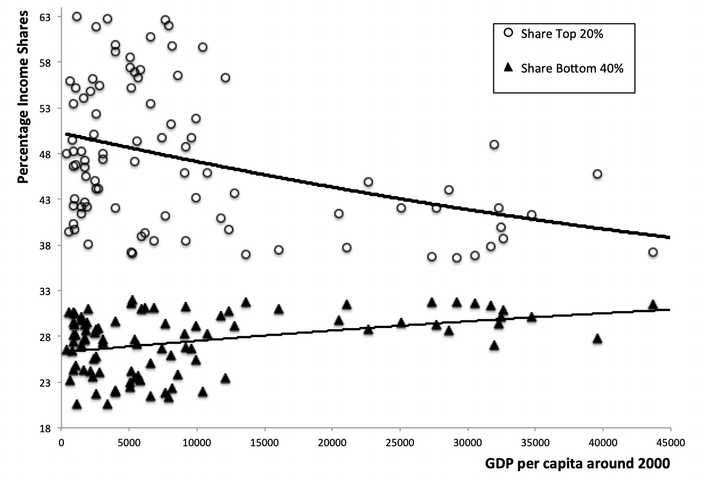
```

---

## Desigualdad e ingreso per cápita: ¿en la parte baja se ve una u-invertida?

```{r fig2, echo=FALSE, out.width="70%"}
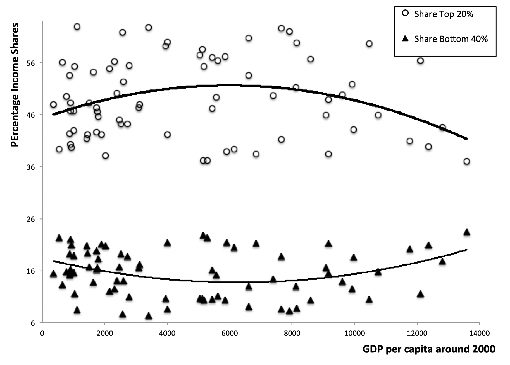
```

---

## Cambios desiguales y compensatorios

.content-box-red[
**Hipótesis de la U invertida de Kuznets (1995)**: La desigualdad puede aumentar y después disminuir a medida que pasamos de ingresos per cápita más bajos a más altos.
]

- Los datos inducen a pensar que el desarrollo económico es un proceso inherentemente desigual.

  - Es posible que al principio éste beneficie más que proporcionalmente a los grupos más ricos de la sociedad.
  
  - Ingreso per cápita muy bajo: Es difícil reducir la prop. de individuos bajo un umbral de ingreso.
  
  - Ingreso per cápita más altos: Mejoras económicas tienden a estar distribuidas de una manera más igualitaria (aumenta la proporción del ingreso correspondiente a los quintiles más pobres).


- Este proceso no es inevitable:

  - Medidas de acceso a infraestructura y recursos (como servicios sanitarios y la educación), generan que el crecimiento económico se distribuya de una manera más uniforme.
  
- Necesidad de analizar con cuidado relación equidad y crecimiento: Existe una creciente desigualdad en muchos países (ejemplo EE.UU.).

---

## Desigualdad de ingresos en EEUU 1910-2010

```{r fig3, echo=FALSE, out.width="80%"}
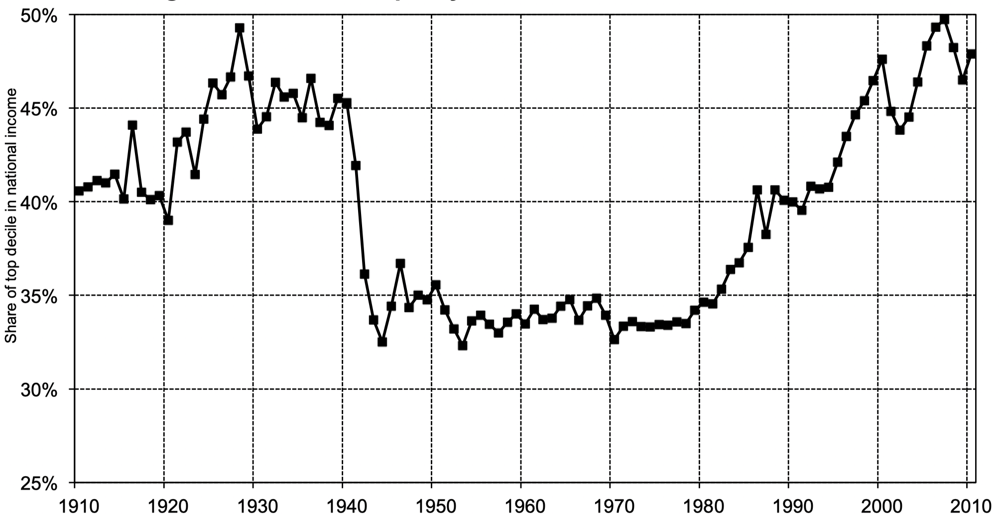
```
Fuente: Piketty (2014)

---
class: separator-blue, middle

# Las numerosas caras del subdesarrollo

---

## Desarrollo humano

- La **dependencia** excesiva del **PIB (o PNB) per cápita** como indicador del desarrollo puede **inducir a errores**.

- Países relativamente prósperos puede salir mal parados en algunos de los indicadores del desarrollo básicos.

| Country | 1993 income | Share Bottom 40% | Share Top 20% |
|--|:--:|:--:|:--:|
| Sri Lanka | 2,990 | 22 | 39 |
| Guatemala | 3,350 | 8 | 63 |

.bigskip[

]

| Country | Life exp | Inf. Mort. Rate | % Safe water | % Adult literacy |
|--|:--:|:--:|:--:|
| Sri Lanka | 72 | 18 | 60 | 89 |
| Guatemala | 65 | 48 | 62 | 54 |

- La distribución claramente importa, pero no lo es todo: por ejemplo, Pakistán:

| GDPpc | Share Botom 40% | Life exp | Inf. Mort. Rate | % Adult literacy |
|--|:--:|:--:|:--:|:--:|
| 1,898 | 21 | 62 | 91 | 36 |

---

## Índice de desarrollo humano

- El Programa de las *Naciones Unidas para el Desarrollo (PNUD)* publica el **Human Development Report** desde 1990.

- **Índice de Desarrollo Humano (IDH)**: primer índice que combina varios indicadores socioeconómicos.

- Tres componentes del índice:

  - La esperanza de vida al nacer: *Refleja indirectamente la mortalidad de los lactantes y de los niños*

  - Educación, combinar años de escolaridad promedio/esperados: *Media ponderada del % de adultos que saben leer y escribir (2/3) y tasas de escolarización en ed. primaria, secundaria y terciaria (1/3).*

  - Logaritmo del Ingreso per cápita: *Se ajusta a partir de un umbral (5.000 US$) para darle menos peso a países de ingreso más alto.*

- ¿Cómo combinar peras con manzanas? Crear índices normalizados en cada dimensión:
$$
I_{\mathrm{dim}}=\frac{x-\text { mínimo }}{\text { máximo }-\text { mínimo }}
$$

- Ejemplo: Expectativa de Vida $EV \in [20,83]$. Si $EV \rightarrow 20 \Rightarrow I\rightarrow 0$, mientras $EV \rightarrow 83 \Rightarrow I \rightarrow 1$  .

---

## Índice de desarrollo humano (cont...)

- IDH una media geométrica de los tres indicadores (con idénticos ponderadores):
$$\mathrm{HDI}=I_{EVida}^{1/3} I_{Educación}^{1/3} I_{Ingresos}^{1/3} \ \ \ \ \in [0,1]$$
- Interpretación: **Proporción del desarrollo último que ha logrado el país**.

- Ventajas: Sencillez y variaciones por dimensión.
  
- Esquema de ponderación es arbitrario, pero es una forma (entre muchas) de combinar indicadores de desarrollo.

- Diferencial de clasificación IDH vs. Ingreso per cápita:
  
  - 2010: Sri Lanka +10, Pakistán -4, Guatemala -13.
  
---
  
## Aún así, una alta correlación entre el IDH y el PIB per cápita

```{r fig4, echo=FALSE, out.width="65%"}
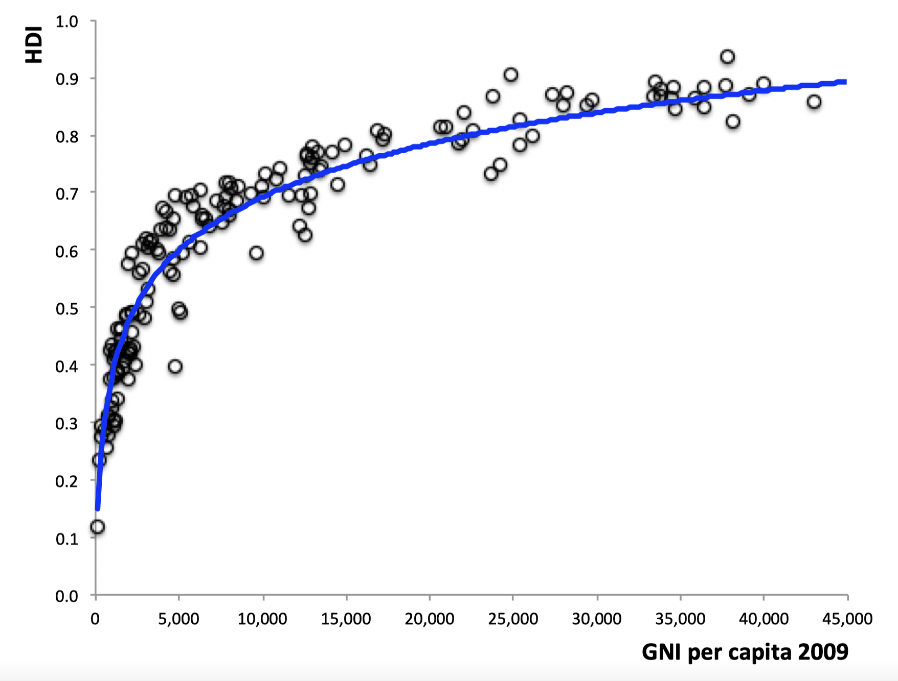
```

---

## Lo mismo se cumple para los indicadores que lo componen

```{r fig5, echo=FALSE, out.width="70%"}
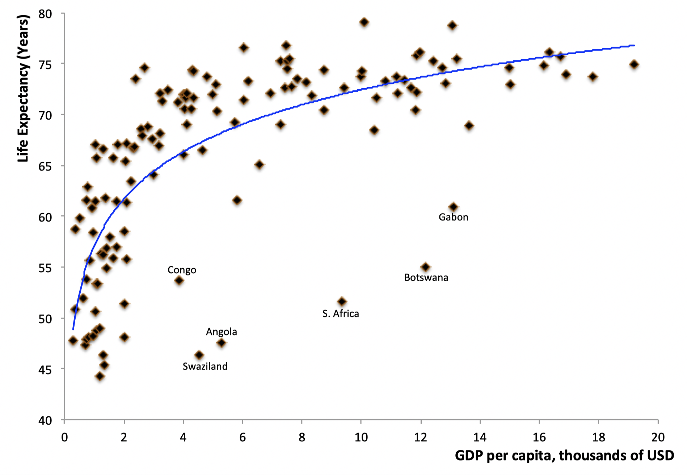
```

---

## Lo mismo se cumple para los indicadores que lo componen

```{r fig6, echo=FALSE, out.width="70%"}
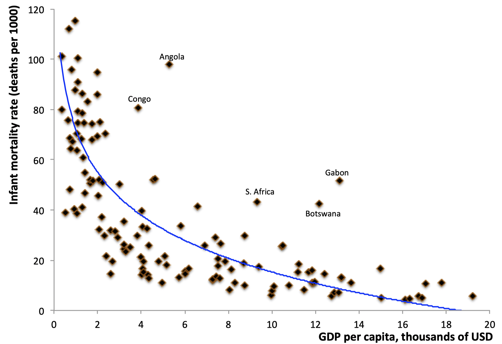
```

---

## Lo mismo se cumple para los indicadores que lo componen

```{r fig7, echo=FALSE, out.width="65%"}
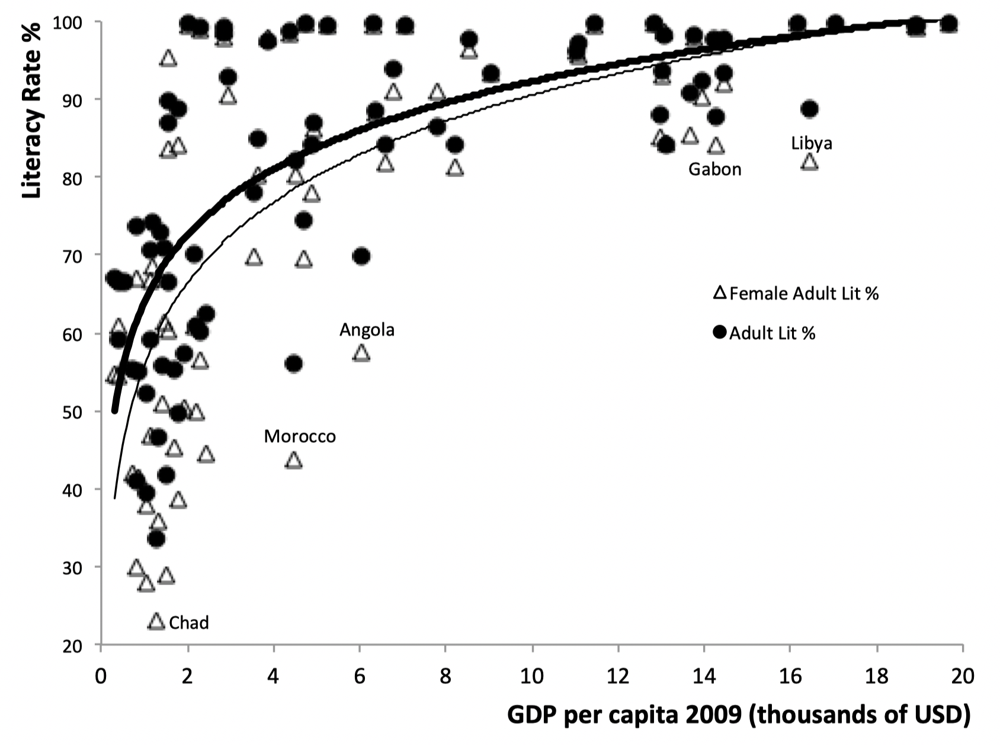
```

---
class: separator-blue, middle

# Características estructurales de los países en vías de desarrollo

---

## Características demográficas

.content-box-red[
  Los países muy pobres se caracterizan por tener tanto unas **elevadas tasas de natalidad** como unas **elevadas tasas de mortalidad**. A medida que se desarrollan, las tasas de mortalidad descienden y las tasas de natalidad a menudo siguen siendo altas.
]

Consecuencias:

- Aumento de la cantidad de producción (más trabajadores) vs. aumento de la población que hace que sea necesario repartir esa producción entre más personas.

  - Efecto negativo predomina si la economía no está dotada de una gran cantidad de capital (físico o humano).  

- La población total es muy joven (elevada la presencia de niños en la población).

  - Total dependencia económica. Consecuencias negativas: pobreza, trabajo infantil y bajo nivel de escolaridad.

---

## Características demográficas

.center[**Tasas de crecimiento de la población e ingreso per cápita**]
```{r fig8, echo=FALSE, out.width="63%"}
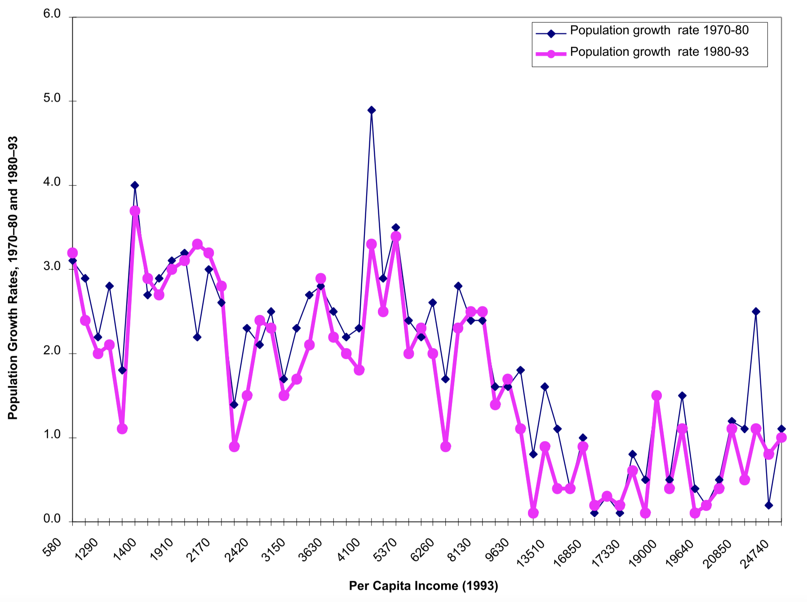
```

---

## Estructura ocupacional y productiva

.content-box-red[
  La **agricultura** representa una proporción significativa de la producción en los países en vías de desarrollo. La **proporción de la población activa** que vive en **zonas rurales** y trabaja en **actividades agrícolas** es elevada.
]

- La actividad agrícola es una parte importante de la vida de las personas de los países en vías de desarrollo.

  - Contratación de mano de obra campesina, arriendo de la tierra y funcionamiento de los mercados de crédito.

- Aspectos negativos:

  - La intensidad de uso del capital es mínima y la tierra está sobreexplotada.

  - Es una actividad de alto riesgo económico (clima, disponibilidad de agua, disponibilidad de fertilizantes y pesticidas, ...)

  - En general los agricultores no pasan de la mera subsistencia o viven con un mínimo de confort.

---

## Estructura ocupacional y productiva

.center[**Proporción de la población activa que trabaja en la agricultura e ingreso per cápita**]
```{r fig9, echo=FALSE, out.width="73%"}
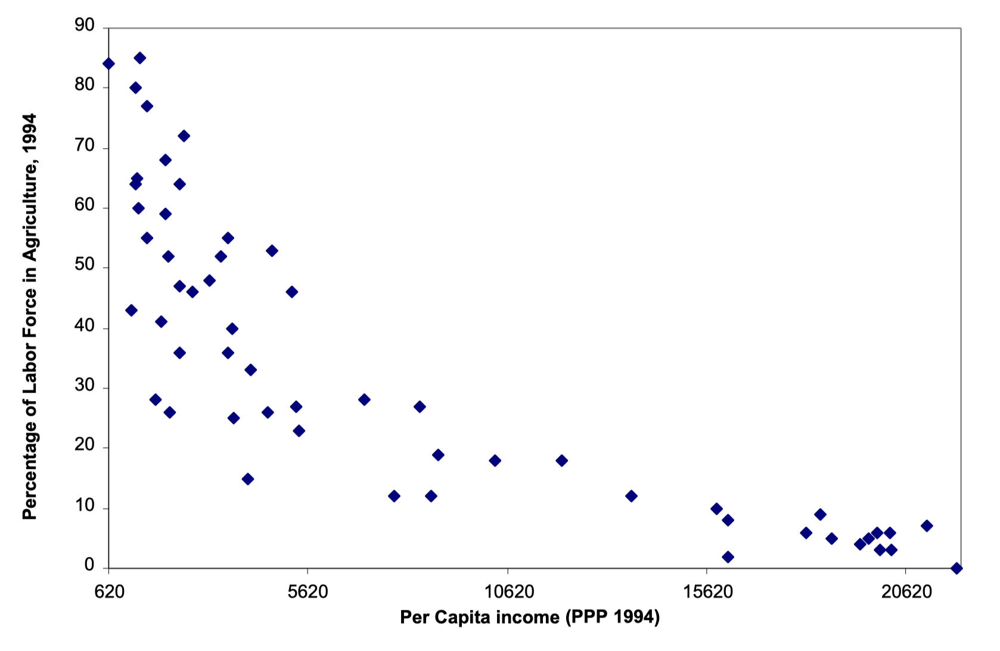
```


---

## Rápida migración de las zonas rurales a las urbanas

.content-box-red[
  Una enorme cantidad de mano de obra **emigra de las zonas rurales a las urbanas**, lo cual es resultado de la fuerza de **expulsión de la agricultura** (pobreza y falta de tierra) como de la **fuerza de atracción de zonas urbanas** (salarios altos y mayor protección).
]

- El crecimiento urbano supera el crecimiento demográfico total, lo cuál genera presiones sobre las ciudades.

  - La migración no es negativa, pero muchos procesos se aceleran y esta aceleración genera enormes tensiones.

- Observar una alta proporción de la población en países en vías de desarrollo en el sector servicios revela estas tensiones.

  - En países desarrollados una elevada proporción de la población trabaja enm el sector servicios (mayor ingreso, mayor demanda por servicios).

  - ¿porqué observamos algo similar en país en vías de desarrollo? El sector servicios de estos países es sintomático del desarrollo de un sector no organizado o informal 
  
  - Problema de clasificación: limpiabotas, pequeños comerciantes,  intermediarios, ... son servicios.
---

## Rápida migración de las zonas rurales a las urbanas

.center[**Mano de obra no agrícola que trabaja en los servicios e ingreso per cápita**]
```{r fig10, echo=FALSE, out.width="70%"}
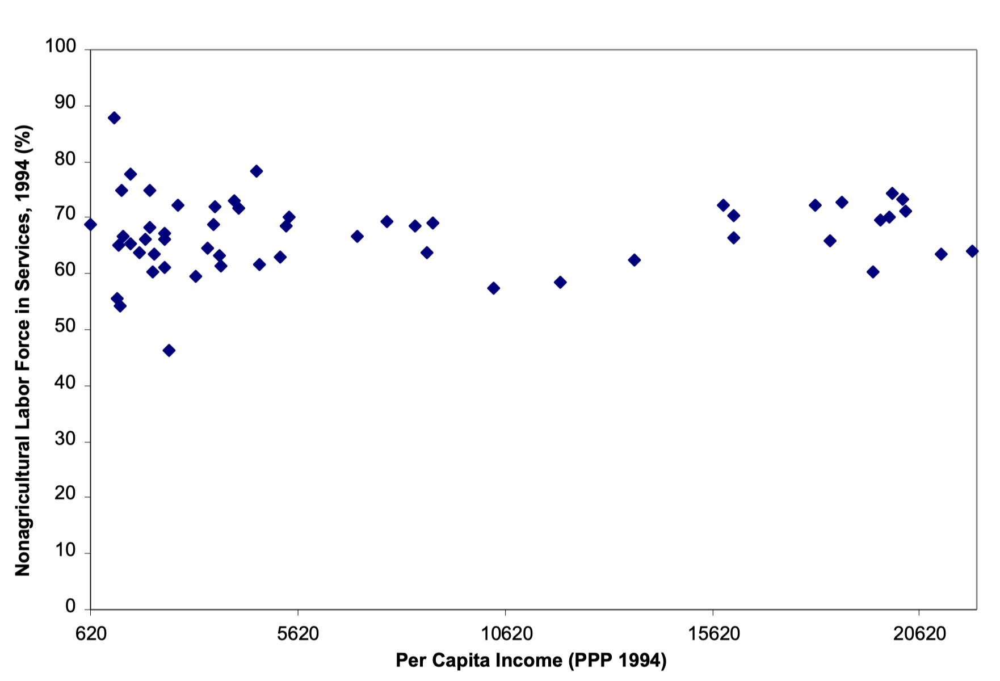
```

---

## El comercio internacional

.content-box-red[
  Todos los países participan en el **comercio internacional**. La diferencia entre países en vías de desarrollo y países desarrollados está en la **composición del comercio**. Los primero son exportadores de **productos básicos** (materias primas, los cultivos, y textiles y artículos de la industria ligera), mientras los segundos exportan **bienes manufacturados** (desde bienes de capital hasta bienes de consumo durables).
]

Explicación: *teoría de la ventaja comparativa*. Los países se especializan en la exportación de los bienes con ventaja relativa de costos.

- Abundancia relativa de trabajo no cualificado $\rightarrow$ exportación de bienes con uso intensivo de este factor.

Consecuencias:

- Los precios de los productos básicos son propensos a experimentar grandes fluctuaciones (ingresos inestables.).

- A medida que los productos básicos pierdan importancia en la cesta de consumo sus precios tenderán a descender (términos de intercambio a la baja).

- La tecnología suele asimilarse utilizándola.
---

## El comercio internacional

.center[**Proporción del total de exportaciones correspondiente a las exportaciones de productos básicos**]
```{r fig11, echo=FALSE, out.width="75%"}
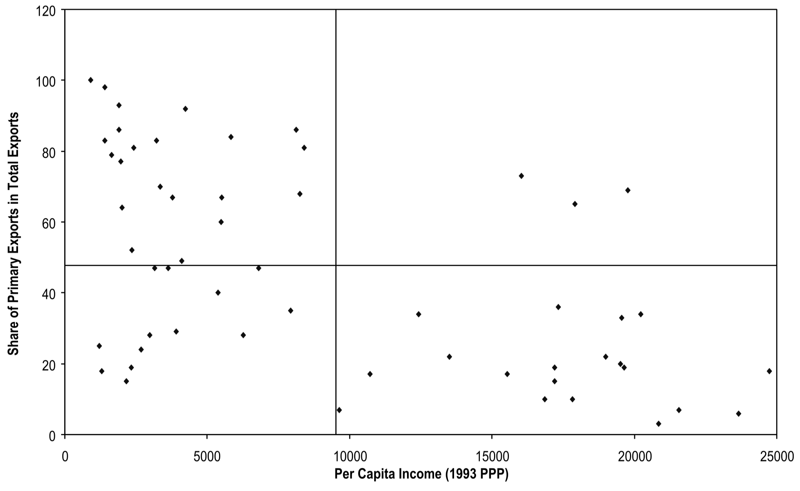
```
---

## El comercio internacional

.center[**Variaciones de la relación real de intercambio, 1980-93**]
```{r fig12, echo=FALSE, out.width="62%"}
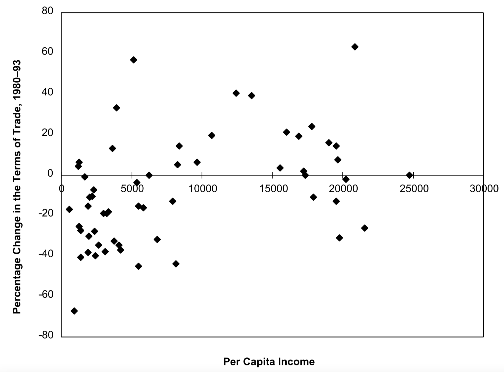
```
---

## El comercio internacional

.center[**Proporción del total de importaciones correspondiente a las importaciones de productos básicos**]
```{r fig13, echo=FALSE, out.width="62%"}
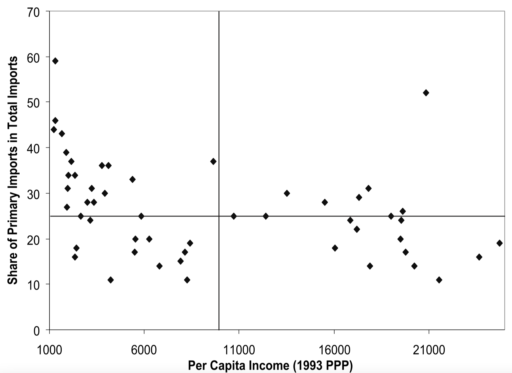
```

---
class: separator-blue, middle

# Crecimiento dispar y aspiraciones

---


## Aspiraciones y crecimiento dispar

- En la era de la información, los estándares de vida de todos están en total exposición (y además en una carrera  acelerada):

  - Se generan aspiraciones y frustraciones sociales.

  - No está claro si esta exposición conduce a una mejora (incentivo) o a la desesperación (desincentivo).

.bigskip[

]
- Ghatak-Ghosh-Kotwal, semanario económico y político, 19 de abril de 2014
> "[El término anterior es uno] en el que el crecimiento se aceleró, los indues comenzaron a ahorrar e invertir más, la inversión extranjera llegó rápidamente, [y] la pobreza disminuyó drásticamente... [Pero] el crecimiento también puede desatar poderosas aspiraciones así como frustraciones, y los partidos políticos que pueden aprovechar estas emociones cosechan los beneficios".

---

## Elecciones generales en India 2014


- Mishra, The Guardian, 16 de mayo de 2014 
>"[G]ente con aspiraciones dramáticamente elevadas pero en su mayoría incumplibles se han vuelto vulnerables a los demagogos que prometen una regeneración nacional. Es un tigre con furia desevocada... que Modi ha tratado de montar desde Gujarat a Nueva Delhi.

.bigskip[

]

- Tocqueville, 1856
> "Los franceses encontraron su posición tanto más intolerable cuanto mejor se hizo."

---

## El tunel de Hirschman

```{r fig14, echo=FALSE, out.width="70%"}
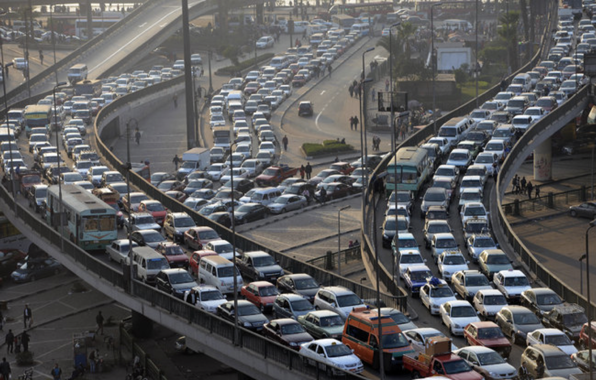
```