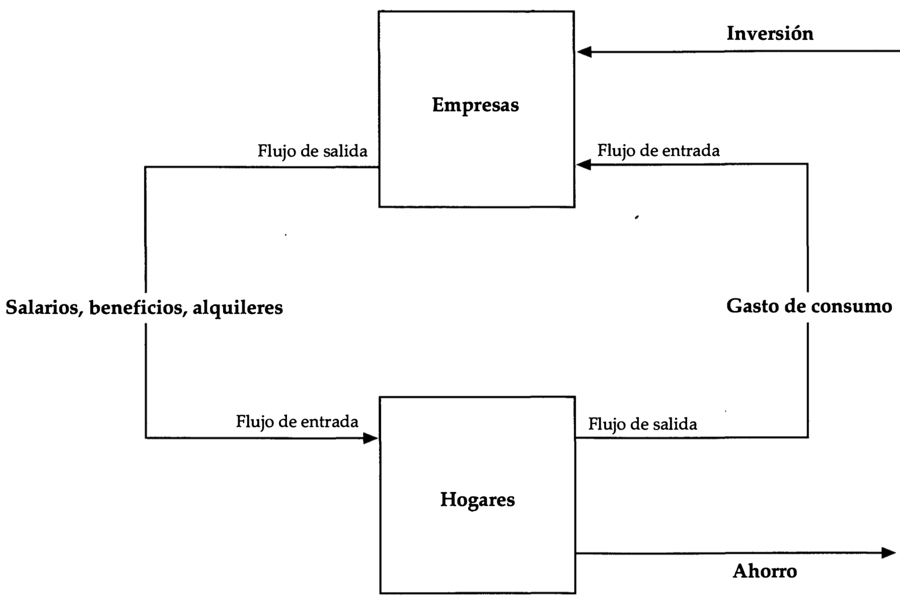
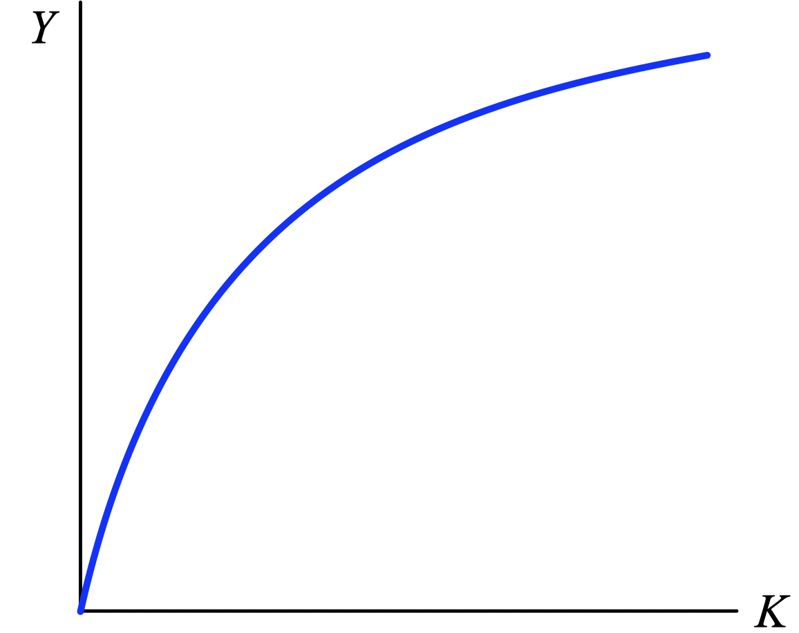
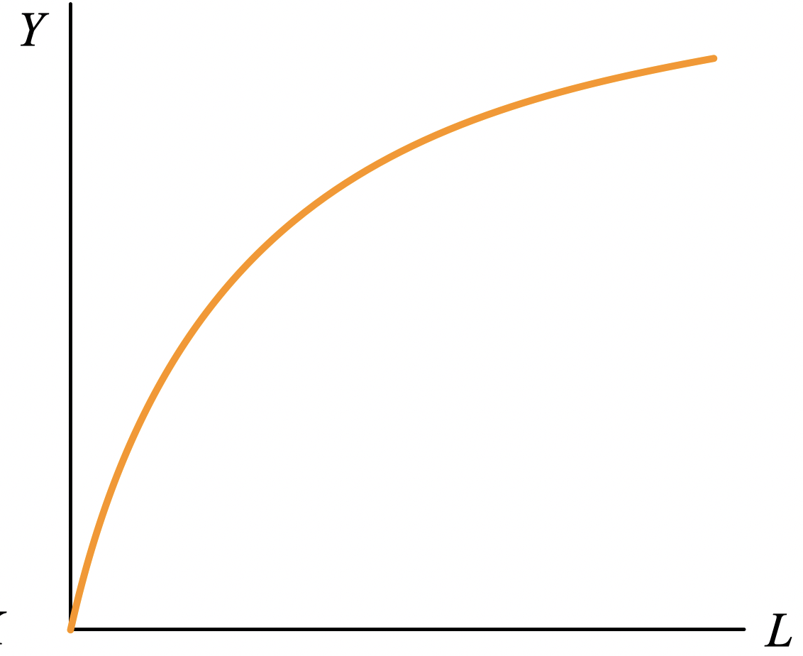
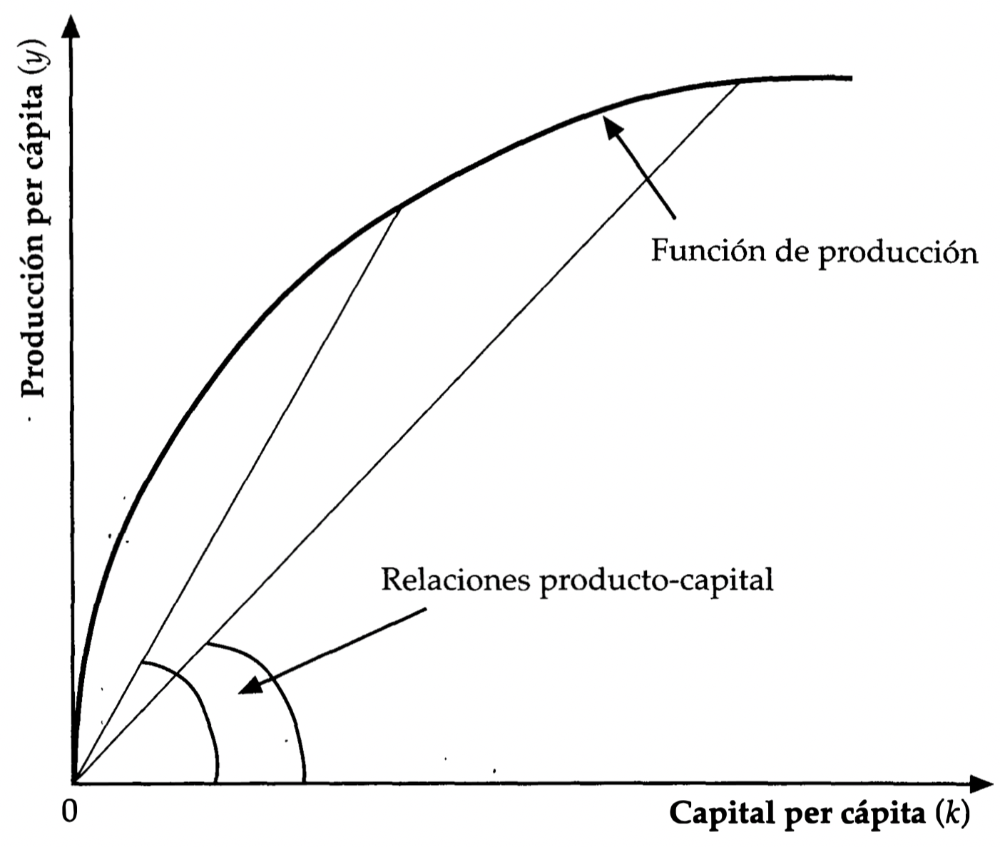

layout: true

<div class="my-footer"></div> 

---

```{r setup, include=FALSE}
knitr::opts_chunk$set(echo = FALSE, fig.align = "center",
                      message = FALSE, warning = FALSE)
knitr::opts_chunk$set(fig.dim=c(9, 6), fig.retina=2, out.width="100%")
```

```{r xaringan-themer, include=FALSE, warning=FALSE}
library(xaringanthemer)
library(readxl)

style_duo_accent(primary_color = "#3d5a80", 
                 secondary_color = "#dedede",
                 text_bold_color = "#ee6c4d",
                 text_font_family = "Droid Serif",
                 text_font_url = "https://fonts.googleapis.com/css?family=Droid+Serif:400,700,400italic",
                 header_font_google = google_font("Yanone Kaffeesatz"),
                 base_font_size = "20px",
                 code_font_size = "0.9rem")

```


class: separator-blue, middle

# Introducción

---

## Introducción

.content-box-red[
Un aumento de la tasa de crecimiento de un punto porcentual puede significar el estancamiento o la prosperidad en el plazo de una generación!!
]

**Robert Lucas** afirmó lo siguiente en sus **Marshall Lectures** de la Universidad de Cambridge:

> Las tasas de crecimiento de la renta real per cápita son ... diversas, incluso cuando se analiza un largo periodo ... Las rentas de la India se duplicarán cada 50 años; las de Corea cada 10. La situación de un indio será, en promedio, dos veces mejor que la de su abuelo; la de un coreano, 32 veces mejor ...

> No entiendo cómo se pueden observar cifras como éstas sin ver que representan posibilidades. ¿Podría tomar el Gobierno de la India alguna medida que permitiera que la economía india creciera como la de Indonesia o la de Egipto? En caso afirmativo, ¿cuál exactamente? En caso negativo, ¿qué hay en la "naturaleza de la India" que lo impida? Las consecuencias que tienen este tipo de cuestiones para el bienestar humano son sencillamente inmensas: cuando se piensa en ellas, resulta difícil pensar en ninguna otra cosa.

---

## Crecimiento económico moderno

.pull-left-1[

- El crecimiento económico es un **fenómeno relativamente moderno** (Kuznets, 1996)

- **Simple cálculo**: creciendo a 2%, el PIB per cápita se duplica en 35 años.

- **Maddison (2008) y Bolt and Van Zanden (2013)**: Los países de la OCDE se multiplicaron por 3 en 1850-1930, y por 5.2 entre 1930-2010.
]

.pull-right-2[
.center[**PIB per cápita de algunos países de la OCDE, 1850-2010**]

.small[
| Country | 1850 | 1930 | 2010 | 1930/1850 |  2010/1930 |
| :--- | :---: | :---: | :---: | :---: | :---: |
| Austria | 1,650 | 3,586 | 24,096 |  2.2 |  6.7 |
| Belgium | 1,847 | 4,979 | 23,557 | 2.7  | 4.7  |
| Canada | 1,330 | 4,811 | 24,941 | 3.6  | 5.2  |
| Denmark | 1,767 | 5,341 | 23,513 |  3.0 | 4.4 |
| Finland | 911 | 2,666 | 23,290 |  2.9 | 8.7 |
| France | 1,597 | 4,532 | 21,477 | 2.8  | 4.7  |
| Germany | 1,428 | 3,973 | 20,661 |  2.8 | 5.2 |
| Japan | 681 | 1,850 | 21,935 | 2.7 | 11.9 |
| Netherlands | 2,355 | 5,603 | 24,303 | 2.4 | 4.3 |
| Norway | 956 | 3,627 | 27,987 | 3.8 | 7.7 |
| Sweden | 1,076 | 4,238 | 25,306 | 3.9 | 6.0 |
| United Kingdom | 2,330 | 5,441 | 23,777 | 2.3 | 4.4 |
| United States | 1,849 | 6,213 | 30,491 | 3.4 | 4.9 |
]]

---

## Crecimiento económico moderno


.pull-left-1[

- A pesar de altas tasas de crecimiento de varios países en desarrollo, hay aún **mucho por hacer para ponerse al día**.

- Estos países no solo necesitan crecer, deben **crecer a tasas que superen con creces la experiencia histórica**. 

- El mundo desarrollado ya existe, y su **acceso a recursos económicos** no solo es mucho mayor que el de los países en desarrollo, sino que el **poder** que otorga este acceso está a la vista.
]

.pull-right-2[
.center[**PIB per cápita de algunos países en vías de desarrollo en relación al de EE.UU.**]

| Country | 1982 | 1996 | 2009 | | Country | 1982 | 1996 | 2009 |
| :--- | :---: | :---: | :---: | | :--- | :---: | :---: | :---: |
| Argentina | 34.8 | 28.8 | 31.6 | | India | 3.7 | 4.4 | 7.2 |
| Bangladesh | 2.4 | 2.2 | 3.1 | | Indonesia | 5.7 | 8.6 | 9.1 |
| Botswana | 15.8 | 22.4 | 29.1 | | Malaysia | 20.9 | 28.3 | 30.5 |
| Brazil | 27.6 | 22.3 | 22.5 | | Mexico | 42.7 | 29.7 | 29.8 |
| Chile | 19.4 | 27.8 | 31.3 | | Nigeria | 5.4 | 4.1 | 4.8 |
| China | 2.3 | 5.8 | 14.8 | | Pakistan | 5.1 | 5.5 | 5.7 |
| Cote d'Ivoire | 9.9 | 5.2 | 3.7 | | Rwanda | 3.3 | 1.9 | 2.5 |
| Egypt | 10.5 | 10.1 | 12.3 | | South Africa | 34.8 | 22.0 | 22.3 |
| Ethiopia | 2.3 | 1.5 | 2.0 | | Sri Lanka | 6.5 | 7.3 | 10.4 |
| Ghana | 3.3 | 2.8 | 3.4 | | Thailand | 9.5 | 17.1 | 17.4 |

]

---

class: separator-blue, middle

# Punto de partida de la teoría del crecimiento económico

---

## Stock de capital: fuerte correlación con el ingreso per cápita

.center[**logaritmo del PIB per cápita y logaritmo del valor del capital per cápita, 2014**]
```{r fig1, echo=FALSE, out.width="70%"}
knitr::include_graphics("img/fig1_gdp_capital.png")
```

---

## Stock de capital: fuerte correlación con el ingreso per cápita

.center[**logaritmo del PIB per cápita y logaritmo del valor del capital per cápita, 2014**]
```{r fig2, echo=FALSE, out.width="66%"}
knitr::include_graphics("img/fig2_gdp_capital_countries.png")
```

---

## Stock de capital: fuerte correlación con el ingreso per cápita

- Si esta correlación es fuerte, ¿no es la acumulación de capital la respuesta?

- Temas a considerar:

  - Capacidad y motivos de ahorro.

  - Cómo se traducen los ahorros en producción.

- Eso nos lleva a la **teoría del crecimiento económico**.

---

## Punto de partida de la teoría del crecimiento: ahorro = inversión

.pull-left[
```{r fig0, echo=FALSE, out.width="100%"}

```
]
.pull-right[

**Identidad contable**

- Producción: $Y(t)=C(t)+S(t)=C(t)+I(t)$

- Capital: $K(t+1)=(1-\delta) K(t)+I(t)$

- Ecuación de *Harrod-Domar*:
**$$s / \theta=(1+g)(1+n)- (1-\delta) \approx g + n + \delta $$**

- Definiciones:

  - $y(t) = Y(t) / P(t)$,
  
  - $g = [y(t+1) - y(t)] / y(t)$, 

  - $n = [P(t+1) - P(t)] / P(t)$,

  - $s=S(t)/Y(t)$, 

  - $\theta = K(t) / Y(t)$
]

---

## Punto de partida en la teoría del crecimiento

.content-box-red[
El crecimiento puede afectar a los parámetros que lo predicen (tasa de ahorro, tasa de crecimiento de la población, relación capital-producto). **Esas variables pueden ser determinadas endógenamente**.
]

- El **ingreso per cápita** y su distribución pueden afectar el **ahorro**.

  - Ingreso cercano a subsistencia: $s$ bajo.
  
  - Ingresos clase media: desigualdad $\rightarrow$ aspiraciones $\rightarrow s\uparrow$ .
  
  - Ingresos altos: aspiraciones menos importantes y consumo corriente atractivo $\rightarrow s\downarrow$.
  
- **Transición demográfica**: Relación de $n$ con el nivel de desarrollo (U invertida).

  - Países pobres: tasas de mortalidad muy altas y tasas de natalidad altas $\rightarrow n$ bajas.
  
  - Nivel de vida $\uparrow$: tasas de mortalidad $\downarrow$ $\rightarrow n\uparrow$
  
  - Nivel de desarrollo a largo plazo $\uparrow$: las tasas de natalidad $\downarrow$ $\rightarrow n$ nuevamente bajas.

---

class: separator-blue, middle

# El Modelo de Solow (endogeneidad de $K/Y$)

---

## El modelo de Solow: idea central

.content-box-red[
**Idea básica**: El capital y el trabajo generan conjuntamente el producto. 

- Abundancia de trabajo (e.r.c. el capital): un poco más de capital cundirá mucho $K/Y\downarrow$.

- Escasez de trabajo (e.r.c. el capital): se utilizará intensivamente el capital $K/Y\uparrow$.
]

- **Supuesto 1**: Los agentes ahorran una fracción constante $s$ de su ingreso:
$$S(t) = I(t) = sY(t)$$

- **Supuesto 2:**: La población crece a tasa $n$:
$$n = [P(t+1) - P(t)] / P(t)$$

- Stock de capital per cápita: 
$$K(t+1)=(1-\delta) K(t)+sY(t) \rightarrow (1+n)k(t+1)=(1-\delta) k(t)+sy(t)$$
con $k=K/P$ y $y=Y/P$. 

---
## La función de producción

- La **función de producción** representa los conocimientos técnicos de la economía para mezclar insumos.
$$Y=F(K, L)$$
$K$ y $L$ son una larga lista de insumos, pero por ahora piensen en ellos como dos números.

- Rendimientos a escala:

  - Rendimientos constantes a escala: $F(\lambda K, \lambda L)=\lambda F(K, L)$ para todo $\lambda>0$.

  - Rendimientos crecientes a escala: $F(\lambda K, \lambda L)>\lambda F(K, L)$ para todo $\lambda>1$.

  - Rendimientos decrecientes a escala: $F(\lambda K, \lambda L)<\lambda F(K, L)$ para todo $\lambda>1$.

- **Supuesto 3:** La función de producción muestra rendimientos constantes a escala.

---

## La función de producción

**Supuesto 4:**: La función de producción muestra rendimientos marginales decrecientes de los insumos individuales.

.pull-left[
```{r fig3, echo=FALSE, out.width="90%"}

```

.center[Para valor fijo de $L$]
]

.pull-right[
```{r fig4, echo=FALSE, out.width="90%"}

```

.center[Para un valor fijo de $K$]
]

---

## La función de producción

- Una función de producción muy utilizada es la función Cobb-Douglas:
$$Y=A K^{\alpha} L^{\beta}$$
con $0<\alpha<1,0<\beta<1$.

- Rendimientos a escala con la función Cobb-Douglas

  - $\alpha+\beta=1$ (rendimientos constantes a escala, nuestro caso principal)

  - $\alpha+\beta<1$ (rendimientos decrecientes a escala)

  - $\alpha+\beta>1$ (rendimientos crecientes a escala)

- Propiedad (suponiendo mercados competitivos):
$$PMK (K/Y) = q K/Y = \alpha \ \ \ \ PML (L/Y) = w L/Y = \beta$$

---

## La función de producción en su forma per cápita

- Partamos con la función Cobb-Douglas $Y=A K^{\alpha} L^{\beta}$ y dividamos entre $L$ para obtener:
$$\frac{Y}{L}=A \frac{K^{\alpha}}{L^{1-\beta}}=A\left(\frac{K}{L}\right)^{\alpha } \Rightarrow y=A k^{\alpha}$$
donde $y=Y / L$ y $k=K / L$ siempre que $\alpha+\beta=1$ (RCE).

- Caso general: $Y=F(K, L)$. Con RCE $F(\lambda K, \lambda L)=\lambda F(K, L)$. Definiendo $\lambda=1 / L$ en esta ecuación, obtenemos
$$F\left(\frac{K}{L}, 1\right)=\frac{1}{L} F(K, L)=\frac{Y}{L}, \text { o } y=f (k)$$
donde $y=Y / L, k=K / L$ y $f(k)=F(k, 1)$

---

## La relación $K/Y$

.pull-left-1[
**Redimientos marginales decrecientes**:

A medida que $k\uparrow \rightarrow K/Y\downarrow$ debido a que hay una escasez relativa de trabajo.
]

.pull-right-2[
```{r fig5, echo=FALSE, out.width="85%"}

```
]
---

## Algunas consideraciones respecto de la función de producción

.pull-left[
- Recuerde: $y=f(k)$ y en el caso Cobb-Douglas: $$y=A k^{\alpha}$$

- Observación: Tome el caso Cobb-Douglas y obtenga: $$\ln y=\ln A+\alpha \ln k$$

- **En el diagrama de dispersión anterior la relación lineal es bastante impresionante**.
]

.pull-right[
```{r fig6, echo=FALSE, out.width="150%"}
knitr::include_graphics("img/fig2_gdp_capital_countries.png")
```
]

---

## Algunas consideraciones respecto de la función de producción

- Existe **mucha variación residual** alrededor de la relación lineal en el gráfico de dispersión anterior.

- **Variaciones de productividad**:
$$Y=A K^{\alpha} L^{\beta}$$
$A$ varía considerablemente de un país a otro.

  - Flujo limitado de tecnología entre países.

  - Altos costos fijos: infraestructura, redes en la producción, etc.

  - Ineficiencia distributiva: mercados de capitales imperfectos, clientelismo político, etc.

---

## Algunas consideraciones respecto de la función de producción

- **Capital humano limitado**: 
$$Y=F(K,\text{mano de obra de diferentes calidades})$$ 

  - En el caso Cobb-Douglas se podría postular:
$$Y=A K^{\alpha}(e L)^{\beta}$$
donde $e$ son los años de escolaridad por persona. **Vínculo con un $A$ más bajo** a través de unidades de eficiencia.

  - Alternativamente: 
  $$Y=A K^{\alpha} U^{\beta} H^{\gamma}$$ donde $U$ es mano de obra no calificada y $H$ es capital humano. Suponemos sustitución imperfecta entre tipos de trabajo.

