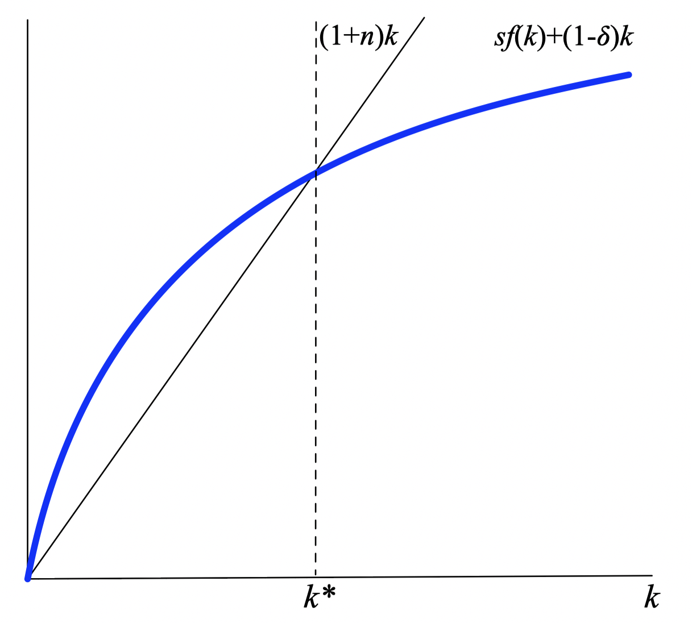
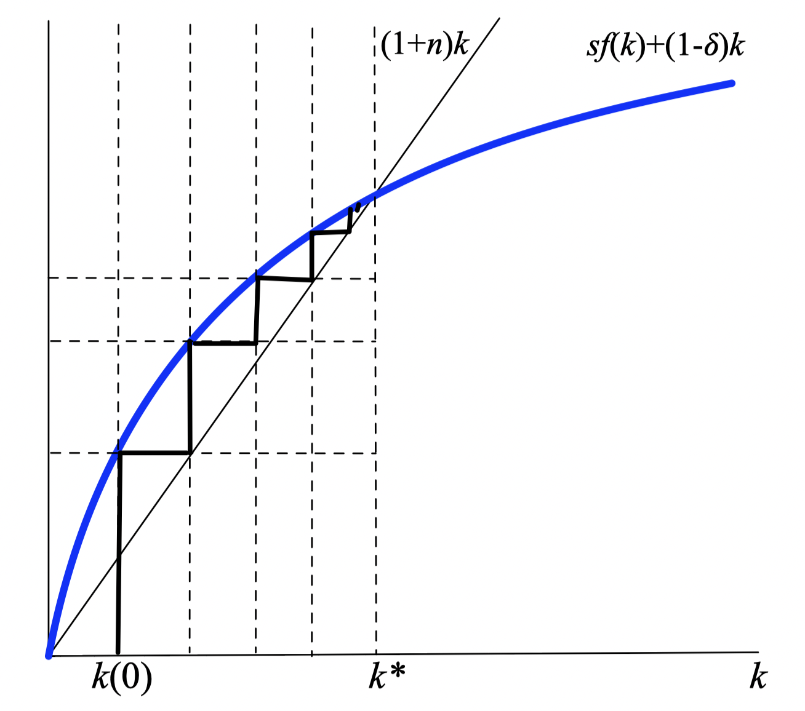
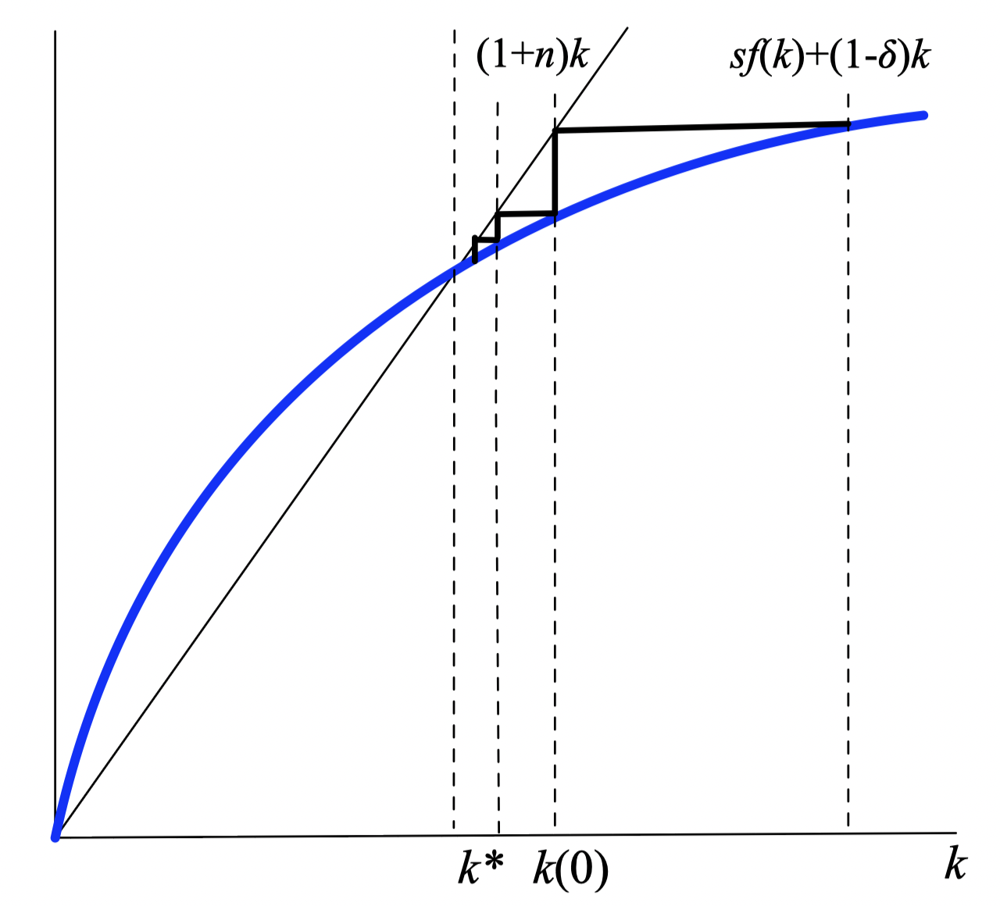
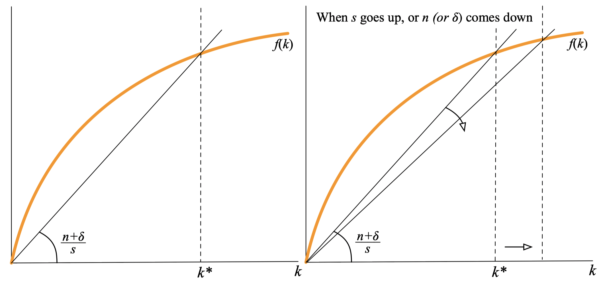
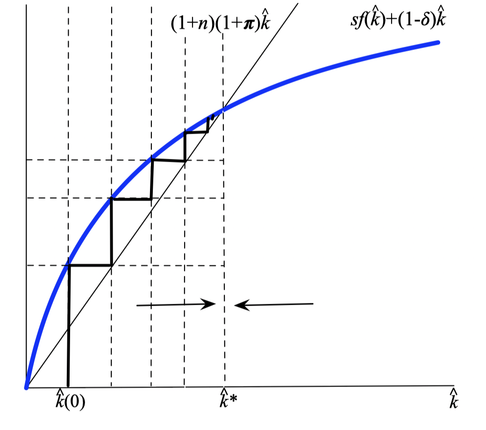
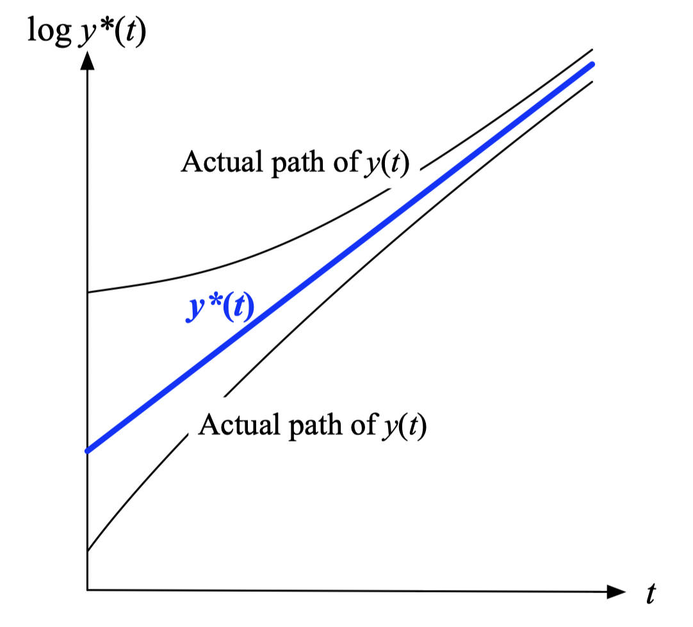
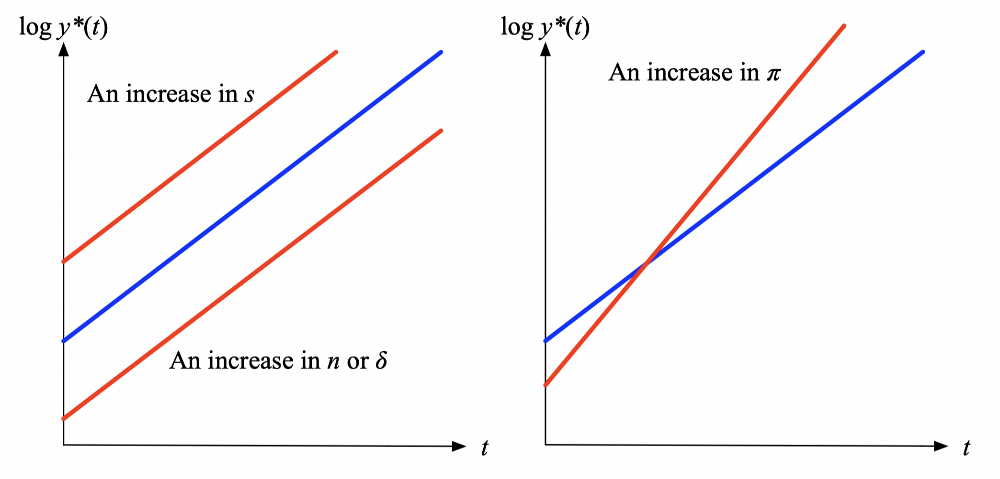

layout: true

<div class="my-footer"></div> 

---

```{r setup, include=FALSE}
knitr::opts_chunk$set(echo = FALSE, fig.align = "center",
                      message = FALSE, warning = FALSE)
knitr::opts_chunk$set(fig.dim=c(9, 6), fig.retina=2, out.width="100%")
```

```{r xaringan-themer, include=FALSE, warning=FALSE}
library(xaringanthemer)
library(readxl)

style_duo_accent(primary_color = "#3d5a80", 
                 secondary_color = "#dedede",
                 text_bold_color = "#ee6c4d",
                 text_font_family = "Droid Serif",
                 text_font_url = "https://fonts.googleapis.com/css?family=Droid+Serif:400,700,400italic",
                 header_font_google = google_font("Yanone Kaffeesatz"),
                 base_font_size = "20px",
                 code_font_size = "0.9rem")

```


class: separator-blue, middle

# El modelo de Solow (continuación)

---

## La ecuación fundamental del modelo de Solow

**Recodemos ...**

- Los agentes ahorran una fracción constante de su ingreso:
$$S(t)=s Y(t)$$

- El ahorro es igual a la inversión:
$$S(t)=I(t)$$

- La inversión incrementa el stock de capital:
$$K(t+1)=(1-\delta) K(t)+I(t)=(1-\delta) K(t)+s Y(t)$$
con $\delta$ la tasa de depreciación.

- Esta es la ecuación de acumulación del stock de capital.

---

## La ecuación fundamental del modelo de Solow

- Ecuación de acumulación:
$$K(t+1)=(1-\delta) K(t)+s Y(t)$$

- Para convertir a magnitudes per cápita dividimos entre el trabajo: $k=K / L, y=Y / L$ :
$$(1+n) k(t+1)=(1-\delta) k(t)+s y(t)$$ 
(usamos $n$ para indicar la tasa de crecimiento de la población).

- Combinamos con la función de producción per cápita $y=f(k)$ :
**$$(1+n) k(t+1)=(1-\delta) k(t)+s f(k(t))$$**

- Esta es la **ecuación fundamental** para el modelo de crecimiento. Con ella podemos estudiar la dinámica del stock de capital

---

## La dinámica del stock de capital

.pull-left[
**Solución de Solow**:

- Ecuación fundamental:
$$(1+n) k(t+1)=(1-\delta) k(t)+s f(k(t))$$

- En términos de variaciones
$$\Delta k=\frac{(1-\delta) k(t)+s f(k(t)) - (1+n)k(t)}{1+n}$$
]

.pull-right[
```{r fig1, echo=FALSE, out.width="100%"}

```
]
---

## La dinámica del stock de capital

.pull-left-1[
**Convergencia desde un capital bajo:**

- Si $k(0) < k^{*}$, entonces:

  - $\Delta k>0$.

  - $k(t) \rightarrow^{+} k^{*}$ para cualquier $k(0)$
  
  - Donde: $$\frac{f\left(k^{*}\right)}{k^{*}}=\frac{n+\delta}{s}$$
]

.pull-right-2[
```{r fig2, echo=FALSE, out.width="80%"}

```
]


---

## La dinámica del stock de capital

.pull-left-1[
**Convergencia desde un capital alto:**

- Si $k(0) > k^{*}$, entonces:

  - $\Delta k<0$.

  - $k(t) \rightarrow^{-} k^{*}$ para cualquier $k(0)$
  
  - Donde: $$\frac{f\left(k^{*}\right)}{k^{*}}=\frac{n+\delta}{s}$$
]

.pull-right-2[
```{r fig3, echo=FALSE, out.width="80%"}

```
]


---

## El estado estacionario

- La **relación capital-trabajo** en estado estacionario es constante:
$$\frac{y^{*}}{k^{*}}=\frac{f\left(k^{*}\right)}{k^{*}}=\frac{n+\delta}{s}$$

- $k^{*}=K(t) / L(t)$ es constante $(\Delta k = 0)$, pero $K(t)$ y $L(t)$ siguen creciendo a una tasa de $n$.

- Lo mismo ocurre con el producto, $y^{*}=f(k^{*})$ es constante, por lo que $Y(t)$ crece también a tasa $n$.

  - El argumento depende fundamentalmente de los **rendimientos decrecientes de los insumos**.

.bigskip[

]

.content-box-red[
**Predicción del modelo de Solow 1:** 

No hay crecimiento a largo plazo por encima del crecimiento de la población. Cualquier crecimiento extra sólo viene del progreso técnico, como veremos más adelante.
]
---

## El estado estacionario: estática comparativa

- ¿Cómo $s, n$ y $\delta$ afectan a $k^{*}$:

```{r fig4, echo=FALSE, out.width="90%"}

```

---

## El estado estacionario para el caso Cobb-Douglas

- Estado estacionario $k^{*}$ resuelve:
$$\frac{f\left(k^{*}\right)}{k^{*}}=\frac{n+\delta}{s}$$

- En el caso de la función Cobb-Douglas, $f(k)=A k^{\alpha}$, tenemos:
$$\frac{f\left(k^{*}\right)}{k^{*}}=A k^{* \alpha-1}=\frac{n+\delta}{s}$$
y por tanto:
$$k^{*}=\left(\frac{s A}{n+\delta}\right)^{1 /(1-\alpha)}$$

- Se puede verificar directamente las propiedades que antes establecimos geométricamente 

  - Esto es, encuentre el signo de las derivadas parciales de $k^{*}$ con respecto a $s$, $n$ y $\delta$.

---

class: separator-blue, middle

# Fuentes de crecimiento: exógeno vs. endógeno

---

## Fuentes de crecimiento

**Crecimiento exógeno versus crecimiento endógeno**

- Crecimiento exógeno: proviene de “fuera” del modelo.

  - Progreso tecnológico continuo.

- Crecimiento endógeno: proviene del “adentro” del modelo.

  - Progreso tecnológico inducido

  - Ausencia de rendimientos decrecientes
  
---

## Crecimiento exógeno en el modelo de Solow: progreso tecnológico 

- **Supuesto X**: Función de producción es ahora:
$$Y(t)=F(K(t), e(t) L(t))$$
donde $e(t)$ es la eficiencia del trabajo, entonces $e(t) L(t)$ es el trabajo efectivo.

- Progreso tecnológico exógeno: 
$$e(t+1)=e(t)(1+\pi), \pi>0$$

- Dividamos la ecuación de acumulación por $e(t) L(t)$ en lugar de $L(t)$ :
$$(1+\pi)(1+n) \hat{k}(t+1)=(1-\delta) \hat{k}(t)+s f(\hat{k}(t))$$
donde $\hat{k}=K / e L$ está medido en **unidades efectivas per cápita**.

- Todo lo demás es idéntico a los visto antes.

---

## El estado estacionario (en unidades efectivas de de trabajo)

.pull-left[
- En estado estacionario:
$$\begin{aligned}
\frac{f\left(\hat{k}^{*}\right)}{\hat{k}^{*}}&=\frac{(1+n)(1+\pi)-(1- \delta)}{s} \\
&\simeq \frac{n+\delta+\pi}{s}
\end{aligned}$$


- Note que: 
$$y^{*}(t)=\hat{y}^{*}e(t)$$
entonces, el la tasa de crecimiento per cápita a largo plazo es $\pi$.

]

.pull-right[
```{r fig5, echo=FALSE, out.width="95%"}

```
]

---

## El estado estacionario (en unidades efectivas de de trabajo)

- En el caso de la función Cobb-Douglas, $\hat{y}=f\left(k^{*}\right)=A \hat{k}^{\alpha}$, tenemos:
$$\hat{k}^{*}=\left(\frac{s A}{n+\delta+\pi}\right)^{1 /(1-\alpha)}$$

- La producción de estado estacionario en unidades efectivas de trabajo es:
$$\hat{y}^{*}=A^{1 /(1-\alpha)}\left(\frac{s}{n+\delta+\pi}\right)^{\alpha /(1-\alpha )}$$

- Como antes, la producción real per cápita y el capital crecen a una tasa de $\pi$.

---

## El estado estacionario (en unidades efectivas de de trabajo)

.pull-left[
- Trayectoria de la producción per cápita en estado estacionario:
$$\begin{aligned}
y^{*}(t)&=\hat{y}^{*}(1+\pi)^{t} \\
&=A^{1 /(1-\alpha)}\left(\frac{s}{ n+\delta+\pi}\right)^{\alpha /(1-\alpha)}(1+\pi)^{t}
\end{aligned}$$

- Note que fuera de la trayectoria de estados estacionario, el producto per cápita puede crecer más (o menos) que $\pi$.
]

.pull-right[
```{r fig6, echo=FALSE, out.width="95%"}

```
]
---

## El estado estacionario: estática comparativa

- Trayectoria de la producción per cápita en estado estacionario:
$$y^{*}(t)=\hat{y}^{*}(1+\pi)^{t}=A^{1 /(1-\alpha)}\left(\frac{s}{n+\delta+\pi}\right)^{\alpha /(1-\alpha)}(1+\pi)^{t}$$

```{r fig7, echo=FALSE, out.width="75%"}

```

---

## El modelo AK, un primer paso a los modelo de crecimiento endógeno

- Observemos cómo se mueve el estado estacionario con $\alpha$.

  - Cuando $\alpha \rightarrow 1$, de forma que $y(t)=A k(t)$,  el modelo se comporta de manera muy diferente:
$$(1+n) k(t+1)=(1-\delta) k(t)+s A k(t)$$

  - Realizando manipulaciones algebraicas:
$$\text { Tasa de crecimiento }= g = \frac{k(t+1)-k(t)}{k(t)}=\frac{s A-(n+\delta)}{1+n}$$

- En su versión aproximada tenemos:
$$s A \simeq g+n+\delta$$

  - Ahora los **parámetros** tienen **efectos permanentes** sobre la tasa de crecimiento, a diferencia del modelo de Solow.