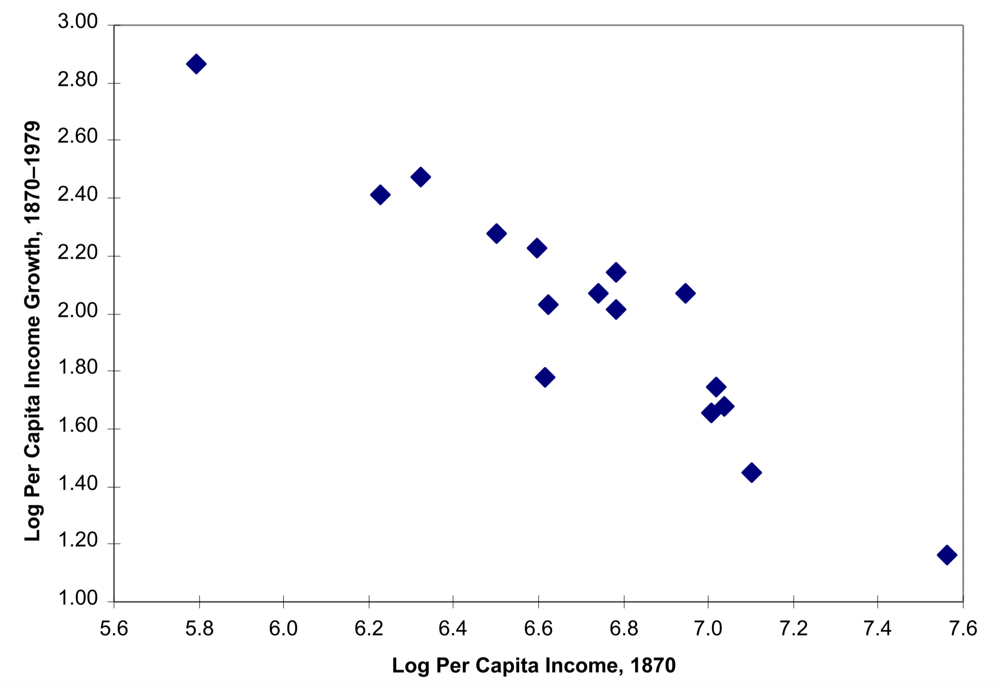
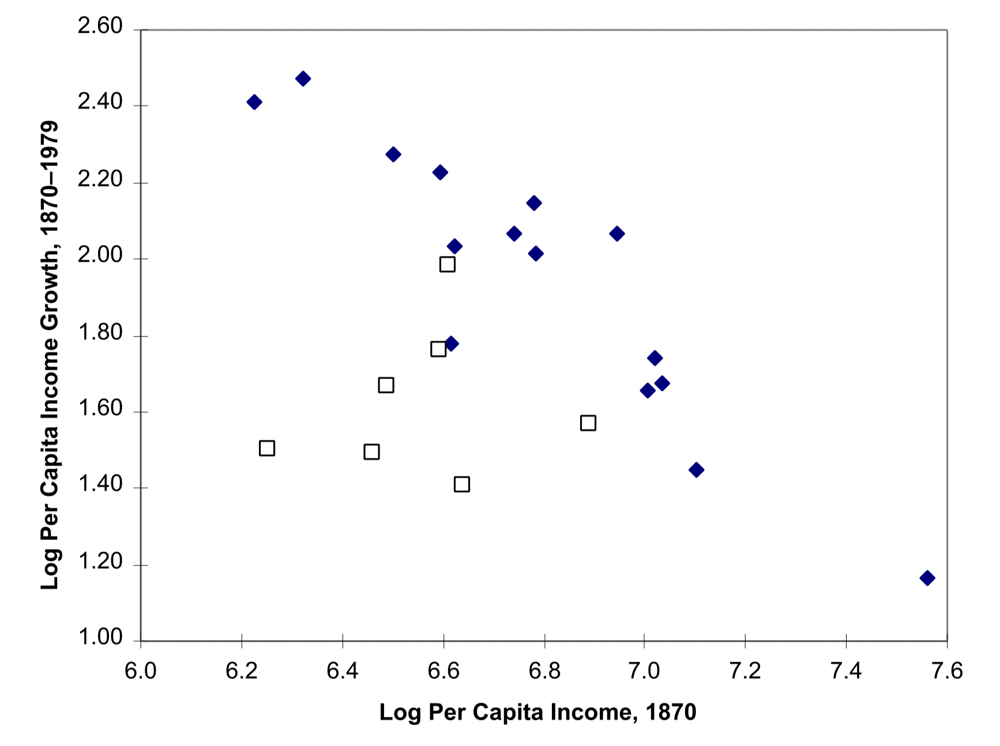
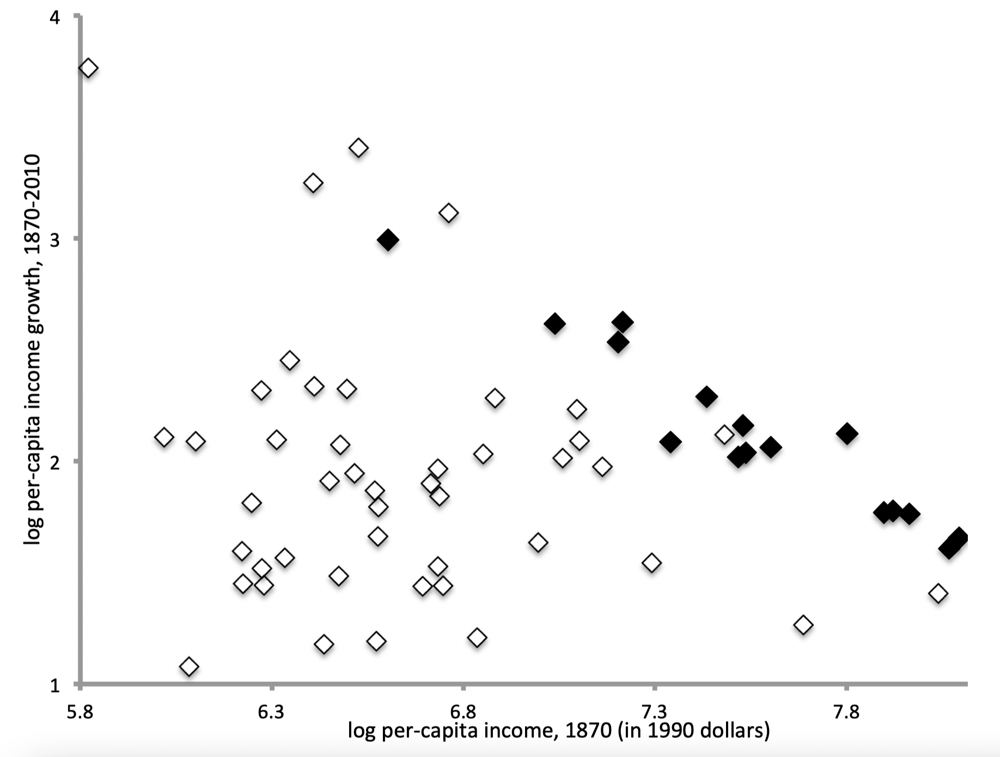
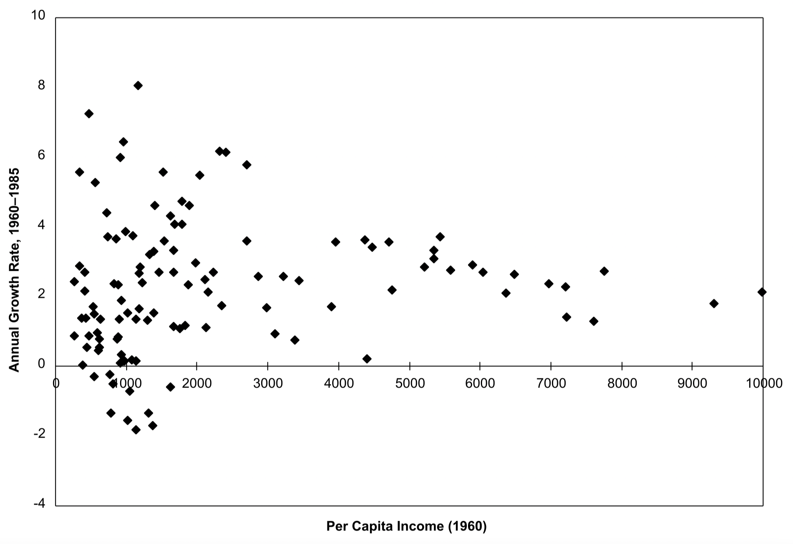
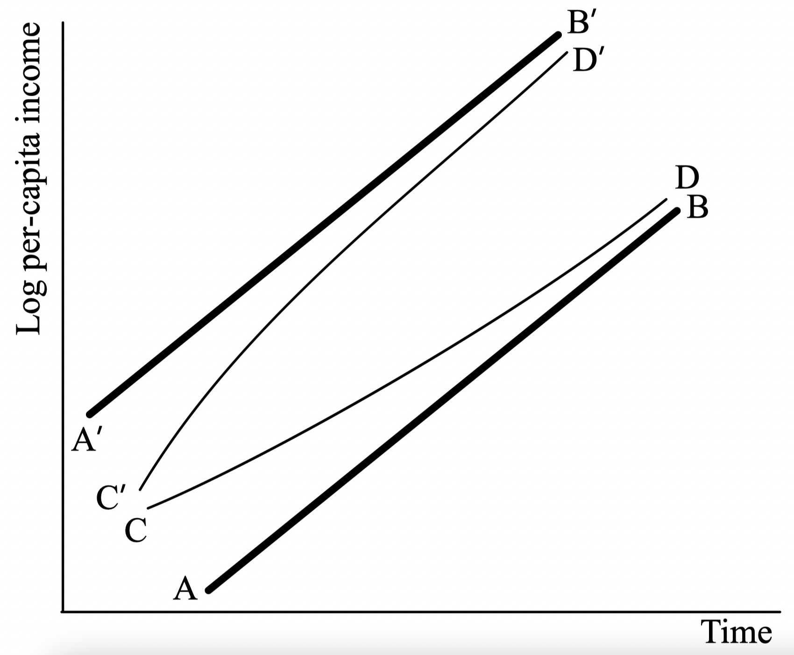
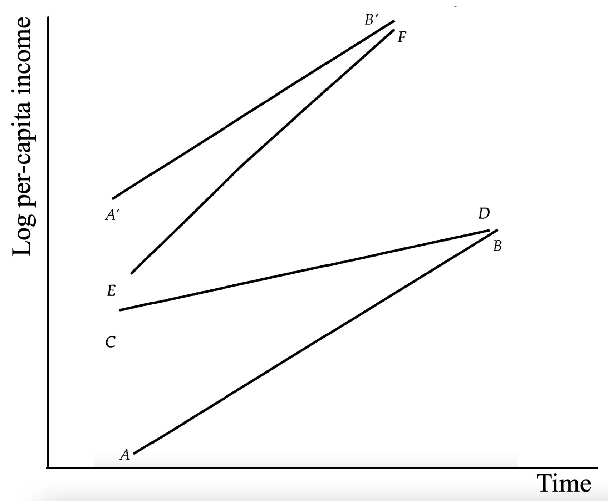

layout: true

<div class="my-footer"></div> 

---

```{r setup, include=FALSE}
knitr::opts_chunk$set(echo = FALSE, fig.align = "center",
                      message = FALSE, warning = FALSE)
knitr::opts_chunk$set(fig.dim=c(9, 6), fig.retina=2, out.width="100%")
```

```{r xaringan-themer, include=FALSE, warning=FALSE}
library(xaringanthemer)
library(readxl)

style_duo_accent(primary_color = "#3d5a80", 
                 secondary_color = "#dedede",
                 text_bold_color = "#ee6c4d",
                 text_font_family = "Droid Serif",
                 text_font_url = "https://fonts.googleapis.com/css?family=Droid+Serif:400,700,400italic",
                 header_font_google = google_font("Yanone Kaffeesatz"),
                 base_font_size = "20px",
                 code_font_size = "0.9rem")

```


class: separator-blue, middle

# Convergencia

---

## Convergencia no condicinal

- El modelo de crecimiento de Solow predice **convergencia no condicional**:

  - Los ingresos de los países tienden a acercarse cada vez más unos a otros.

  - Este resultado está basado fuertemente en el supuesto de rendimientos decrecientes...

  - ...así como en la igualdad de los parámetros $s, n, \pi$ entre países.

- Pareciera que la idea de convergencia no condicional es demasiado pedir:

  - No obstante, curiosamente la literatura se ha hecho la pregunta y ha tratado de responderla.

---

## Probando empíricamente convergencia no condicinal

- **Baumol (AER 1986)** estudió 16 países:

  - Los más ricos del mundo hoy en día.

  - En orden de más pobre a más rico en 1870: 
  
.center[{Japón, Finlandia, Suecia, Noruega, Alemania, Italia, Austria, Francia, Canadá, 
  
  Dinamarca, EE. UU., Países Bajos, Suiza, Bélgica, Reino Unido y Australia}]

- ¿Por qué solo 16? Angus Maddison y el **proyecto Maddison**.

.bigskip[

]

.content-box-red[
La base de datos del proyecto Maddison proporciona información sobre el crecimiento económico comparativo y los niveles de ingresos a muy largo plazo. La versión 2020 de esta base de datos cubre 169 países y el período hasta 2018.

https://www.rug.nl/ggdc/historicaldevelopment/maddison/releases/maddison-project-database-2020?lang=en
]

---

## Probando empíricamente convergencia no condicinal

.pull-left[
- **Idea**: realizar una regresión de la tasa de crecimiento de 1870-1979 sobre los ingresos de 1870 (periodo base).
$$\ln y_{i}^{1979}-\ln y_{i}^{1870}=A+b \ln y_{i}^{1870}+\epsilon_{i}$$

- La hipótesis de convergencia no condicional se cumpliría si: $$b \simeq-1$$ 

- Baumol obtiene $\hat{b}=-0.995, R^{2}=0.88$.
]

.pull-right[
**Gráficamente**:
```{r fig1, echo=FALSE, out.width="110%"}

```
]
---

## Probando empíricamente convergencia no condicinal

- Crítica de **De Long (AER 1988)**:

  - Agrega siete países más a los 16 de Maddison.

  - En 1870, estos países tenían tanto derecho a ser miembros del **club de la convergencia** como cualquiera de los 16 incluidos por Baumol: 
  
  .center[{Argentina, Chile, Alemania Oriental, Irlanda, Nueva Zelanda, Portugal y España}]

  - Hasta 1913, Nueva Zelanda, Argentina y Chile figuraban en la lista de los diez principales receptores de inversiones extranjeras británicas y francesas (en términos per cápita).

  - Todos tenían un PIB per cápita superior al de Finlandia en 1870.

  - **Estrategia**: dejar Japón (¿por qué?) y agregar los 7.
  
---

## Probando empíricamente convergencia no condicinal

.pull-left[
```{r fig2, echo=FALSE, out.width="100%"}

```
]

.pull-right[
- Pendiente sigue siendo negativa, aunque pierde significancia estadística.

- Controlando por error de medida: **desaparece toda relación**. Suponga que el verdadero valor $\ln y_{i}^{*1870}$ no es observado:
$$e_i = \ln y_{i}^{*1870} - \ln y_{i}^{1870}, \ \ \ Cov(\ln y_{i}^{1870},e_i)=0$$
Verdadera relación:
$$\ln y_{i}^{1979}-\ln y_{i}^{*1870}=A+b \ln y_{i}^{*1870}+\epsilon_{i}$$
Pero estimamos:
$$\ln y_{i}^{1979}-\ln y_{i}^{1870}=A+b \ln y_{i}^{1870} + (1+b) e_i+\epsilon_{i}$$
MCO de $b$ no cambia, pero $V((1+b) e_i+\epsilon_{i}) > V(\epsilon_{i})$
]
---

## Probando empíricamente convergencia no condicinal

**Más países**: Conjunto de datos de Maddison actualizado 2013, 60 países.

```{r fig3, echo=FALSE, out.width="60%"}

```

---

## Probando empíricamente convergencia no condicinal

**Aún más países**: Barro (QJE 1991), más de 100 países durante 1960-1985.

```{r fig4, echo=FALSE, out.width="65%"}

```

---

## Convergencia condicional

- El concepto de convergencia no condicional supone que todos los parámetros que determinan el nivel de ingreso de largo plazo son iguales.

.content-box-red[
**Convergencia condicional:** 

El concepto de convergencia tiene sentido solo después de "controlar por" $s$ y $n$ o cualquier parámetro que varíe sistemáticamente entre países
]

- Dos enfoques para analizar empíricamente el concepto de convergencia condicional.

  - **Calibración**: Vamos a ver si el modelo de Solow es "suficiente" para explicar cuantitativamente las diferencias de ingreso (metodología propuesta por Kydland y Prescott, 1982).
  
  - **Regresión**: Vamos a ver si los datos soportan las predicciones del modelo de Solow respecto de los determinantes del estándar de vida de los países (Mankiew, Romer y Weil, 1992). 
  
---

## Convergencia condicional

Los países se diferencian en uno o más de los siguientes: nivel de conocimientos técnicos (y su evolución), la tasa de ahorro, la tasa de crecimiento demográfico y la tasa de depreciación. Distingamos:

.pull-left[
**Convergencia en tasas de crecimiento:** 
```{r fig6, echo=FALSE, out.width="85%"}

```
]
.pull-right[
**Divergencia:**
```{r fig7, echo=FALSE, out.width="85%"}

```
]


---

## Enfoque de calibración

- Recuerde la ecuación que determinaba el stock de capital en unidades efectiva de trabajo en estado estacionario era:
$$\frac{f\left(\hat{k}^{*}\right)}{\hat{k}^{*}} \simeq \frac{n+\delta+\pi}{s}$$

- Usando la función de producción Cobb-Douglas: 
$$Y=A K^{\alpha}(e L)^{1-\alpha}$$
con $e(t)=(1+\pi)^{t}.$ 

- En unidades laborales efectivas:

$$\hat{y}=\frac{Y}{e L}=\frac{A K^{\alpha}(eL)^{1-\alpha}}{eL}=A \left( \frac{K} {eL}\right)^{\alpha}=A \hat{k}^{\alpha}(=f(\hat{k}))$$

---

## Enfoque de calibración

- Combinando ambas ecuaciones tenemos:
$$\frac{n+\delta+\pi}{s} \simeq \frac{f\left(\hat{k}^{*}\right)}{\hat{k}^{*}}=A \hat{ k}^{* \alpha-1}$$

- Finalmente, resolvemos para $\hat{ k}^{*}$:
$$\hat{k}^{*}=\left(\frac{s A}{n+\delta+\pi}\right)^{1 /(1-\alpha)}$$
y para $\hat{y}^{*}$ usando la función de producción:
$$\hat{y}^{*}=A\left(\frac{s A}{n+\delta+\pi}\right)^{\alpha /(1-\alpha)}=A^{1 /(1 -\alpha)}\left(\frac{s}{n+\delta+\pi}\right)^{\alpha /(1-\alpha)}$$
---

## Enfoque de calibración

- Ahora suponga que dos países tienen $\pi$, $n$ y $\delta$ similares. El ratio de productos per cápita sería:
$$\frac{y_{1}}{y_{2}}=\left(\frac{A_{1}}{A_{2}}\right)^{1 / 1-\alpha}\left(\frac{ s_{1}}{s_{2}}\right)^{\alpha / 1-\alpha}$$

- $\alpha$ es la participación del ingreso del capital (¿recuerdan?).

  - Posibles valores: $0.25$ (Parente-Prescott) $-0.40$ (Lucas), entonces $\alpha /(1-\alpha) \leq 2 / 3$

- Suponga que el **país uno tiene el doble de tasa de ahorro $s$**. 

  - Entonces el ratio de ingresos es aprox. $2^{2/3}=1.587$, alrededor de $60\%$.

  - **¿Es suficiente?, la respuesta el no**. Entre 1990-2020, el ingreso per cápita promedio (PPA) del $10\%$ más rico fue alrededor de $30+$ veces el del $10\%$ más pobre.

---

## Enfoque de calibración

- Los diferenciales tecnológicos pueden darnos una mejor resultado en explicar diferencia en ingreso. Recuerde que:
$$\frac{y_{1}}{y_{2}}=\left(\frac{A_{1}}{A_{2}}\right)^{1 / 1-\alpha}\left(\frac{ s_{1}}{s_{2}}\right)^{\alpha / 1-\alpha}$$

- Es decir, las diferencias $A$ están más amplificadas que las diferencias $s$:
$$\frac{y_{1}}{y_{2}}=\left(\frac{A_{1}}{A_{2}}\right)^{1 /(1-\alpha)}$$

- Mismo ejercicio, suponga que el **país uno tiene el doble de nivel tecnológico**.

  - Entonces el ratio de ingresos es aprox. $2^{5/3}=3.174$, alrededor de $3+$ veces. 
  
  - Mejor, pero aún lejos. Se requerirían diferencias enormes en $A$ para capturar diferencias observadas en $y$.

  - **Variación en los ingresos demasiado alta en relación con la teoría básica**.

---

## ¿Qué significa $\alpha$?

- Recordemos que $\alpha$ representa la participación del ingreso del capital en el ingreso total.
$$\alpha = \frac{PMK \times k}{y}=\frac{q \times k}{y} \in (0,1)$$

  - Cuanto más grande es, mayor es la propagación que podemos calibrar o predecir.

  - Pero $\alpha$ mide la participación del capital físico, que no se acerca a 1.

  - Es el corazón de la dificultad con el modelo de Solow.

- También se pueden acumular otros insumos, como el capital humano.

  - Se debe considerar la participación de estos otros insumos en los ingresos totales.
  
---

## El modelo de Solow con tres insumos

- Suponga ahora que la función de producción es (usemos una Cobb-Douglas):
$$Y=A K^{\alpha} U^{\beta} H^{\gamma}$$
donde $U$ es mano de obra no calificada y $H$ es mano de obra educada.

- Mantenemos los supuestos de RCE en los 3 insumos y rendimientos marginales decrecientes en cada insumo.

- Note que existe sustitución imperfecta entre $U$, $H$ y $K$. Para producir se requieren los tres tres timpoes de insumos.
 
- Ahora dividamos entre $U$ para expresar la producción por trabajador no calificado:
$$y=A k^{\alpha} h^{\gamma}$$
con $h=H/U$ y $k=K/U$.

---

## El modelo de Solow con tres insumos

- Ahora tenemos dos ecuaciones de acumulación:

  $$Ahorros: \ \ \ K(t+1)=\left(1-\delta_{k}\right) K(t)+s_{k} Y(t)$$

  $$Educación: \ \ \ H(t+1)=\left(1-\delta_{h}\right) H(t)+s_{h} Y(t)$$

- Supongamos por simplicidad que no existe progreso tecnológico. De nuevo, dividiendo por $U$ tenemos:
$$\qquad(1+n) k(t+1)=\left(1-\delta_{k}\right) k(t)+s_{k} y(t)$$
$$(1+n) h(t+1)=\left(1-\delta_{h}\right) h(t)+s_{h} y(t)$$

- En estado estacionario se cumple $k(t)=k(t+1)=k^{*}$, $h(t)=h(t+1)=h^{*}$, $y(t)=y^{*}$, luego:
$$k^{*}=\frac{s_{k} y^{*}}{n+\delta_{k}}$$
$$h^{*}=\frac{s_{h} y^{*}}{n+\delta_{h}}$$

---

## El modelo de Solow con tres insumos

- Recuerda $y=A k^{\alpha} h^{\gamma}$. Combinando:
$$y^{*}=A k^{* \alpha} h^{* \gamma}=A\left(\frac{s_{k} y^{*}}{n+\delta_{k}}\right) ^{\alpha}\left(\frac{s_{h} y^{*}}{n+\delta_{h}}\right)^{\gamma},$$
$$y^{*}=A^{1 /(1-\alpha-\gamma)}\left(\frac{s_{k}}{n+\delta_{k}}\right)^{\alpha /(1 -\alpha-\gamma)}\left(\frac{s_{h}}{n+\delta_{h}}\right)^{\gamma /(1-\alpha-\gamma)}$$

---

## Enfoque de calibración (nuevamente)

- Ahora suponga que dos países tienen $n$, $\delta_k$ y $\delta_h$  similares. El ratio de productos per cápita sería:

$$\frac{y_1}{y_2}=\left(\frac{A_1}{A_2}\right)^{1 /(1-\alpha-\gamma)}\left(\frac{s_{1,k}}{s_{2,k}}\right)^{\alpha /(1 -\alpha-\gamma)}\left(\frac{s_{1,h}}{s_{1,h}}\right)^{\gamma /(1-\alpha-\gamma)}$$

- $\alpha$ y $\gamma$ son la participación del ingreso del capital y del capital humano (trabajo calificado) sobre el ingreso total, respectivamente.

  - Posibles valores: $\alpha = [0.25, 0.40]$ y $\gamma = [0.10, 0.20]$, entonces $(\alpha+\gamma) /(1-\alpha-\gamma) \leq 3 / 2$

- Suponga que el **país uno tiene el doble de tasa de ahorro $s$ en ambos capitales**. 

  - Entonces el ratio de ingresos es aprox. $2^{3/2}=2.828$, aproximadamente $\times 3$.
  
- Mismo ejercicio, suponga que el **país uno tiene el doble de nivel tecnológico**.

  - Entonces el ratio de ingresos es aprox. $2^{5/2}=5.656$, alrededor de $\times 5$. 
  
- Mucho mejor!! **Se requieren más componente para que la teoría logre capturar diferencias en ingreso**.  

---

class: separator-blue, middle

# Crecimiento endógeno

---

## Capital físico y capital humano (nuevamente)

- ¿Qué sucede si $\alpha+\gamma=1$ en el modelo visto antes? En este caso:
$$y=A k^{\alpha} h^{1-\alpha}$$

- Implicancias:

  - Definimos $r=h/k$, entonces:
  $$y/k=Ar^{1-\alpha} \ \ \ \ \ \ \ \ y/h=Ar^{-\alpha}$$
  
  - Usando las ecuaciones de acumulación tenemos:
$$\qquad(1+n) k(t+1)=\left(1-\delta_{k}\right) k(t)+s_{k} y(t)$$
$$(1+n) h(t+1)=\left(1-\delta_{h}\right) h(t)+s_{h} y(t)$$

---

## ¿Qué logramos con este ejercicio?

**La convergencia contradice los hechos. Pero ...**

- La variación observada en el ingreso per cápita se ajusta a las variaciones en el ahorro.

- Usando un modelo que tiene tanto capital físico como humano.

**Eso no quiere decir que podamos explicar esas variaciones para empezar.**

- Tortugas (?!)

- A seguir: teorías de la divergencia.