layout: true

<div class="my-footer"></div> 

---

```{r setup, include=FALSE}
knitr::opts_chunk$set(echo = FALSE, fig.align = "center",
                      message = FALSE, warning = FALSE)
knitr::opts_chunk$set(fig.dim=c(9, 6), fig.retina=2, out.width="100%")
```

```{r xaringan-themer, include=FALSE, warning=FALSE}
library(xaringanthemer)
library(readxl)

style_duo_accent(primary_color = "#3d5a80", 
                 secondary_color = "#dedede",
                 text_bold_color = "#ee6c4d",
                 text_font_family = "Droid Serif",
                 text_font_url = "https://fonts.googleapis.com/css?family=Droid+Serif:400,700,400italic",
                 header_font_google = google_font("Yanone Kaffeesatz"),
                 base_font_size = "20px",
                 code_font_size = "0.9rem")

```


class: separator-blue, middle

# Introducción

---

## Los datos muestran muy poca convergencia

**Se observa muy poca convergencia, a menos que condicionemos en ...**

- ...tasas de ahorro, tasa de crecimiento poblacional, capital humano;

- variables políticas, como la democracia;

- variables culturales, como la corrupción o la ética laboral;

- variables religiosas... y un largo etc.


.content-box-red[
¿Realmente queremos una teoría del subdesarrollo basada en la presunción de que los individuos en diferentes partes del mundo tienen alguna diferencia intrínseca en su disposición —o capacidad— para ahorrar, trabajar o procrear?
]

**Esto no parece correcto!**

- Nos gustaría tener una teoría que, aunque no menosprecie ni minimice el papel de los factores sociales, culturales y políticos, no se detenga simplemente ahí.

---

## Causalidad bidireccional puede ser fundamental para nuestras vidas

.content-box-red[
El **subdesarrollo** no se ve como una falla de algunos parámetros económicos fundamentales o valores socioculturales, sino mas bien como un **resultados de la interacción de factores**, tal vez precipitados por un **sistema de creencias** o por **condiciones históricas**.
]

Razones para usar este enfoque:

1. Conduce a una teoría en la que la "convergencia" económica (de ingresos, riqueza, bienestar) entre países no es automáticamente (o quizá no existe: divergencia).

2. No se basa en diferencias “fundamentales” entre pueblos o culturas. 

3. Tampoco permite el “cualquier cosa puede pasar”. Solo ciertas configuraciones de variables pueden ocurrir en la teoría (esto es, debemos eliminar primero la posibilidad de algunos/muchos resultados).

4. Implica un papel muy diferente para la política gubernamental (políticas temporales con efecto permanente).


---

# Pregunta central

.content-box-red[
¿Si las personas de todo el mundo son intrínsecamente iguales (todos son seres humanos, con las mismas esperanzas y deseos), por qué las culturas y las economías, nacidas del mismo material intrínseco, funcionan de manera tan diferente?
]

.bigskip[

]

Don conceptos centrales para responder a esta pregunta, ambos relacionados con la posible existencia de **múltiples equilibrios**:

- En un momento dado la sociedad podría verse atrapada en uno de varios posibles resultados, esto dependiendo de las **creencias** individuales sobre las acciones de los demás.

- Los **eventos históricos** (tecnologías iniciales, normas sociales o instituciones) pueden tener un impacto muy persistente/duradero, atrapando a la sociedad en el presente en uno de varios posibles resultados.

Note que este enfoque rompe con la idea de convergencia desde el principio: *La posibilidad de divergencia (o trampas del desarrollo), diferentes resultados dentro de la misma estructura, ocupa un lugar central*.

---

class: separator-blue, middle

# Complementariedad y multiplicidad de equilibrios

---

## QUERTY vs DVORAK

.content-box-red[
**Definición de complementariedad**: Situación en la que la realización de alguna acción por parte de un número mayor de individuos anima a más individuos a adoptar dicha acción.
]

.pull-left[
```{r querty, echo=FALSE, out.width="90%"}

```
]

.pull-right[
```{r dvorak, echo=FALSE, out.width="90%"}
knitr::include_graphics("img/dvorak.png")
```
]

*El ejemplo Qwerty ilustra una complementariedad. El número de adoptantes de un sistema depende de cuántos se espera que lo adopten. Dependiendo de la historia inicial, múltiples configuraciones de adopción son posibles.*
---

## Anticomplemetariedad: Congestión como un ejemplo de convergencia

.center[**Historia de dos carreteras**]

```{r fig1, echo=FALSE, out.width="53%"}
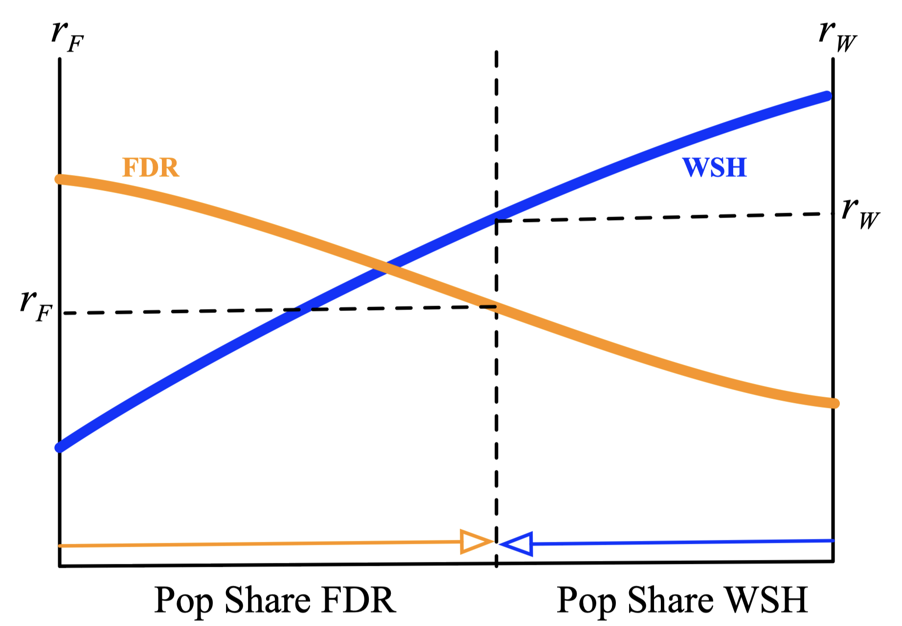
```

**Definición**: $r_j(n)$, $j=F,W$, es el retorno neto dado el número de usuarios $n$. Clave: $r_j'(n)<0$ 

---

## Anticomplemetariedad: Congestión como un ejemplo de convergencia

.center[**Historia de dos carreteras**]

```{r fig2, echo=FALSE, out.width="53%"}
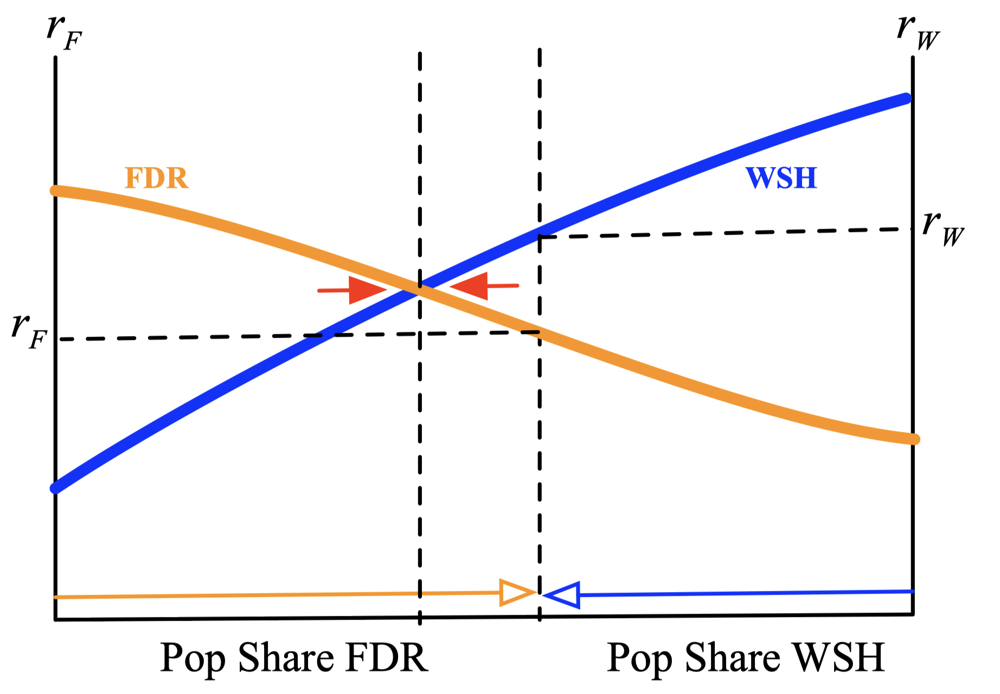
```

**Definición**: $r_j(n)$, $j=F,W$, es el retorno neto dado el número de usuarios $n$. Clave: $r_j'(n)<0$  

---

## Complemetariedad: QWERTY como un ejemplo de divergencia

.center[**Historia de dos tecnologías**]
```{r fig3, echo=FALSE, out.width="53%"}
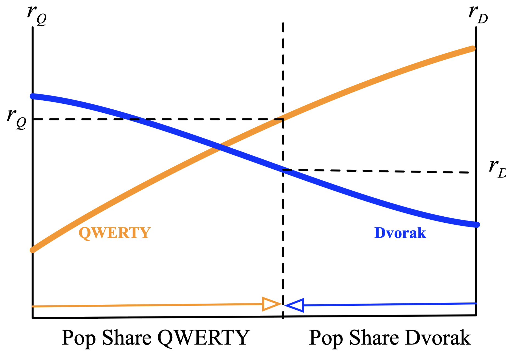
```

**Definición**: $r_j(n)$, $j=Q,D$, es el retorno neto dado el número de usuarios $n$. Clave: $r_j'(n)>0$  
---

## Complemetariedad: QWERTY como un ejemplo de divergencia

.center[**Historia de dos tecnologías**]
```{r fig4, echo=FALSE, out.width="53%"}
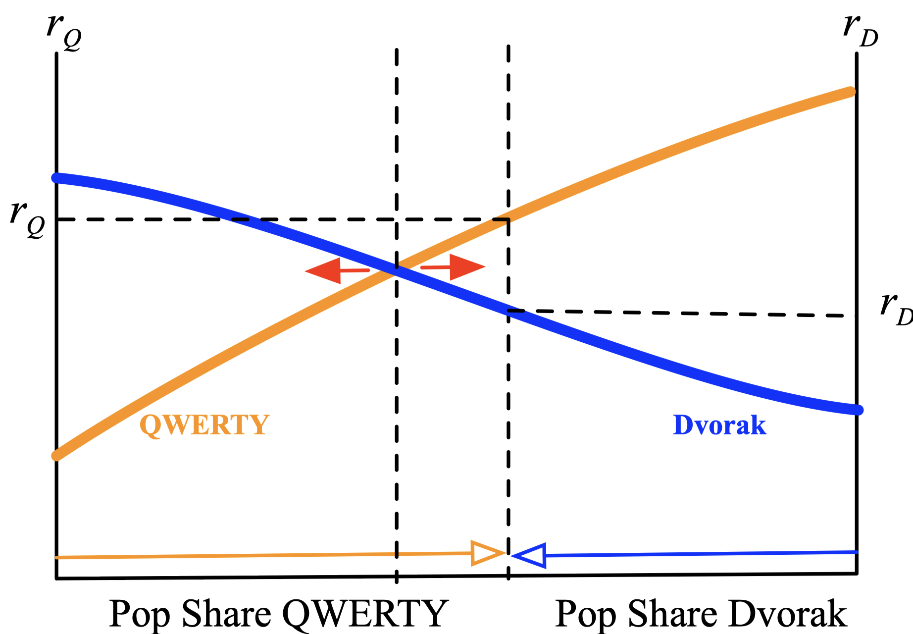
```

**Definición**: $r_j(n)$, $j=Q,D$, es el retorno neto dado el número de usuarios $n$. Clave: $r_j'(n)>0$  

---

## Otros ejemplos de complemetariedad

- **Plataformas**: Mac vs PC, iOS vs. Android, Facebook, AirBnB, Tinder, etc. 

  - Sitios con muchos usuarios son atractivos para nuevos usuarios por la complementariedad.

- **Infrastructure**: Sistema de transporte público donde $p=v+F/n$.
.   
  - Bajo número de usuarios $\rightarrow$ costo fijo por usuario alto $\rightarrow$ disuasión al uso $\rightarrow$  número de usuarios bajo.
  
- **Finanzas**: El mercado financiero es atractivo para las personas que buscan rendimientos seguros para sus activos.

  - Más usuarios $\rightarrow$ mayor flujo de dinero $\rightarrow$ mayor diversificación $\rightarrow$ más usuarios.
  
- **Corrupción**:

  - Evasión de impuestos alta $\rightarrow$ menor % de auditorias (costosas) $\rightarrow$ mayor incentivo a la evasión.

- **Normas sociales**:

  - Un mismo individuo puede comportarse de formas muy diferentes dependiendo de cómo se comportan los demás (diferentes sociedades y entornos).

---

## Mapa de Complementariedades

**Configuración básica:**

- Dos acciones o elecciones: llamémoslas QWERTY y DVORAK.

- $n$ = fracción de la población que **se espera** elija una determinada acción o elección (ejemplo: QUERTY)

- $x(n)$ = fracción de población que **quiere elegir** una acción (ejemplo QWERTY), bajo el expectativa de que $n$ lo hará.


**Complementariedad:** $x(n)$ es una función creciente. Cuanto mayor sea la fracción de personas $n$ que se espera que sean tomen una acción o elección, mayor será la fracción de personas $x(n)$ que querrán tomar dicha acción o elección. Matemáticamente, $x'(n)>0$.

  - Se puede generalizar esta idea a la **intensidad de las acciones o elecciones**, no solo binarias. Esto es, $x(n)$ es una función continua de $n$
  
  - El **mapa de complementariedad** es la representación de la conexión entre la “expectativa” $n$ con la “respuesta” $x(n)$. 
  
  - El **equilibrio** ocurre cuando $x(n) = n$. Entonces cada intersección del mapa con la diagonal es un equilibrio potencial.

---

## Mapa de Complementariedades: QWERTY Revisado

```{r fig6, echo=FALSE, out.width="100%"}
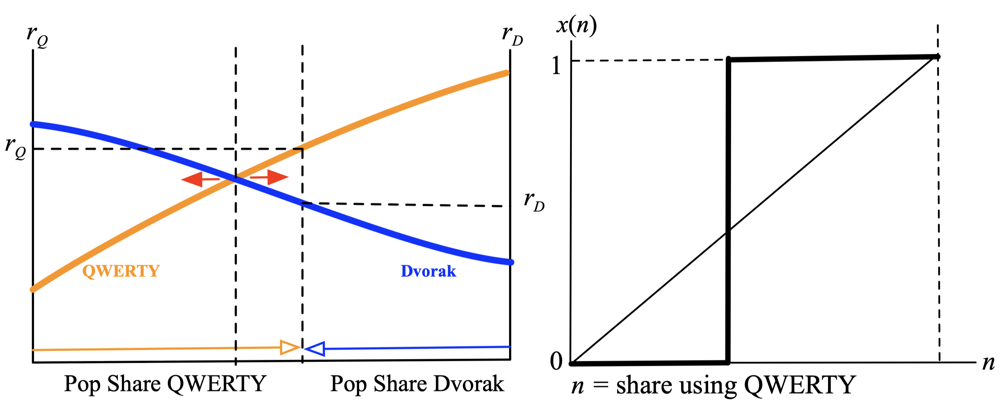
```

---

## Mapa de Complementariedades: Congestión revisado

```{r fig8, echo=FALSE, out.width="100%"}
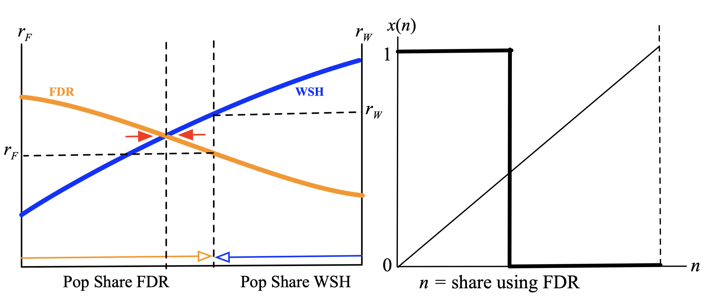
```

---

## Mapa de Complementariedades y multiplicidad de equilibrios

```{r fig9, echo=FALSE, out.width="100%"}
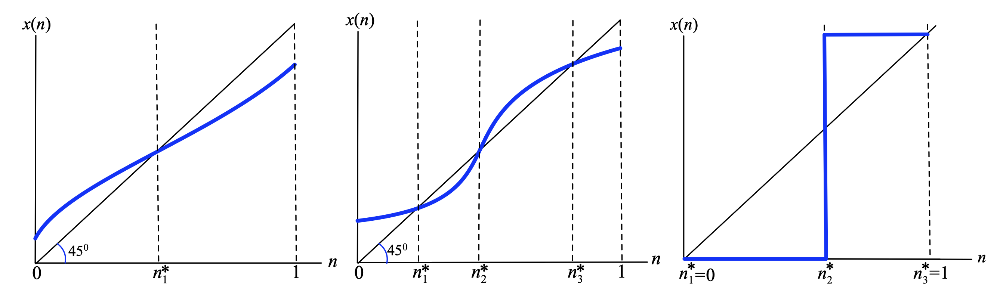
```

- **Equilibrios**: Intersecciones de $x(n)$ con la línea $45^{\circ}$.

- Resultados **únicos o múltiples**: ¿Cómo se relaciona esto con la convergencia y la divergencia?

---

## Equilibrios estables e inestables

```{r fig10, echo=FALSE, out.width="83%"}
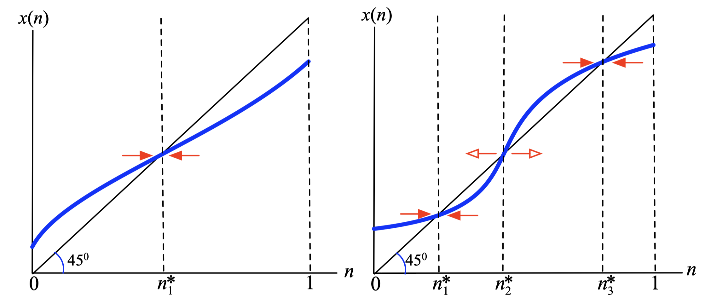
```

- **Estabilidad**: si el sistema retorna al equilibrio en el que se encuentra después de la perturbación. Si $x(n)$ cruza $45^{\circ}$ desde "arriba" (estable) o "abajo" (inestable).

- Discusión: Observe cómo las **políticas temporales** pueden tener **efectos permanentes**.

---

## Nota: multiplicidad de equilibrios como una falla de coordinación

**El dilema de los turistas** 

- Dos amigos están visitando la ciudad india de Mumbai.

- Se pierden y no saben dónde está cada uno.

- Cada uno "cree" que el otro acudirá a un conocido lugar "turístico" con la esperanza de que el otro piense lo mismo.

- Hay dos lugares posibles: Chowpatti Beach y Apollo Bunder.

- Matriz de pagos:

| | Chowpatti | Apollo |
|---|:---:|:---:|
|Chowpatti | (2,2) | (0,0) |
| Apollo |  (0,0) | (1,1) |

- **Lo mejor para ambos** sería encontrarse en Chowpatti, pero si la comunicación es limitada, es difícil que este resultado esté garantizado.

---

## Historia vs. expectativas

- Recuerde nuestra **configuración básica**:

  - Dos acciones o elecciones: llamémoslas QWERTY y DVORAK.

  - $n$ = fracción de la población que **se espera elija** QWERTY.

  - $x(n)$ = fracción de la población **que quiere elegir** QWERTY, bajo la expectativa de que $n$ lo hará.

- Basado en **expectativas**.

---

## Historia vs. expectativas

- Recuerde nuestra **configuración básica**:

  - Dos acciones o elecciones: llamémoslas QWERTY y DVORAK.

  - $n$ = fracción de la población que <s>se espera que elija</s> **eligió** QWERTY.

  - $x(n)$ = fracción de la población que quiere elegir QWERTY, bajo <s>la expectativa de que</s>  **observación de que**  $n$ lo hizo en el pasado.

  - Basado en la <s>expectativa</s> **historia**.

- Ejemplos:

  - **Expectativas**: Crisis de divisas, saqueos repentinos, moda....

  - **Historia**: Capital social, externalidades de red, discriminación...

*Generalmente tendremos una mezcla de historia y expectativas en todos los ejemplos*. 

---

## El mapa de complementariedad (nuevamente)

- Mapeo de $n$ la fracción **esperada (u observada)** para realizar una acción a $x(n)$ la fracción entonces incentivada a realizar esa acción.

- En este caso distinguimos entre **Equilibrios** (expectativas) o **estados estacionarios** (historia).

- Todo lo demás aplica a ambos conceptos. Note que la diferenciación es más un tema conceptual y de interpretación que metodológico.


---


## Ejemplo: unirse o no a la revolución

- Beneficios y costos:

  - Éxito: $B(x)$ a cada participante, con $x\in[0,1]$ la ubicación y $B'(x)<0$. 

  - Fracaso: $L$ a cada participante (ejemplo: encarcelamiento).

  - El espectador obtiene 0 recompensa sin importar lo que suceda.

- Probabilidad de éxito $p(n)$, donde $n$ es número de personas que se unen a la revolución.

  - $p'(n)>0$, $p(0)=0$ y $p(1)=1$. 

- ¿Si se espera que se unan $n$ personas, cuántas quieren unirse?
  
  - Unirse si: 
  $$p(n) B(x)-[1-p(n)] L>0$$

---

## Ejemplo: unirse o no a la revolución

```{r unirse_rev_1, echo=FALSE, out.width="83%"}
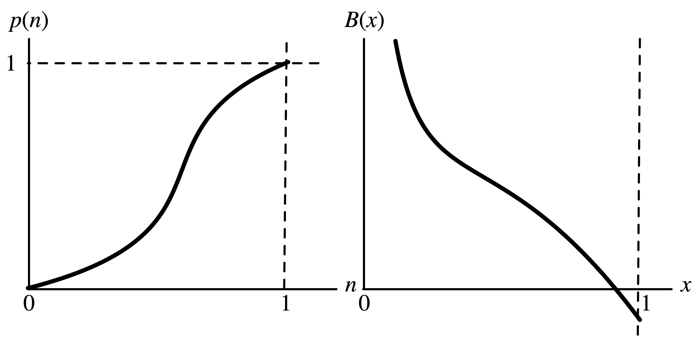
```
  
---

## Ejemplo: unirse o no a la revolución
  

.pull-left[
**Caso 1**: Beneficio uniforme $B(x)=B$

- Mapa de complementariedad es:
$$B>\frac{1-p(n)}{p(n)} L$$
- **Múltiples equilibrios**, con (y sin) revolución $n=1$ $(n=0)$.
]
.pull-right[
```{r unirse_rev_2, echo=FALSE, out.width="90%"}
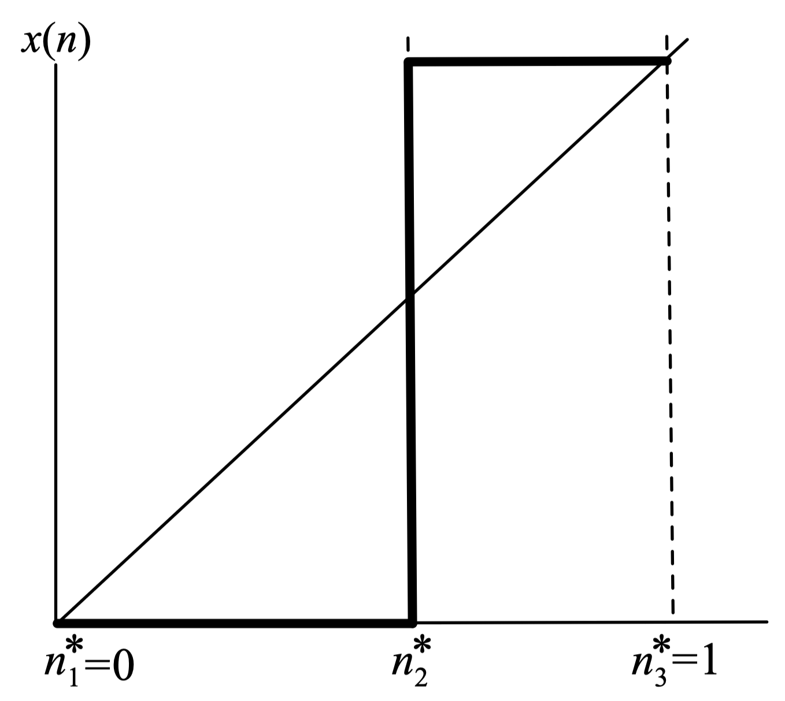
```
]


---

## Ejemplo: unirse o no a la revolución

.pull-left[
**Caso 2**: Beneficio uniforme $B(x)=\frac{1-x}{x}$ y $p(n)=n$

- Mapa de complementariedad es:
$$\frac{1-x(n)}{x(n)}>\frac{1-n}{n} L$$
- Entonces:
$$x(n) = \min\left\{1, \frac{n}{n + (1-n)L}\right\}$$
- Para cualquier parámetro $L>1$ tenemos que $x(n)<n$ cuando $n>0$. **La revolución no ocurre**.

- ¿Qué sucede para $L<1$?.
]
.pull-right[
```{r unirse_rev_3, echo=FALSE, out.width="90%"}
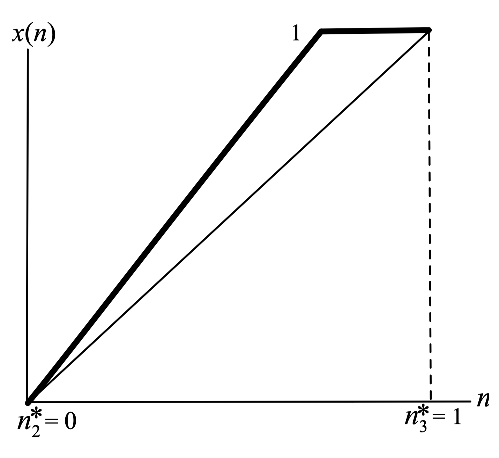
```
]

---

## Ejemplo: unirse o no a la revolución

.pull-left[
**Caso 3**: Beneficio uniforme $B(x)=\frac{1-x}{x}$ y $p(n)=n^2$

- Mapa de complementariedad es:
$$\frac{1-x(n)}{x(n)}>\frac{1-n^2}{n^2} L$$
- Entonces:
$$x(n) = \min\left\{1, \frac{n^2}{n^2 + (1-n^2)L}\right\}$$
- $L \leq 1$: en el equilibrio estable **La revolución no ocurre**.

- $L>1$: **múltiples equilibrios**, con (y sin) revolución cuando $x(n)<n$ $(x(n)>n)$ 
]
.pull-right[
```{r unirse_rev_4, echo=FALSE, out.width="90%"}
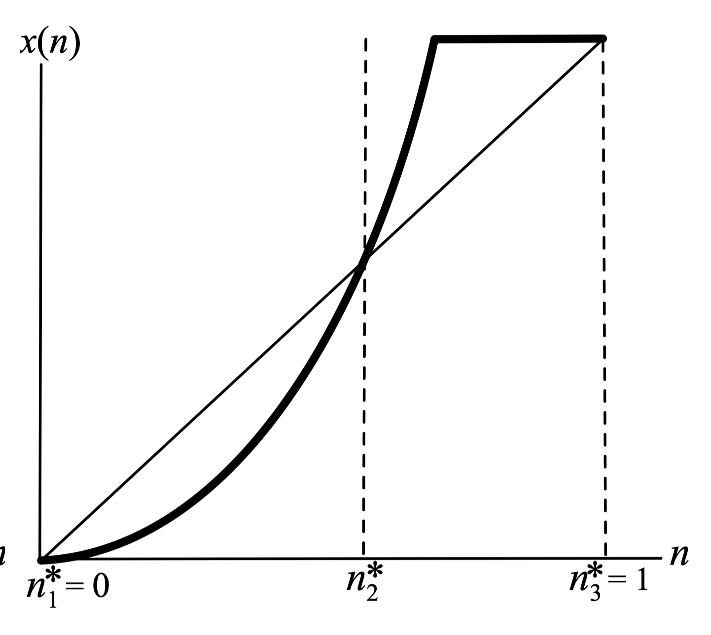
```
]