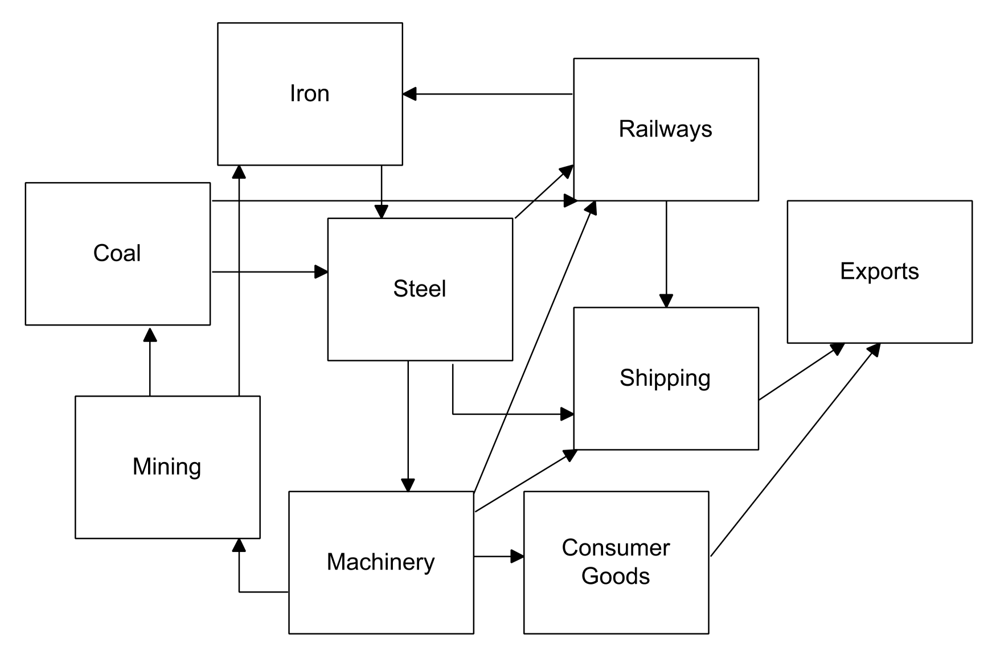
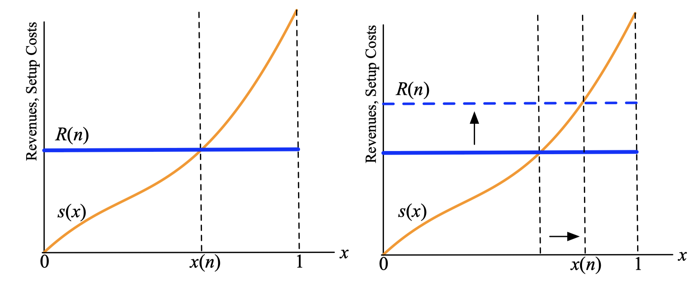
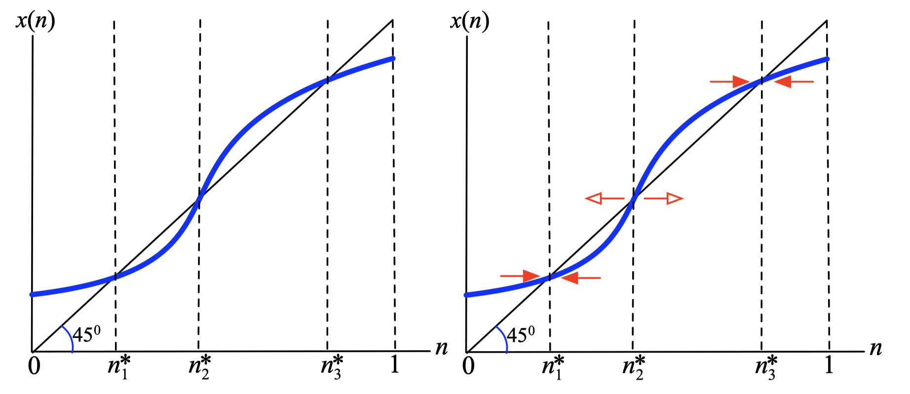
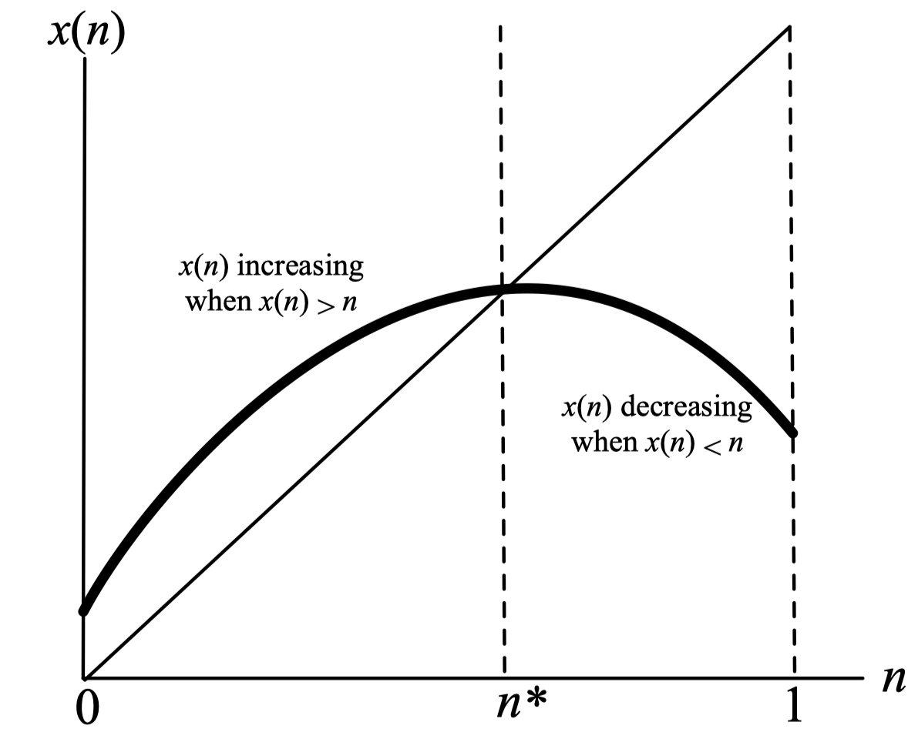
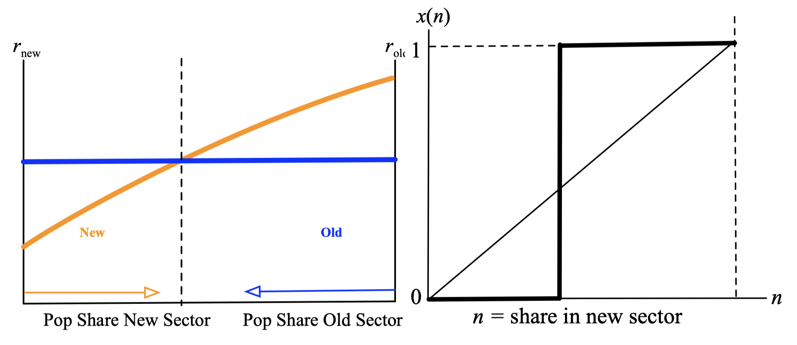

layout: true

<div class="my-footer"></div> 

---

```{r setup, include=FALSE}
knitr::opts_chunk$set(echo = FALSE, fig.align = "center",
                      message = FALSE, warning = FALSE)
knitr::opts_chunk$set(fig.dim = c(9, 6), fig.retina = 2, out.width = "100%")
```

```{r xaringan-themer, include=FALSE, warning=FALSE}
library(xaringanthemer)
library(readxl)

style_duo_accent(primary_color = "#3d5a80",
                 secondary_color = "#dedede",
                 text_bold_color = "#ee6c4d",
                 text_font_family = "Droid Serif",
                 text_font_url = "https://fonts.googleapis.com/css?family=Droid+Serif:400,700,400italic",
                 header_font_google = google_font("Yanone Kaffeesatz"),
                 base_font_size = "20px",
                 code_font_size = "0.9rem")

```

class: separator-blue, middle

# El subdesarrollo como un equilibrio entrampado

---

## Inversiones y complementariedades en la demanda

- Las complementariedades generalizadas pueden conducir a la economía a entramparse en un **equilibrio malo o de bajo nivel**, siendo que existe otro mejor si todos los agentes pudieran coordinar sus acciones para alcanzarlo.

- El subdesarrollo es el resultado de una **falla de coordinación**, en la cual la inversión no ocurre porque otras inversiones no han sido hechas.

- Rosenstein-Rodan (1943) y Murphy-Shleifer-Vishny (1989): La expansión industrial aumenta los ingresos, lo cual genera demanda de otras industrias.

- La inversión industrial genera **externalidades**:

  1. Beneficio de la empresa $\mapsto$ mayor ingreso nacional.

  2. Salarios más altos para los trabajadores, $\mapsto$ mayor ingreso nacional.

  3. La demanda de insumos (ganancias de otras empresas) $\mapsto$ mayor ingreso nacional.

- Una empresa que invierte lo hace fijándose en los **retornos privados** y no se preocupa directamente por estos **efectos nacionales**. 

---

## Inversiones y complementariedades en la demanda


**Vínculos intersectoriales y complementariedades** (Rosenstein-Rodan 1943, Hirschman 1958)

.pull-left-1[

- **vínculos hacia adelante**: 

  Inversión $\downarrow$ $\Rightarrow$ producción $\downarrow$ se propaga “hacia adelante” $\Rightarrow$ escasez de insumos para otros sectores $\Rightarrow$ inversión otros sectores $\downarrow$ (y viceversa).

- **vínculos hacia atrás**:

  Inversión $\downarrow$ $\Rightarrow$ producción $\downarrow$ se propaga “hacia atrás” $\Rightarrow$ sectores que usan mi producto como insumo tendrán baja demanda $\Rightarrow$ inversión en mi sector $\downarrow$ (y viceversa).
  
]
.pull-right-2[
```{r fig1, echo=FALSE, out.width="100%"}

```
]

---

## Mapa de complementariedad para el proceso de industrialización

- Supongamos que una economía tiene muchas empresas.

- Cada empresas está indexadas por $x$ en el intervalos $[0,1]$:

- La empresa puede usar un método de **producción simple**, o puede **invertir** y aumentar su producción utilizando una **tecnología altamente productiva**.

- La nueva tecnología es productiva pero es **costosa de implementar**. Los empresas con $x$ de bajotienen costos de instalación más bajos.

- Cada uno puede estar **inactivo o invirtiendo**.

  - Inactividad $\mapsto$ bajo beneficio (normalizamos a 0)

  - Inversión  $\mapsto$ ingresos $R(n)$ (depende de cuántas empresas $n$ inviertan, vínculos sectoriales)

- **Beneficios netos** de una empresa inversora 
$$x: \pi(n, x) \equiv R(n)-s(x)$$
donde $s(x)$ es el costo de instalación específico de la empresa $x$. 

---

## Mapa de complementariedad para el proceso de industrialización

Ordenemos las empresas de menor a mayor costo de instalación en $s(x)$. El **Mapa de complementariedad** es $n \mapsto R(n) \mapsto x(n)$ donde $x=x(n)$ es el índice más grande tal que $\pi(x, n)=R(n)-s(x) \geq 0$.

```{r fig2, echo=FALSE, out.width="85%"}

```

Siempre que $R(n)$ sea creciente en $n$, $x(n)$ también lo será.
---

## Mapa de complementariedad para el proceso de industrialización

```{r fig3, echo=FALSE, out.width="80%"}

```

En el punto $n_{1}^{*}$, solo las empresas hasta $x\left(n_{1}^{*}\right)$ quieren invertir (equilibrio localmente estable).

En $n_{3}^{*}$ todas las empresas están mejor, pero ninguna empresa puede alcanzarlo unilateralmente desde $n_{1}^{*}$. Se requeriría un **big push**.
  
---

## Mapa de complementariedad para el proceso de industrialización

- Hemos discutido las **externalidades** creadas por cada empresa al **invertir**.  

  - Dado que las empresas invierten mirando la rentabilidad privada, los resultados en equilibrio podrían ser ineficientes y podrían existir múltiples equilibrios con diferentes niveles de eficiencia.
  
- Adam Smith en **La Riqueza de las Nacionaes** defiende la idea que los precios de mercado y los intereses privados serán suficientes para manejar todos los beneficios sociales.

  - ¿Puede calzar esta historia con nuestro mapa de complementariedad?

- Miremos el caso en que al argumento de Adam Smith funciona. 

  - Supongamos que solo hay una externalidad del acto de inversión: las ganancias de la empresa aumentan el ingreso nacional y estimulan otras inversiones.
  
  - Si bien las empresas no están interesadas en aumentar el ingreso nacional, su búsqueda de ganancias puede incentivarlos a actuar por el bien de la sociedad.
  
---

##EL MAPA DE COMPLEMENTARIEDAD PARA LA INDUSTRIALIZACIÓN

.pull-left[
- Mapa de complementariedad con una forma particular: 

  - $x(n)>n$: la empresa marginal $x(n)$ supera a la última empresa $n$ que se espera invierta, pero $n$ tiene un costo de instalación más bajo que $x(n)$ $\Rightarrow$ ganancia positiva $\Rightarrow$ ingreso nacional $\uparrow$
  
  - $x(n)<n$: la empresa $n$ que se espera invierta excede a la empresa marginal $x(n)$ $\Rightarrow$ ganancia negativa $\Rightarrow$ ingreso nacional $\downarrow$

**Intuición**: Las complementariedades duran mientras el beneficio de la industrialización sea positivo. 
]

.pull-right[
```{r fig4, echo=FALSE, out.width="100%"}

```
]


*Pero el beneficio privado no es la única contribución de nuestra empresa a otras empresas.*

---

# Rompiendo un mal equilibiro: Debáte de política

.content-box-red[
Los equilibrios o estados estacionarios **múltiples**  que surgen a partir de **complementariedades** tienen una característica distintiva: las **políticas temporales** pueden tener **efectos permanentes**.
]

- Estos modelos sientan una base (limitada) para los debates políticos (Rosenstein-Rodan, 1943,1961; Nurkse, 1952,1953; Hirschman, 1958):

- **Política del big push de Rosenstein-Rodan**: Una política capaz de aumentar simultáneamente la inversión en muchos sectores diferentes de la economía.
  
- **Características**: 
  
  (1) Requiere una inversión masiva (presumiblemente pública) en muchos sectores diferentes de la economía a la vez.
  
  (2) Es necesario tener una idea cuantitativa de la distribución de la inversión entre los sectores (mezcla correcta de inversiones).


---

# Rompiendo un mal equilibiro: Debáte de política

- Algunos problemas con la idea Rosenstein-Rodan:

  - Los requerimientos informacionales y el tamaño de las inversiones (en ese orden) son problemáticos.
  
  - La política no explota el hecho que el resultado deseado también es un equilibrio (incentivos que corrijan la falla de coordinación).

- **Propuesta de Hirschman**: En luigar de usar el big push (homologo de crecimiento equilibrado), usar una política deliberada de crecimeinto desequilibrado.

- Promover el desarrollo de ciertos sectores de la economía de tal manera que los vínculos generen inversiones espontáneas. 

- ¿Cómo elegir un sector líder?: 

  (1) Vínculos y fuerza de los vínculos.
  
  (2) Invertir en la actividad menos rentable (que tenga vínculos).

---

## Transiciones: ¿por qué la historia importa?

Externalidades rezagadas; nadie quiere ir primero...

```{r fig5, echo=FALSE, out.width="80%"}

```

- **La historia es el punto inicial** ¿Quién se mueve de al equilibrio si los rendimientos tardan en acumularse? QWERTY vs. moda (historia vs. creencias) 

---

## Resumen

- Complementariedades y equilibrios (o estados estacionarios) múltiples.

  - Equilibrios típicamente rankeados según Pareto.

   - Dos sociedades fundamentalmente idénticas pueden comportarse de manera diferente.

- Las complementariedades cambian la forma en que pensamos acerca de la política pública.

  - Intervenciones temporales versus permanentes; p.ej.: amnistías, salario mínimo, multas temporales, big psuh, acción afirmativa.

- **¿Qué sigue?** Caída en la fertilidad en Bangladesh (transiciones en equilibrio) de Munshi y Myaux (JDE 2006)

  - Complementariedades, omisión de variables, y problemas de identificación.

