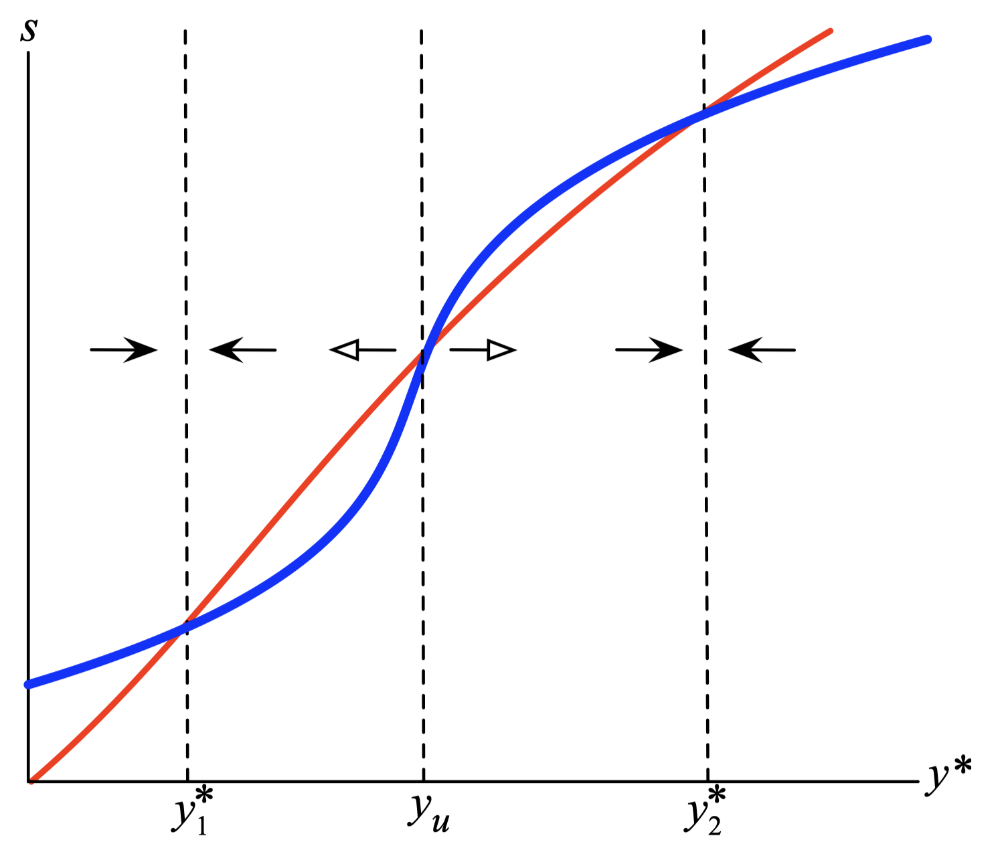
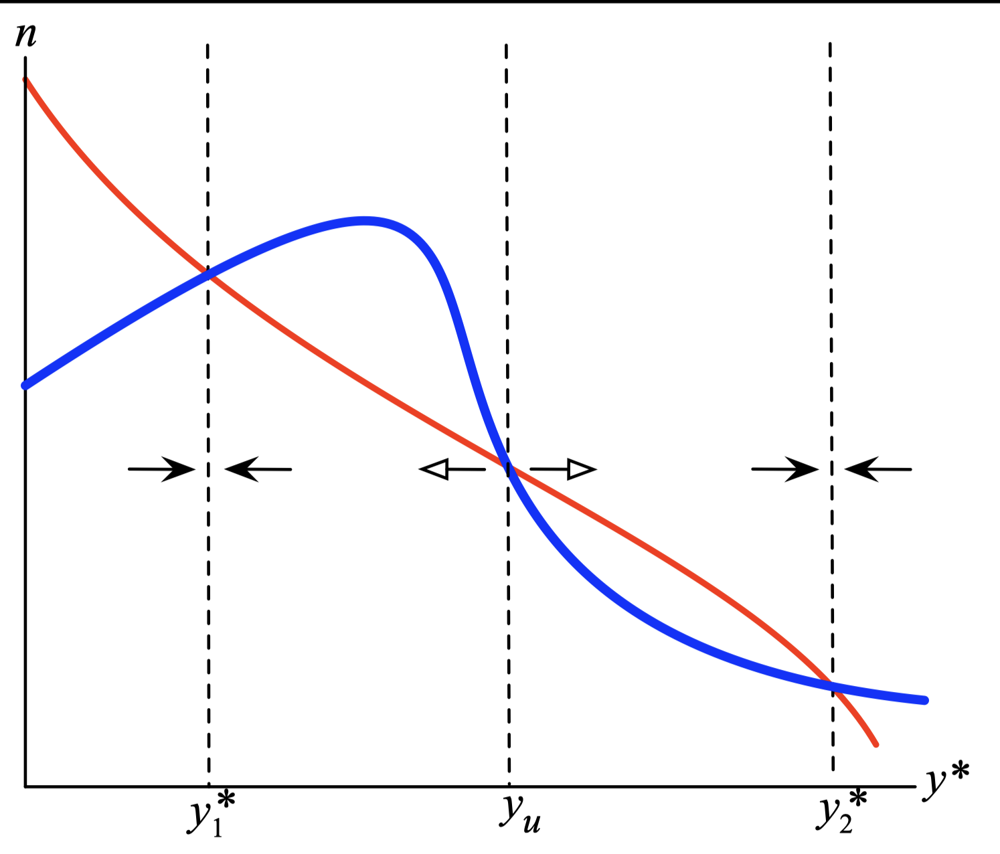
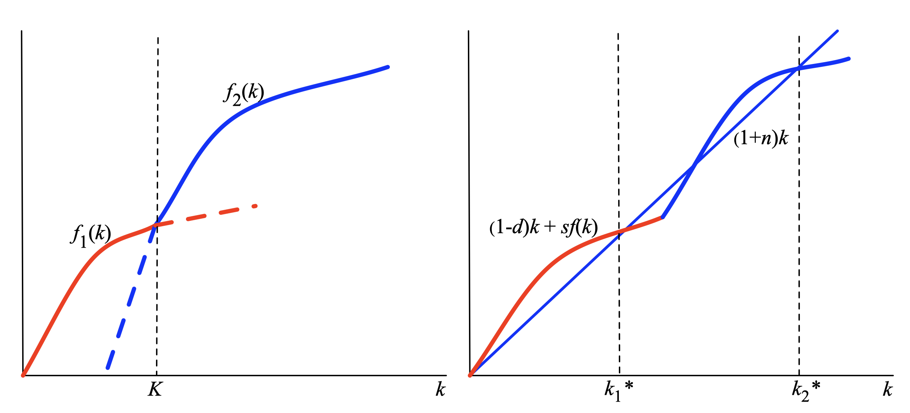

layout: true

<div class="my-footer"></div> 

---

```{r setup, include=FALSE}
knitr::opts_chunk$set(echo = FALSE, fig.align = "center",
                      message = FALSE, warning = FALSE)
knitr::opts_chunk$set(fig.dim=c(9, 6), fig.retina=2, out.width="100%")
```

```{r xaringan-themer, include=FALSE, warning=FALSE}
library(xaringanthemer)
library(readxl)

style_duo_accent(primary_color = "#3d5a80", 
                 secondary_color = "#dedede",
                 text_bold_color = "#ee6c4d",
                 text_font_family = "Droid Serif",
                 text_font_url = "https://fonts.googleapis.com/css?family=Droid+Serif:400,700,400italic",
                 header_font_google = google_font("Yanone Kaffeesatz"),
                 base_font_size = "20px",
                 code_font_size = "0.9rem")

```


class: separator-blue, middle

# Dependencia histórica

---

## Dependencia histórica

Murray Gell-Mann, Premio Nobel de Física 1969: 

> Jorge Luis Borges escribió una historia sobre alguien que hizo un modelo con posibles historias alternativas para el universo, en forma de un jardín de senderos que se bifurcan... La historia que realmente se observa está co-determinada por simples leyes fundamentales y por una secuencia inconcebiblemente larga de accidentes o eventos fortuitos, que pueden ocurrir de varias maneras y sólo se puede predecir de antemano las probabilidades de ocurrencia de los diferentes resultados... algunos de estos accidentes producen una gran cantidad de impacto en el futuro. A esos los podemos llamar **accidentes congelados**. 

---

## Dependencia histórica

- **Retroalimentación macroeconómica**

  - Resultados que afectan parámetros aparentemente exógenos, como $s$ o $n$.

  - Desigualdad autosostenida.

- **Rendimientos crecientes a escala**

  - Costos fijos para iniciar un negocio o emprendimiento. 
  
  - Aprendizajes en la práctica (*learning by doing*).

- **Sesgos por el statu quo**

  - Afecta la dirección del cambio.

- **Industrias extractivas e instituciones coloniales**

  - Influencia sobre los esquemas políticos y legales posteriores.

---

## Retroalimentación macroeconómica: Endogeneidad de $s$

.pull-left-2[
```{r fig1, echo=FALSE, out.width="85%"}

```
]

.pull-right-1[
- .blue[Línea Azul]: Cómo se ve afectado $s$ por el ingreso en estado estacionario $y^{*}$.

  - bajo ingreso (subsistencia) $\Rightarrow$ bajo ahorro.

  - ingreso medio (aspiraciones) $\Rightarrow$ aumenta el ahorro.

  - ingreso alto (aspiraciones alcanzadas) $\Rightarrow$ baja el ahorro.

- .red[Línea Roja]: cómo el ingreso $y^{*}$ está determinado por $s$.

  - Modelo de Solow.
]
---

## Retroalimentación macroeconómica: Endogeneidad de $n$

.pull-left-2[
```{r fig2, echo=FALSE, out.width="85%"}

```
]

.pull-right-1[
- .blue[Línea Azul]: Cómo $n$ se ve afectado por el ingreso de estado estacionario $y^{*}$.

  - bajo ingreso $\Rightarrow$ mortalidad alta y natalidad alta.
  
  - ingreso medio $\Rightarrow$ mortalidad cae y natalidad se ajusta lentamente.
  
  - ingreso alto $\Rightarrow$ mortalidad baja y natalidad baja.

- .red[Línea Roja]: Cómo $y^{*}$ está determinado por $n$. 

  - Modelo de Solow. 
]
---

## Rendimientos crecientes: Modelo de crecimiento

- Función de producción: $y=f(k)$, pero $f$ tiene dos tecnologías integradas.

- $f_{1}(k)=A k^{\alpha}$ y $f_{2}(k)=B k^{\beta}-C$, con $B \gg A$ y $C$ es un costo hundido.

```{r fig3, echo=FALSE, out.width="85%"}

```

---

## Rendimientos crecientes: Iniciando un negocio

.pull-left[
```{r fig4, echo=FALSE, out.width="100%"}
knitr::include_graphics("img/fig4.png")
```
]

.pull-right[
**Ejemplo**: Empresa establecida (digamos autos convencionales) vs. Empresa nueva que busca entrar (nuevo autos híbridos).

- **Clave**: Retornos Crecientes a Escala $\rightarrow$ La escala permite reducir costos.

- Cuando una empresa entra tienen que soportar pérdidas por el periodo de **transición**. Si no lo hace no habrá entrada.


- Razones:

  - Altos costos para escala pequeña. 

  - Cambio gradual.

  - Mercados de capitales imperfectos.
]
---

## Rendimientos crecientes: Producción circular

- Función de producción:
$$Y=\left[Q_{1}^{\alpha}+Q_{2}^{\alpha}+\cdots+Q_{n }^{\alpha}\right]^{1 / \alpha}$$

  - El presupuesto de capital disponible es de $K$.

  - Una unidad de $K$ hace una unidad de cualquier intermedio: $Q_i=K$.

- Función de producción indirecta: dividir $K$ en partes iguales entre $n$, por lo que:
$$Y=\left[n\left(\frac{K}{n}\right)^{\alpha}\right]^{1 / \alpha}=n^{(1-\alpha) / \alpha} K$$

  - La productividad total de los factores (PTF) aumenta con el número de intermediarios.

- Imagine un costo fijo a pagar por cada nuevo bien intermedio utilizado.

  - Producción a pequeña escala $\Rightarrow$ pocos productos intermedios $\Rightarrow$ PTF es baja $\Rightarrow$ ingresos bajos $\Rightarrow$ demanda baja $\Rightarrow$ producción a pequeña escala

---

## Sesgo por Status Quo

- **Fernández y Rodrik (1991)**: Piensen en un proyecto que debe ser votado para su aprobación. Todo proyecto tiene ganadores y perdedores. 

- Suponga que no hay un mecanismo de compensación de ganadores a perdedores. 

- El **proyecto propuesto** paga $+1$ a un beneficiario y $-1$ a un perdedor. Si el proyecto no pasa todos quedan con 0.

- Se sabe que $70\%$ serán beneficiarios. Casos:

  1. Identidad del beneficiario desconocida: todos votan sí, proyecto pasa.
  $$0.7(1) + 0.3(-1) = 0.4 > 0$$

  2. Se conoce la identidad del beneficiario: $70 \%$ vote sí, se aprueba el proyecto.

  3. Identidad del beneficiario parcialmente conocida: Digamos que el $45\%$ sabe que se beneficiará. ¡Entonces el resto vota no!
  $$0.25(1) + 0.75(-1) = -0.5 < 0$$

- El proyecto (una vez dentro) será rechazado. Pero si no existe, no se vota.

---

## Instituciones

.content-box-red[
**Instituciones**: Reglas ambientales (formales o informales) para la conducción y ordenamiento de relaciones económicas, sociales y políticas.
]

Ejemplos:

- Protegen los derechos de propiedad (aplicación de la ley).

- Proporcionan pensiones de vejez (seguridad social).

- Proporcionan un seguro contra una crisis bancaria (Banco Central, Super. de Bancos).

- Habilitan participaciones financieras en empresas (el mercado de valores).

- Garantizan que los contratos se cumplirán (tribunales).

- Supervisan elecciones seguras y justas (Comisiones Electorales, Ej. SERVEL).

- Generan normas de reciprocidad y sanciones (informales).

---

## Instituciones

- Las **buenas instituciones** económicas promueven la inversión y el crecimiento

- Pero la creación de instituciones está profundamente condicionada por la historia.

- Las **malas instituciones** (como las autocracias) se autogeneran o generan peores
instituciones (dictaduras), ya que los beneficiarios luchan por mantener sus beneficios.

- Sokoloff y Engerman (2000) a propósito de América del Norte y América del Sur:

> Voltaire, por ejemplo, pensó que el conflicto entre franceses y británicos en América del Norte, durante la Guerra de los Siete Años (1756-63), era una locura y lo caracterizó como dos países luachando por unos pocos acres de nieve. Los británicos victoriosos participarían más tarde en un acalorado debate público sobre qué territorio debe tomarse de los franceses como reparación, la isla caribeña de Guadalupe (con una superficie de 563 millas cuadradas) o Canadá!!

---

## Instituciones

**América del Sur**: 

- Enormes riquezas minerales, mucha mano de obra nativa.

- Economías extractivas (derechos mineros, tributos, etc.).

- Economías de plantación con mano de obra esclava; pocos grandes terratenientes.

- Derechos cedidos en forma controlada y restringida. 

  - Ejemplo: estrictas restricciones a la migración al Nuevo Mundo.

  - $\Rightarrow$ élite desigualmente situada que trató de aferrarse al poder.

- Restricciones al comercio y participación política.

  - Ejemplo: era necesario poseer una gran cantidad de tierra para poder votar.

---

## Instituciones

**América del Norte**: EE. UU. y Canadá

- Sin grandes cantidades de mano de obra nativa.

- Sin clima apropiado para plantaciones de azúcar excepto en el Sur (pero incluso ahí, el tamaño de las plantaciones de azúcar era relativamente pequeño).

- Trabajadores de ascendencia europea, igualdad en el capital humano.

- Latifundios relativamente pequeños, inmigración abierta.

- Dificultad para crear instituciones con poder político desigual.

- Votación restringida al principio, pero la franquicia se extendió rápidamente. 
  
---

## Instituciones
  
- Sokoloff y Engermann (2000) concluyen:

> "Estas primeras diferencias en el grado de desigualdad entre las economías del Nuevo Mundo pueden haber sido preservadas por los tipos de instituciones económicas y por los efectos de esas instituciones sobre el acceso a oportunidades económicas. Este camino de desarrollo institucional puede haber afectado el crecimiento económico. Donde había una desigualdad extrema, y las instituciones favorecían a las élites y limitaban el acceso de gran parte de la población a las oportunidades económicas, los miembros de las élites podían mantener mejor su estatus de élite a lo largo del tiempo, pero a costa de que la sociedad no se diera cuenta del potencial económico de los grupos desfavorecidos... [E]stos sesgos en los caminos del desarrollo institucional probablemente explican en gran medida la persistencia de la desigualdad a largo plazo en América Latina y en otras partes del Nuevo Mundo".


