layout: true

<div class="my-footer"></div> 

---

```{r setup, include=FALSE}
knitr::opts_chunk$set(echo = FALSE, fig.align = "center",
                      message = FALSE, warning = FALSE)
knitr::opts_chunk$set(fig.dim=c(9, 6), fig.retina=2, out.width="100%")
```

```{r xaringan-themer, include=FALSE, warning=FALSE}
library(xaringanthemer)
library(readxl)

style_duo_accent(primary_color = "#3d5a80", 
                 secondary_color = "#dedede",
                 text_bold_color = "#ee6c4d",
                 text_font_family = "Droid Serif",
                 text_font_url = "https://fonts.googleapis.com/css?family=Droid+Serif:400,700,400italic",
                 header_font_google = google_font("Yanone Kaffeesatz"),
                 base_font_size = "20px",
                 code_font_size = "0.9rem")

```


class: separator-blue, middle

# El retorno de la desigualdad

---

## El retorno de la desigualdad

- La crisis financiera de 2008 despertó un **nuevo interés por la desigualdad**. La pandemia del COVID-19 también dio un impulso al estudio de esta materia.

- Si bien este renovado interés es realtivamente nuevo, la desigualdad tiene larga data y ha sido **históricamente alta**.

- De hecho ha venido creciendo de forma constante hasta finales del siglo XX (Wolff, Piketty, Saez, Atkinson, y muchos otros)

- **Libro reciente**: Piketty, T. (2014) Capital in the Twenty-First Century. Harvard University Press, Cambridge, MA.

  - El apéndice en línea http://piketty.pse.ens.fr/capital21c contiene métodos y datos.

- El trabajo de Piketty:

  - Trajo la creciente desigualdad a la conciencia pública.

  - Resumió la evidencia de forma convincente y útil.

  - Fue un gran éxito en los Estados Unidos porque tocó un nervio dentro de la sociedad estadounidense. No obstante, el fenómeno es más extendido que solo EEUU.

---

## El retorno de la desigualdad

```{r fig1, echo=FALSE, out.width="75%"}
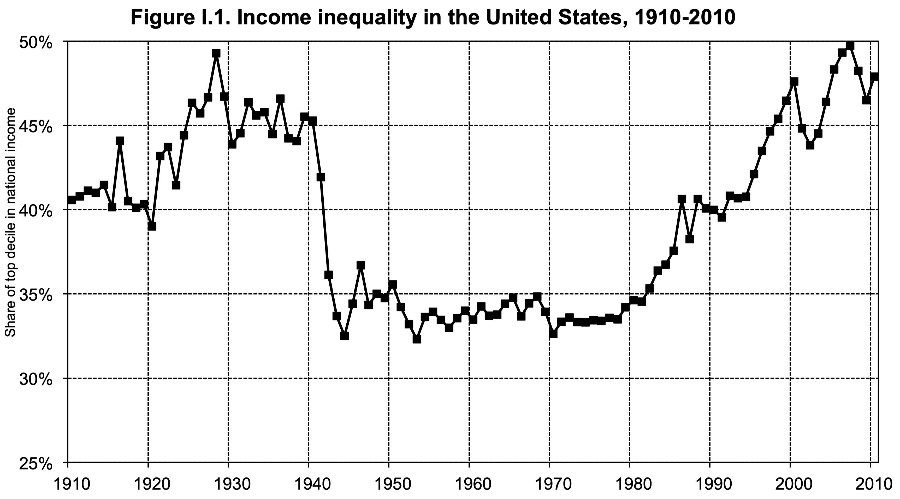
```

.small[*Fuente: Piketty (2014)*]

---

## El retorno de la desigualdad

```{r fig2, echo=FALSE, out.width="73%"}
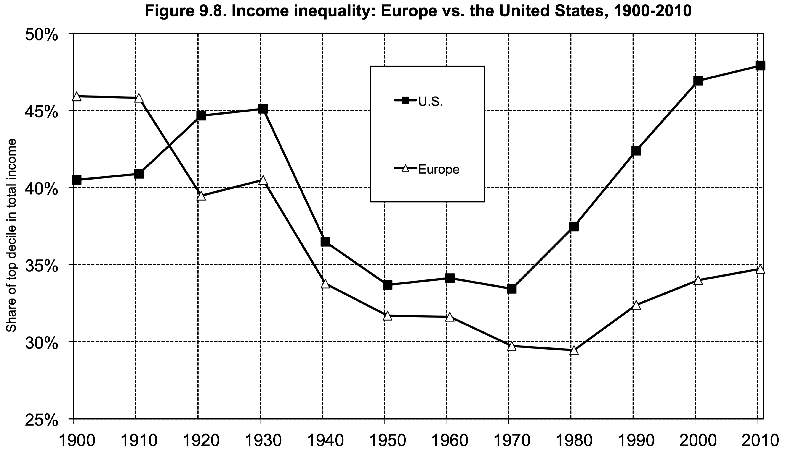
```

.small[*Fuente: Piketty (2014)*]

---

## El retorno de la desigualdad

```{r fig3, echo=FALSE, out.width="73%"}
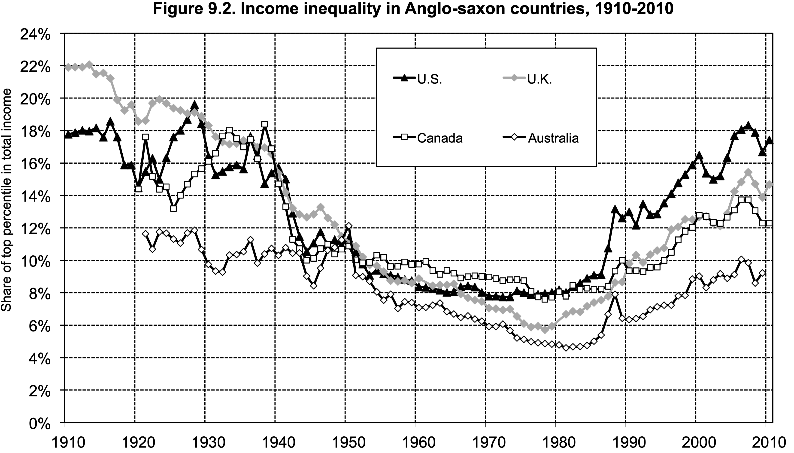
```

.small[*Fuente: Piketty (2014)*]

---

## El retorno de la desigualdad

```{r fig4, echo=FALSE, out.width="73%"}
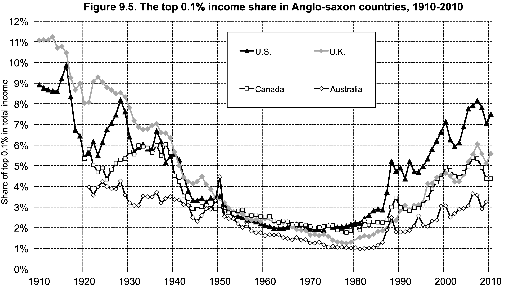
```

.small[*Fuente: Piketty (2014)*]

---

## Intrínseco vs. instrumental 

- El interes por el estudio de la desigualdad es tanto **intrínseco** como **instrumental** (o funcional).

- **Interéses intrínsecos**:

  - Medición de la desigualdad: evaluar y comparar (rankear) distribuciones.

  - Evolución de la desigualdad en las sociedades (por ejemplo, Piketty)

- **Interéses instrumentales**:

  - Desigualdad y varios resultados: crecimiento, nutrición, empleo.

  - Desigualdad y dependencia histórica.

  - Desigualdad e incentivos.


---
class: separator-blue, middle

# Conceptualizar y medir la desigualdad

---

## Conceptualizar y medir la desigualdad

- Sea la siguiente **distribución del ingreso** $\left(y_{1}, \ldots, y_{N}\right)$.

  - Una medida de desigualdad asigna cada vector $\left(y_{1}, \ldots, y_{N}\right)$ a un número.

  - Las clasificaciones/rankings importan, no los números absolutos/exactos.

  - Enfoque axiomático.

- **Principio de anonimato**: 

  - Los nombres no importan.

  - Reescribamos la distribución de ingresos como $$\left(y_{1}, N_{1} ; y_{2}, N_{2} ; \ldots ; y_{m}, N_{m}\right)$$ 
  
  - $m$ es el número de ingresos distintos, con $y_{1}<y_{2}<\cdots<y_{m}$.
  
  - $N_{i}$ es población con ingresos $y_{i}$.
  
  - Las permutaciones de ingresos entre las personas no deberían importar para juicios de desigualdad.

---

## Conceptualizar y medir la desigualdad

- **Principio de población**: 

  - La clonación de toda la población (y sus ingresos) no altera la desigualdad.

  - Solo es relevante la participación de la población $n_{i}=\frac{N_{i}}{N}$ con $\sum_{i=1}^{m} n_{i}=1$.

  - Clonar solo un segmento de la población y mantener el resto inalterado bien puede afectar la desigualdad.
  
- **Principio de Renta Relativa**: 

  - Escalar hacia arriba o hacia abajo los ingresos no afecta la desigualdad.

  - Las medidas de desigualdad de $\left(y_{1}, \ldots, y_{N}\right)$ y $\left(\lambda y_{1}, \ldots, \lambda y_{N}\right)$, $\lambda>0$, son las mismas.

  - Por supuesto, los ingresos absolutos son centrales en la evaluación general del desarrollo.

---

## Conceptualizar y medir la desigualdad

- **Principio de Transferencias de Pigou-Dalton**:

  - Una transferencia de ingresos de los individuos relativamente pobres a los relativamente ricos debe aumentar la desigualdad (*transferencias regresivas*).

  - El principio Se aplica siempre que podamos ver dos distribuciones de ingresos conectadas por una cadena de transferencias regresivas, hayan sucedido o no esas transferencias.

.content-box-red[
**Resumen**: Sea $I(\mathbf{y})$ una medida de desigualdad, donde $\mathbf{y}=\left(y_{1}, \ldots, y_{N}\right)$

- Anonimato: $I(\mathbf{y})=I(\sigma \mathbf{y})$, donde $\sigma$ es una permutación.

- Población: $I(\mathbf{y})=I(\mathbf{y}, \mathbf{y})$.

- Ingreso relativo: $I(\mathbf{y})=I(\lambda \mathbf{y})$ para todos los $\lambda>0$.

- Transferencias: $I(\mathbf{y})<I\left(y_{1}, \ldots, y_{i}-\delta, \ldots, y_{j}+\delta, \ldots, y_{N }\right)$
]
---

class: separator-blue, middle

# La Curva de Lorenz

---

## La Curva de Lorenz

.content-box-red[
Supongamos que ordenamos los miembros de una población en sentido ascendente según su ingreso. En el eje de abscisas representamos los porcentajes acumulados de la población ordenada en sentido ascendente según su ingreso. En el eje de ordenadas, medimos el porcentaje del ingreso nacional correspondiente a cada porcentaje de la población así ordenada. El gráfico resultante se denomina **curva de Lorenz**.
]

```{r fig5, echo=FALSE, out.width="83%"}
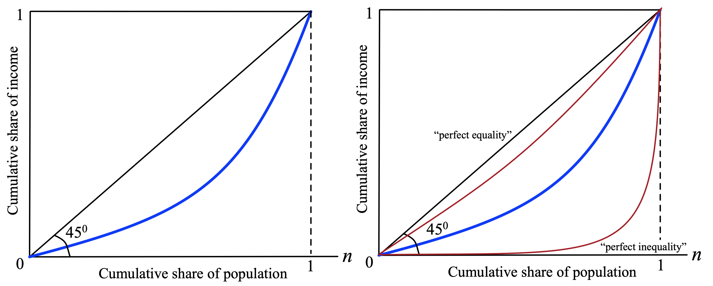
```


---

## La Curva de Lorenz

- Un ejemplo concreto ayuda:

```{r ejercicio_lorenz, echo=FALSE, out.width="95%"}
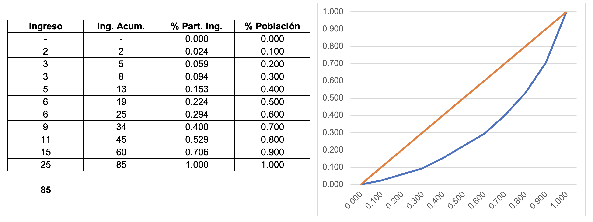
```

---

## El criterio de Lorenz

.pull-left-1[
- Establece que si la curva de Lorenz de una distribución $L(2)$ se encuentra siempre abajo (a la derecha) de la curva de Lorenz de otra $L(1)$, la primera debe considerarse más desigual que la segunda.

- Si $L(2)$ representa a la distribución $\left(y_{1}, y_{2}, \ldots, y_{n}\right)$, y $L(1)$ representa a la distribución $\left(z_{1}, z_{2}, \ldots, z_{m}\right)$, entonces:
$$\begin{equation}
I\left(y_{1}, y_{2}, \ldots, y_{n}\right) \geq I\left(z_{1}, z_{2}, \ldots, z_{m}\right)
\end{equation}$$

]

.pull-right-2[
```{r fig6, echo=FALSE, out.width="90%"}
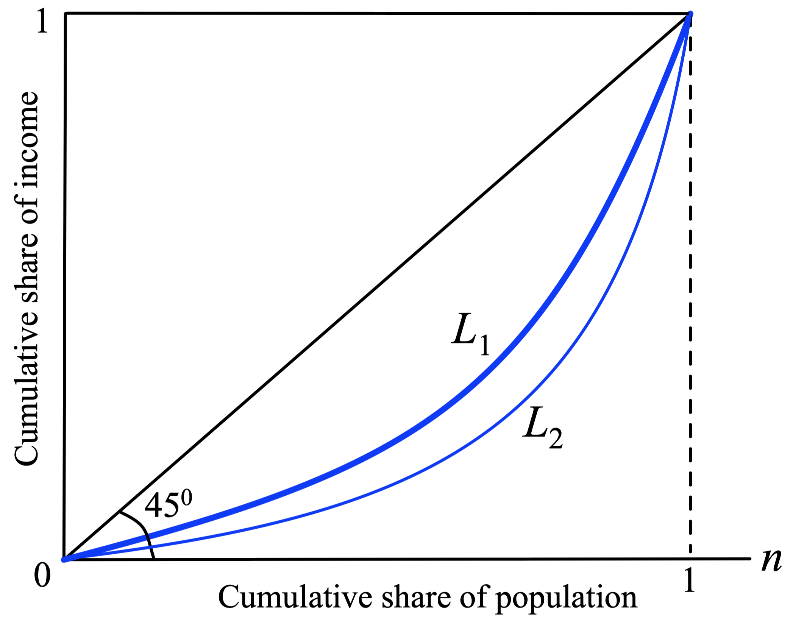
```
]
---

## El criterio de Lorenz

- Una medida de desigualdad $I$ es **consistente en el sentido de Lorenz** si concuerda con el criterio de Lorenz siempre que una curva de Lorenz se encuentre completamente debajo de la otra (incluso podría tocarse en partes, pero no se cruzan).

.content-box-red[
**Teorema 1: **
La medida de desigualdad $I$ es consistente en el sentido de Lorenz si y solo si satisface los principios de anonimato, de población, de ingreso relativo y de transferencias de Pigou-Dalton.
]

- **Ejemplo**. Suponga 3 grupos del mismo tamaño:

  - Situación 1: Ingresos $(10,20,30)$. 
  
  - situación 2: Ingresos $(14,44,62)$.

  - Re-escale y tenga en cuenta que el principio de transferencias se puede aplicar aquí.

---

## El criterio de Lorenz

.pull-left-2[
```{r fig7, echo=FALSE, out.width="90%"}
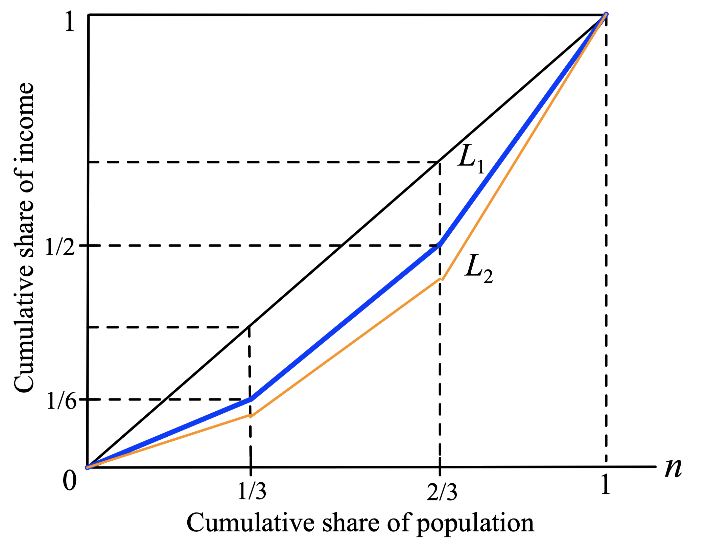
```
]
.pull-rigth-1[
- Muy buena noticia, los axiomas y el criterio de Lorenz son lo mismo!!

- Ahora, note que también nos dice que los axiomas no cubren todos los casos, porque las curvas de Lorenz se pueden cruzar.
]
---

## El criterio de Lorenz

- **Ejemplo**: Compare las distribuciones $(75,125,200,600)$ y $(25,175,400,400)$.

```{r cruce_lorenz, echo=FALSE, out.width="65%"}
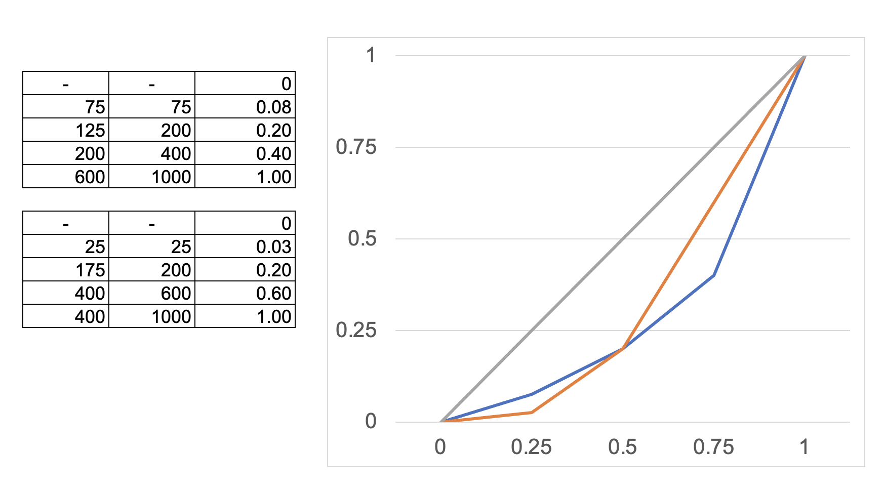
```

- Pasamos de la 1ra a la 2da distribución con una transferencia regresiva y una progresiva. Los 4 principios no son suficientes para comparar. Tenemos que sopesar costos-beneficios de transf. regresivas y progresivas.

---

## Algunas Cursvas de Lorenz

```{r fig8, echo=FALSE, out.width="83%"}
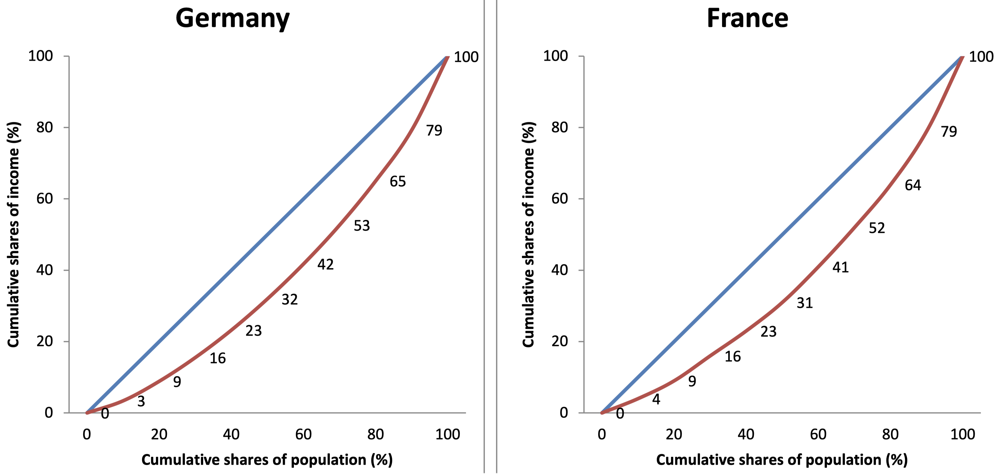
```

---

## Algunas Cursvas de Lorenz

```{r fig9, echo=FALSE, out.width="83%"}
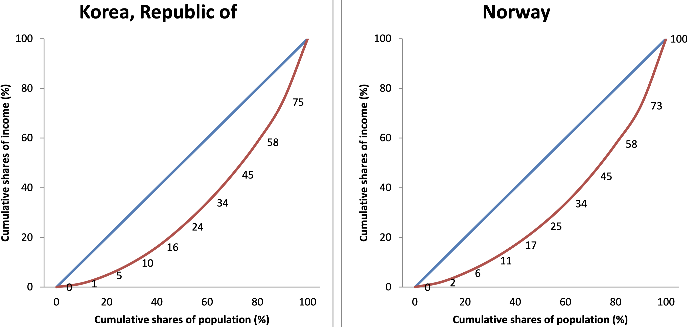
```

---

## Algunas Cursvas de Lorenz

```{r fig10, echo=FALSE, out.width="83%"}
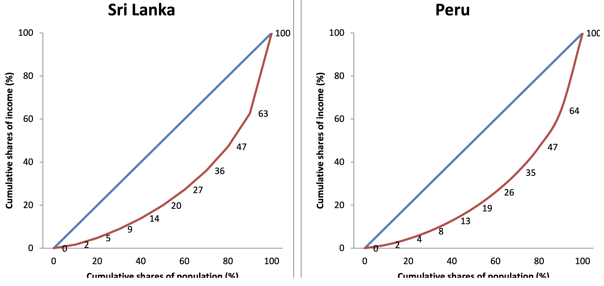
```

---

## Algunas Cursvas de Lorenz

```{r fig11, echo=FALSE, out.width="83%"}
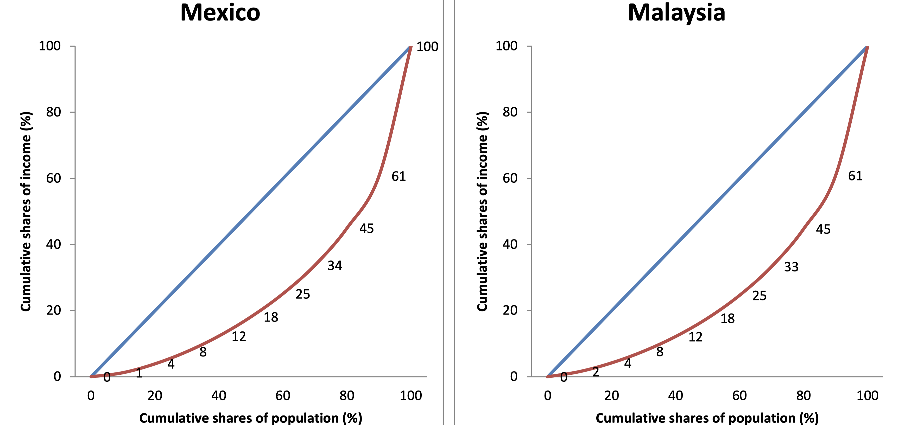
```

---

## Algunas Cursvas de Lorenz

```{r fig12, echo=FALSE, out.width="83%"}
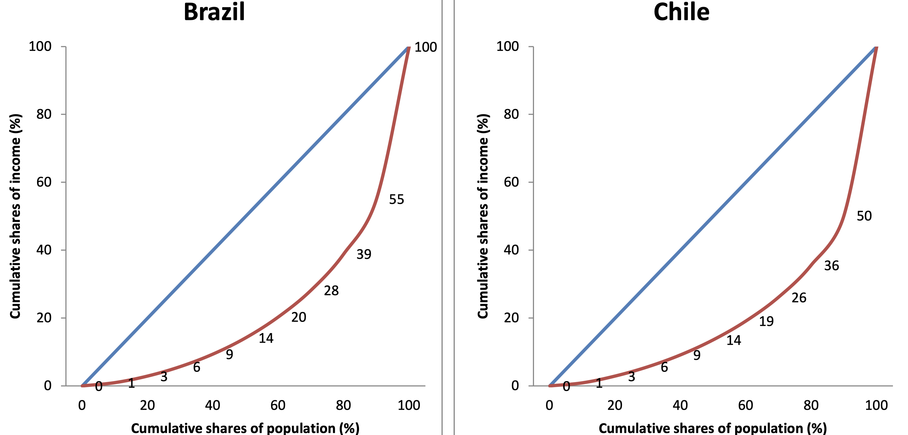
```

---

## Algunas Cursvas de Lorenz: Datos de Consumo

```{r fig13, echo=FALSE, out.width="83%"}
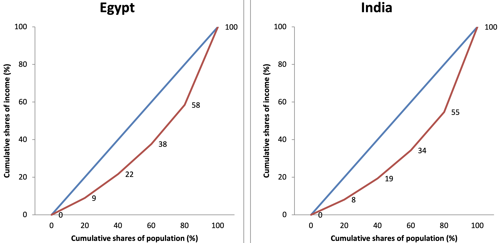
```


---

## Algunas Cursvas de Lorenz: Datos de Consumo

```{r fig14, echo=FALSE, out.width="83%"}
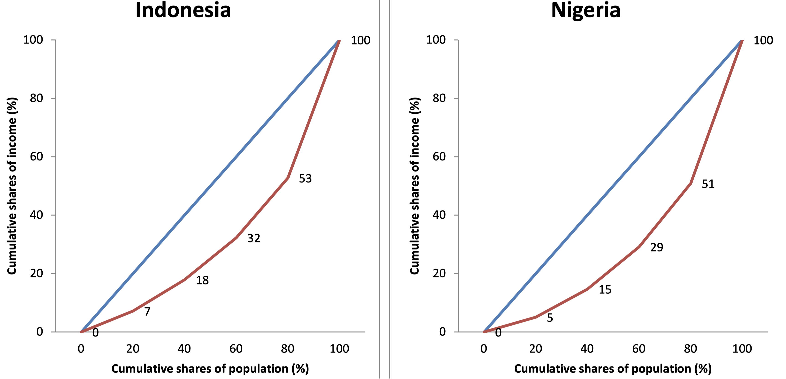
```

---

class: separator-blue, middle

# Medidas completas de la desigualdad

---

## Medidas completas de la desigualdad

- Las curvas de Lorenz representan gráficamente el grado de desigualdad de una sociedad. Dos problemas:

  - Los responsables de política económica y los investigadores les interesa resumir la desigualdad en una cifra.
  
  - Cuando las curvas de Lorenz se cortan, no pueden suministrar una ordenación útil de la desigualdad.

- También queremos medidas que aprovechen al máximo la información disponible:

- **Notación**: 

  - $m$ grupos, cada grupo con $N_j$ individuos, $i=1,...,m$. Distribución: 
$$\mathbf{y}=\left(y_{1}, \ldots y_{m}\right),\left(N_{1}, \ldots, N_{m}\right)$$

  - $n_{i}=\frac{N_{i}}{N}$ es la participación del grupo $i$ en la población. 
  
  - El ingreso medio es $\mu=\left(\sum_{i=1}^{m} N_{i} y_{i}\right) / N$.

---

## Medidas completas de la desigualdad

- **Rango**: Usa información sólo del primer y el último nivel de ingreso. Simple pero limitada.
$$\left(y_{m}-y_{1}\right) / \mu$$

- **Índices de Kuznets**: Los índices son esencialmente "segmentos" de la curva de Lorenz. Muy populares pero también limitados.
$$x \% \ más \ rico /  y \% \ más\  pobre$$ Por ejemplo, $20 \% / 80 \%$.

- **La desviación absoluta medía**: La desigualdad es proporcional a la distancia con respecto al ingreso medio. Primera medida que usa información de toda la distribución. 
$$\frac{1}{\mu} \sum_{j=1}^{m} \frac{N_{j}}{N}\left|y_{j}-\mu\right|=\frac{1}{\mu} \sum_{j=1}^{m} n_{j}\left|y_{j}-\mu\right|$$
¿Es esta medida consistente en el sentido de Lorenz? Comprobar axiomas.

---

## Medidas completas de la desigualdad

- **Coefficient of variation**: Una manera de evitar la insensibilidad de la desviación absoluta media es dar más peso a las mayores desviaciones de la media. La desviación típica hace precisamente eso.
$$\frac{1}{\mu} \sqrt{\sum_{j=1}^{m} \frac{N_{j}}{N}\left(y_{j}-\mu\right)^{2}}=\frac{1}{\mu} \sqrt{\sum_{j=1}^{m} n_{j}\left(y_{j}-\mu\right)^{2}}$$
¿Es esta medida consistente en el sentido de Lorenz? Comprobar axiomas.

- **El coeficiente de Gini**: Parte de una base que es totalmente diferente. En lugar de tomar las desviaciones con respecto al ingreso medio, toma la diferencia entre todos los pares de ingreso.
$$\frac{1}{2 \mu} \sum_{j=1}^{m} \sum_{k=1}^{m} \frac{N_{j} N_{k}}{N^{2}}\left|y_{j}-y_{k}\right|=\frac{1}{2 \mu} \sum_{j=1}^{m} \sum_{k=1}^{m} n_{j} n_{k}\left|y_{j}-y_{k}\right|$$
¿Es esta medida consistente en el sentido de Lorenz? Comprobar axiomas.

---

## Medidas completas de la desigualdad

.content-box-red[
**El coeficiente de Gini y la curva de Lorenz**: El coeficiente de Gíni es precisamente el cociente entre el área situada entre la curva de Lorenz y la recta de 45 °, y el área del triángulo situado debajo de la recta de 45 °.
]

- **Variante del coeficiente de Gini**: Existen 13 variaciones de este índice. Esta es una de ellas.
$$\frac{1}{2 \mu} \sum_{j=1}^{m} \sum_{k=1}^{m} \frac{N_{j} N_{k}}{N(N-1)}\left|y_{j}-y_{k}\right|$$
En este caso una sociedad de dos personas puede exhibir una desigualdad perfecta, pero falla el principio de población.


---

## Comparando el coeficiente de Gini con el coeficiente de variación

- Gini $(G)$ y coef. de variación $(CoV)$ pueden no estar de acuerdo cuando las curvas de Lorenz se cruzan.

- Por ejemplo. Compararemos las dos distribuciones siguientes: $A=(3,12,12)$ y $B=(4,9,14)$.
$$\operatorname{CoV}(A)= \frac{1}{9} \sqrt{\frac{1}{3}(3-9)^{2}+\frac{2}{3}(12- 9)^{2}}=\frac{1}{9} \sqrt{18}$$
$$\operatorname{CoV}(B)= \frac{1}{9} \sqrt{\frac{1}{3}(4-9)^{2}+\frac{1}{3}(14- 9)^{2}}=\frac{1}{9} \sqrt{\frac{50}{3}}$$
Entonces el COV cae al pasar de $A$ a $B$.

- Ahora el Gini:
$$G(A)= \frac{[2|3-12|+2|12-3|]}{2.9^{2}}=\frac{18}{81}$$
$$G(B)= \frac{[|4-9|+|4-14|+|9-4|+|9-14|+|14-4|+|14-9|]}{2.9 ^{2}}=\frac{20}{81}$$
Entonces el Gini sube al pasar de $A$ a $B$.

---

## GINI y CoV: Desacuerdos en la vida real

```{r fig15, echo=FALSE, out.width="50%"}
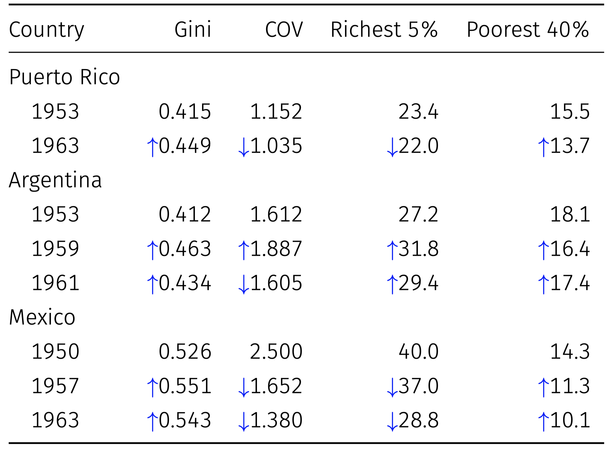
```

- Desigualdad en tres países (Weisskoff (1970), Fields (1980)).

- Las flechas $\uparrow$ y $\downarrow$ muestran la dirección de la desigualdad relativa al año base.

---

## Más allá de la desigualdad económica

> "A medida que avanza la lucha, toda la sociedad se divide en dos campos hostiles, dos grandes clases directamente antagónicas... Las clases se polarizan, de modo que se vuelven internamente más homogéneas y se diferencian cada vez más entre sí en riqueza y poder." (Deutsch 1971, p.44)

```{r fig16, echo=FALSE, out.width="83%"}
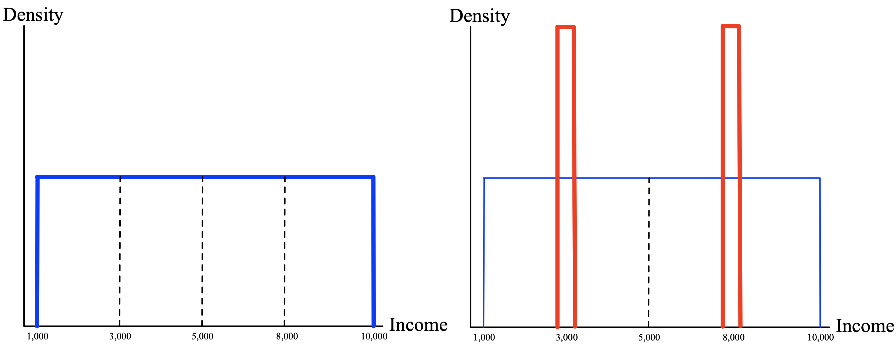
```

---

## Polarización

- como el Gini, la polarización suma alienaciones individuales (en un sentido de aislamiento).

- Pero las alienaciones individuales están determinadas por el tamaño del grupo: 

  - $n_{i}\left|y_{i}-y_{j}\right|$ en lugar de $\left|y_{i}-y_{j}\right|$.

- Agreguando estas dos ideas tenemos el **Índice de Polarización**:
$$P=\frac{1}{\mu} \sum_{i=1}^{m} \sum_{j=1}^{m} n_{i}^{2} n_{j}\left|y_{i}-y_{j}\right|$$

- Se puede aplicar para estudiar la conexión entre distribución y conflicto por ejemplo.