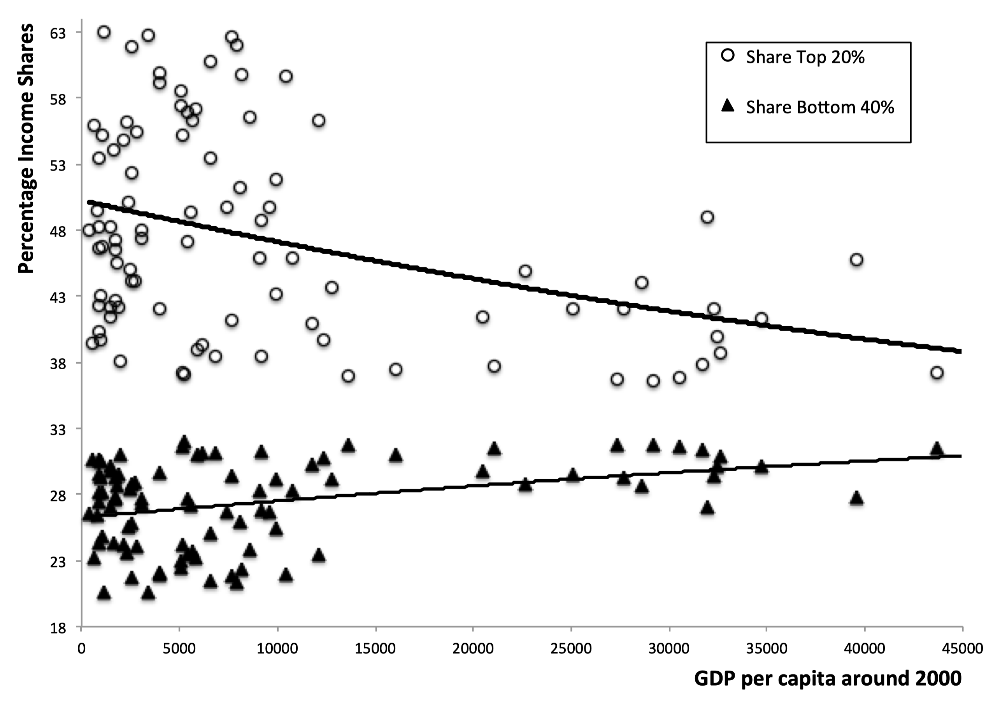
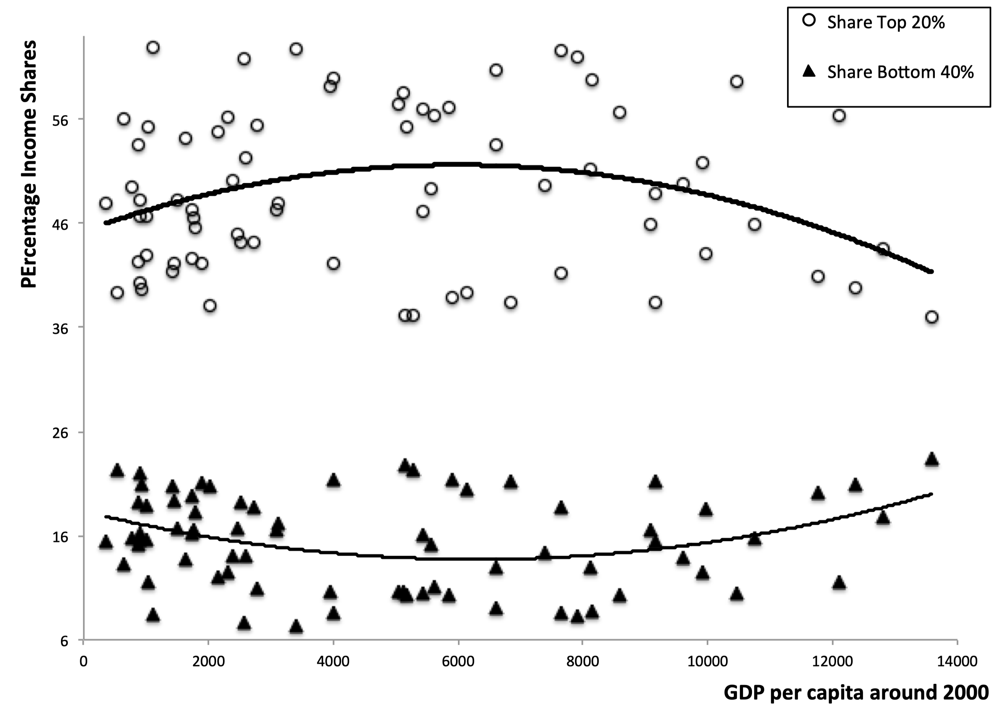
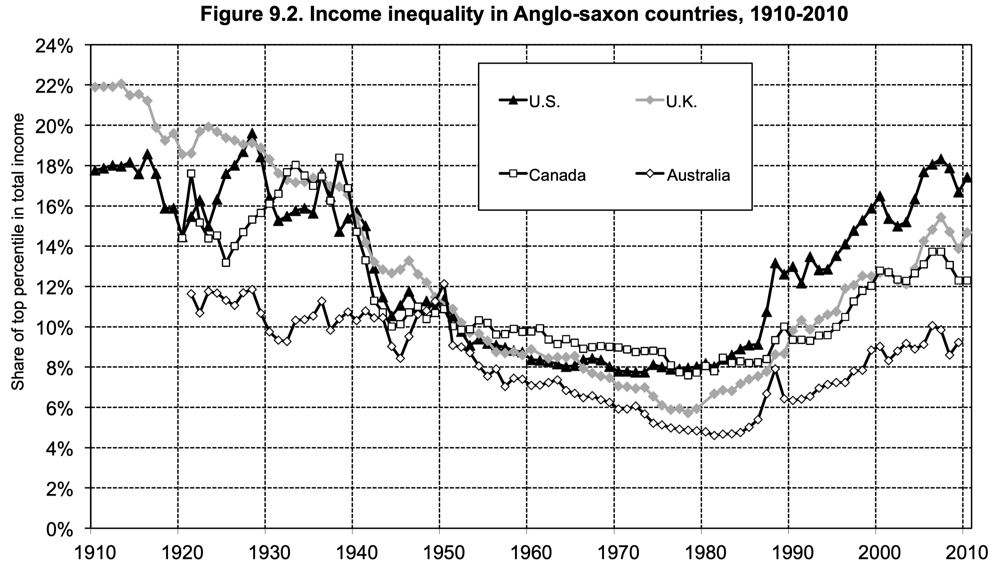
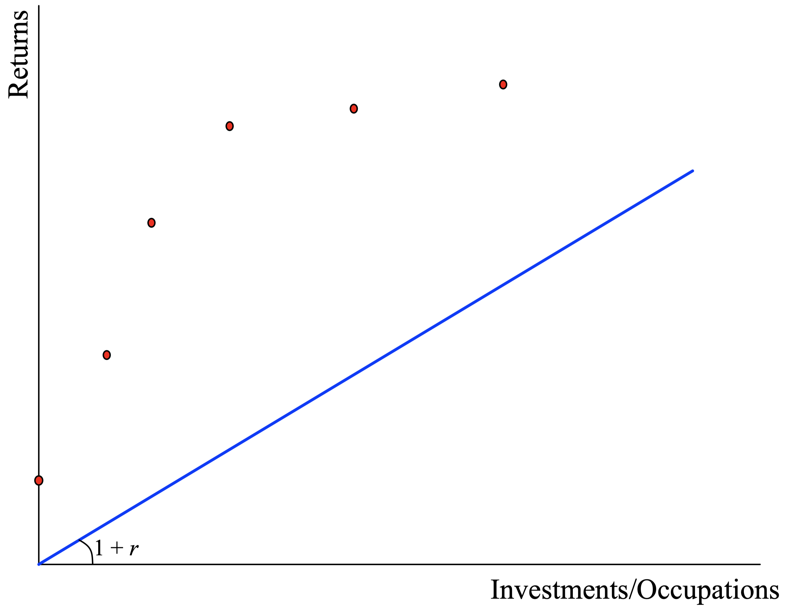
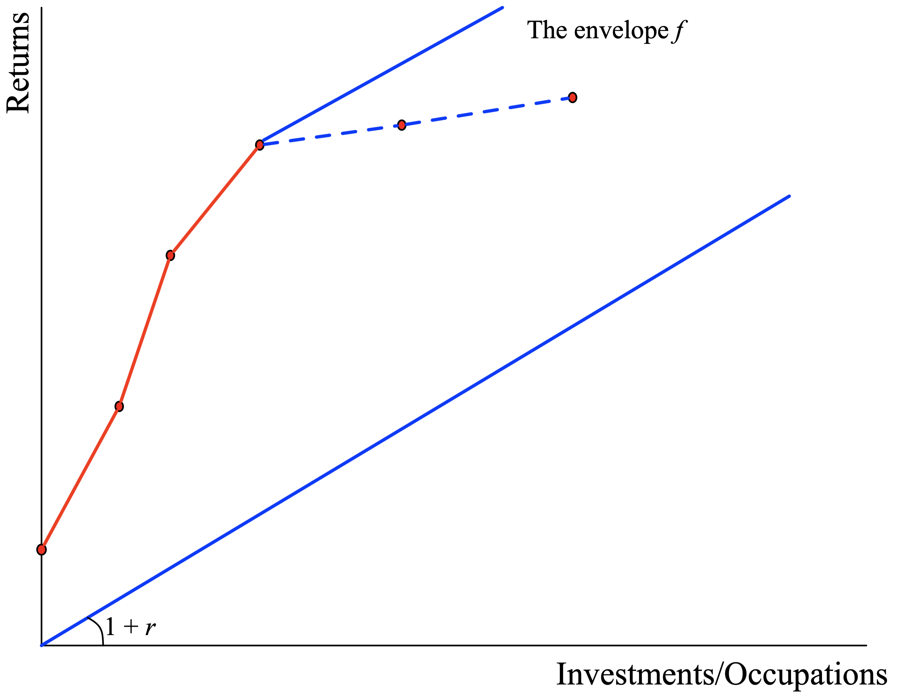
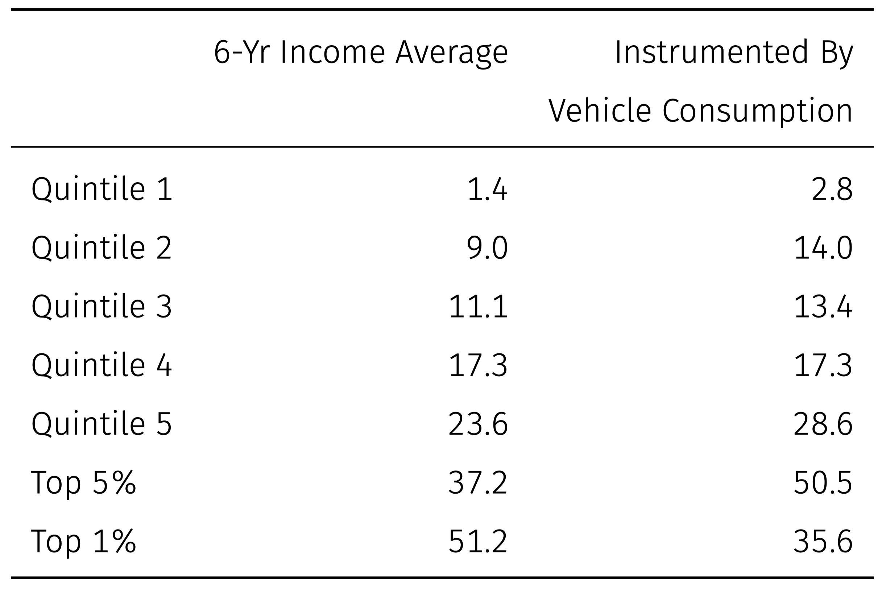

layout: true

<div class="my-footer"></div> 

---

```{r setup, include=FALSE}
knitr::opts_chunk$set(echo = FALSE, fig.align = "center",
                      message = FALSE, warning = FALSE)
knitr::opts_chunk$set(fig.dim=c(9, 6), fig.retina=2, out.width="100%")
```

```{r xaringan-themer, include=FALSE, warning=FALSE}
library(xaringanthemer)
library(readxl)

style_duo_accent(primary_color = "#3d5a80", 
                 secondary_color = "#dedede",
                 text_bold_color = "#ee6c4d",
                 text_font_family = "Droid Serif",
                 text_font_url = "https://fonts.googleapis.com/css?family=Droid+Serif:400,700,400italic",
                 header_font_google = google_font("Yanone Kaffeesatz"),
                 base_font_size = "20px",
                 code_font_size = "0.9rem")

```


class: separator-blue, middle

# Desigualdad y desarrollo

---

## Interconecciones

- Los **individuos poseen dotaciones**: bienes, factores de producción potenciales (trabajo, capital, tierra, etc), y participaciones en empresas.

```{r fig1, echo=FALSE, out.width="70%"}

```

- Dada la distribución actual de las dotaciones y las **interacciones económicas actuales en el mercado** se genera una **nueva distribución** de las dotaciones de mañana.

- La distribución actual de la riqueza da lugar, por medio de las interacciones económicas, a su futura distribución.  

  - El crecimiento económico y la desigualdad económica evolucionan conjuntamente.

---

## El contexto macroeconómico

- Consideremos primero las relaciones empíricas entre la desigualdad y la renta per cápita.

- Hipótesis de la **U invertida** de Kuznets, Dicurso presidencia AEA 1954.

.pull-left-1[
> *Observación 1: Los porcentajes de la renta obtenidos por los grupos de renta más alta eran significativamente menores en los países desarollados que en los países en vías de desarrollo.*
]

.pull-rigth-2[
```{r fig2, echo=FALSE, out.width="55%"}

```
]
---

## El contexto macroeconómico

- Consideremos primero las relaciones empíricas entre la desigualdad y la renta per cápita.

- Hipótesis de la **U invertida** de Kuznets, Dicurso presidencia AEA 1954.


.pull-left-1[
> *Observación 2: El progreso económico, medido por medio de la renta per cápita, va acompañado inicialmente de un aumento de la desigualdad, pero estas disparidades acaban desapareciendo a medida que los beneficios del desarrollo llegan a más personas.*
]

.pull-rigth-2[
```{r fig3, echo=FALSE, out.width="55%"}

```
]
---

## El gran cambio de sentido

- Después de la década de 1970 se ha producido un verdadero recrudecimiento de la desigualdad económica.

.pull-left-1[
*La opinión de que “el crecimiento se encargará de la desigualdad” se ha evaporado.*

**3 tipos de crecimiento** (que ocurren en diferentes medidas):

1. Acumulación de riqueza y habilidades y ganancias de productividad.

2. Crecimiento concentrado en algunos sectores (con demandas por habilidades particulares).

3. Crecimiento compensatorio de 2. Aumento de la demanda de todos los bienes de la economía.
]
.pull-rigth-2[
```{r fig4, echo=FALSE, out.width="60%"}

```
]

---

class: separator-blue, middle

# Conceptos microeconómicos para evaluar la evolución de la desigualdad

---

## Acumulación individual de riqueza

- Qué aspectos del comportamiento individual y la estructura del mercado son relevantes
un estudio detallado de la desigualdad y su evolución? 

  - **Volvamos a un modelo similar al de crecimiento pero a nivel individual**.

- Ecuación de acumulación individual:
$$k_{t+1}=y_{t}-c_{t}+k_{t}$$
donde $k$ es la riqueza (o capital), $y$ es el ingreso, y $c$ es el consumo. 

- El ingreso evoluciona en función de la riqueza y de factores que el individuo no controla:
$$y_{t}=f\left(k_{t}, \theta_{t}\right)$$
donde $\theta_{t}$ es un vector de variables de estado:

  - Shocks aggregados (a nivel de la economía).

  - Shocks idiosincráticos (a nivel individual pero exógenos al individuo).

---

## Acumulación individual de riqueza

- Algunos ejemplos:

  - Ingreso puro de capital: $f\left(k_{t}\right)=r\left(\theta_{t}\right) k_{t}$.

  - Salarios + ingreso de capital: $f\left(k_{t}\right)=w\left(\theta_{t}\right)+r\left(\theta_{t}\right) k_{t}$.

  - Acumulación de habilidades sobre ocupaciones (reinterpretamos $k$ como capital humano):
$$\begin{aligned}
f(k) &=w_{u}(\theta) \text { for } k<\bar{x} \\
&=w_{s}(\theta) \text { for } k>\bar{x}
\end{aligned}$$

  - También podríamos interpretar la ecuación anterior para un emprendedor. En este caso $\bar{x}$ son costos de instalación (ingresos por emprendimientos por ejemplo).

- Las oportunidades de generación de ingresos pueden **parecer exógenas al individuo**, pero en realidad son el **resultado endógeno en una economía** con muchos actores.

  - **Ejemplo**: La oferta laboral de todos afecta el salario que enfrenta cada individuo.

---

## La función de producción del hogar

```{r fig6, echo=FALSE, out.width="60%"}

```

---

## La función de producción del hogar

```{r fig7, echo=FALSE, out.width="60%"}

```

---

## Taxonomía para las fuentes de desigualdad

.content-box-red[
Cuando pensamos en desigualdad, podemos visualizar varias copias de las ecuaciones descritas antes evolucionando una al lado de la otra (un par de ecuaciones para cada persona). Dicha evolución genera distribuciones de ingresos, riquezas, habilidades, etc. 
]

1. **Ahorros**: Diferencias en las tasas de ahorro entre individuos harán que sus ingresos relativos cambien con el tiempo.

2. **Rendimientos de los activos**: Variaciones en la tasa de rendimiento del capital entre personas y niveles de riqueza.

3. **Elección ocupacional**: La desigualdad de ingresos afecta el acceso a los mercados de capitales, y con ello a la conexión entre la riqueza y capital humano, la elección ocupacional (calificada) o el emprendimiento.

4. **Demanda**: Las distribuciones de ingresos afectan el patrón y la composición de la demanda de productos y, por lo tanto, los ingresos individuales (vía retornos a las habilidades).

5. **Políticas y política**: Las distribuciones de ingresos afectan las decisiones del gobierno sobre impuestos al trabajo y a los ingresos de capital. Grupos de presión políticos pueden ser relevantes. 


---

class: separator-blue, middle

# Tasas de ahorro y tasas de rendimiento del capital

---

## Tasas de ahorro y tasas de rendimiento del capital

.content-box-red[
A principios de 2016, una historia se volvió viral: aparentemente, solo 62 de las personas más ricas
en el mundo tienen más riqueza que la mitad de la población total (alrededor de 3,6
mil millones).
]

- **Esto no es sorprendente**: 

  - Si tienes algo de dinero en tu cuenta bancaria y no tienes deudas que pagar, tendrás más riqueza que la riqueza combinada de aproximadamente la mitad de todas las personas que viven en uno de los países más ricos del mundo!!

- **La razón es simple**: 

  - La mitad inferior de los Estados Unidos, definida por la riqueza, tiene alrededor de cero riqueza.

- **Señal de alerta**: 

  - **El ahorro diferencial** entre diferentes clases económicas podría representar una parte significativa del aumento de la desigualdad que observamos.

---

## Tasas de ahorro e ingreso

.pull-left[
- En general, esperamos que las tasas de ahorro aumenten en gran parte de la distribución de ingresos y tal vez se reduzcan a medida que pasamos por la parte superior.

- Las estimaciones de esta relación son muy difíciles de realizar Razón: medir ingresos permanentes versus ingresos totales que contienen los ingresos temporales (shocks).

- **Dynan, Skinner y Zeldes (2004) usan la encuesta de presupuestos de EEUU**: corrigen por ingresos transitorios usando promedios de ingresos de varios años, o instrumentando los ingresos usando consumo de bienes duraderos (vehículos).
]

.pull-right[
Tasas de Ahorro:
```{r fig8, echo=FALSE, out.width="100%"}

```
]
---

## ¿Cuánto explican las diferenciles en las tasas de ahorro?

- Concentrémonos en la acumulación de riqueza financiera.
$$k_{t+1}=\left(y_{t}-c_{t}\right)+k_{t}=s y_{t}+k_{t}=s w_{t}+(1+s r) k_{t}$$

- Enfóquemonos en los acumuladores de riqueza financiera, que viven enteramente de las rentas del capital (Piketty, 2014)
$$y_{t}=r k_{t} \text { y } k_{t+1}=(1+s r) k_{t}$$

- Vamos a usar una calibración aproximada. Definamos primero: 

  - La tasa promedio de crecimiento de la economía es de $g$.

  - La tasa de rendimiento del capital es de $r$.

  - Los capitalistas ahorran $s_{R}$ de sus ingresos.

- Si la participación inicial de los ricos es $x(0)$, entonces $t$ períodos más adelante tenemos:
$$x(t)=x(0)\left(\frac{1+s_{R} r}{1+g}\right)^{t}$$
---

## ¿Cuánto explican las diferenciles en las tasas de ahorro?

- La ecuación anterior nos permite calcular la tasa de retorno como función de $s$ y $g$ (retorno implícito al observar la tasa de ahorro y de crecimiento)
$$r=\frac{[x(t) / x(0)]^{1 / t}(1+g)-1}{s_{R}}$$
- Cálculos aproximados para el 10% de personas con mayores ingresos en EEUU:

  - $x_{0}=1/3$ en 1970, sube a $x_{t}=47/100$ en 2000.

  - Estimación por $g$ : 2% anual.

  - Estimación de Dynan et al para $s_{R}$: 35% (optimista).

- Obtenemos $r$: 9.7%. Posible, pero muy superior a la tasa de retorno del capital (incluidos los dividendos) ajustada por inflación, alrededor del 6.5%.

---

## ¿Cuánto explican las diferenciles en las tasas de ahorro?

$$r=\frac{[x(t) / x(0)]^{1 / t}(1+g)-1}{s_{R}}$$

- Cálculos similares para el 1% de mayores ingresos en EEUU:

  - $x_{0}=8 / 100$ ene 1980, sube a $x_{t}=18 / 100$ en 2005 .

  - Estimación por $g$ : 2% anual.

  - Estimación de Dynan et al para $s_{R}$: 51% 

- Obtenemos $r$: 10.5%. Nuevamente, algo más está sucediendo que solo diferenciales de ahorro.

---

## ¿Cuánto explican las diferenciles en las tasas de ahorro?

$$r=\frac{[x(t) / x(0)]^{1 / t}(1+g)-1}{s_{R}}$$

- Ahora tratemos con el  0.1% de ingresos más altos en EEUU:

  - $x_{0}=2.2 / 100$ en 1980, sube a $x_{t}=8 / 100$ in 2007 .

  - Estimación por $g$ : 2% anual.

  - Si estas personas también ahorra un 0.5 de su ingresos entonces $r$ sería 14.4%!

  - Si ahorran $3 / 4$ de su ingreso entonces $r$ sería 9.6%.

---

## ¿Cuánto explican las diferenciles en las tasas de ahorro?

$$r=\frac{[x(t) / x(0)]^{1 / t}(1+g)-1}{s_{R}}$$

- Obtenemos mejores resultados para Europa, pero no mucho. 10% de ingresos más altos:

  - $x_{0}=29/100$ en 1980, sube a $x_{t}=35/100$ en 2010.

  - Estimación por $g$ : 2% anual.

  - Estimación de Dynan et al $s_{R}$: 35%

- Obtenemos $r$: 7.5%. Muy alto en relación con $r$ en Europa durante este período.

- Finalmente, intentemos con el 1% más rico en el Reino Unido:

  - $x_{0}=6 / 100$ en 1980, sube a  $x_{t}=15 / 100$ en 2005 .

  - Estimación por $g$ : 2% anual.

  - Estimación de Dynan et al $s_{R}$: 51%

- Obtenemos $r$: 11.4%.
