layout: true

<div class="my-footer"></div> 

---

```{r setup, include=FALSE}
knitr::opts_chunk$set(echo = FALSE, fig.align = "center",
                      message = FALSE, warning = FALSE)
knitr::opts_chunk$set(fig.dim=c(9, 6), fig.retina=2, out.width="100%")
```

```{r xaringan-themer, include=FALSE, warning=FALSE}
library(xaringanthemer)
library(readxl)

style_duo_accent(primary_color = "#3d5a80", 
                 secondary_color = "#dedede",
                 text_bold_color = "#ee6c4d",
                 text_font_family = "Droid Serif",
                 text_font_url = "https://fonts.googleapis.com/css?family=Droid+Serif:400,700,400italic",
                 header_font_google = google_font("Yanone Kaffeesatz"),
                 base_font_size = "20px",
                 code_font_size = "0.9rem")

```


class: separator-blue, middle

# Elección ocupacional

---

## Emprendimiento con mercados de capitales imperfectos

- Suponga que la economía está poblada por un gran número de personas, indexadas por $[0,1]$. 

  - Todas son idénticas excepto en su **riqueza inicial**.

  - Las personas eligen si se convierten en **asalariados** o en **emprendedores**.

  - Para emprender primero se debe pagar $S$ como costo de puesta ne marcha del negocio.

- La función de producción de los emprendedores es: $f(\ell)=A \ell^{\alpha}$.

  - Para producir, el emprendedor contrata trabajadores al salario $w$. El objetivo es maximizar los beneficios:
$$A \ell^{\alpha}-w \ell$$

  - En el equilibrio en el mercado del trabajo, $w$ se ajusta para igualar oferta y demanda. 

---

## Criterio de eficiencia a nivel de la sociedad

.pull-left[
- **Producto neto de costos de puesta marcha**: El planificador elige $n$ para maximizar:
$$\max _{n} n A\left(\frac{1-n}{n}\right)^{\alpha}-n S(1+r)$$
donde $r$ es la tasa de retorno de las alternativas de inversión para los recursos usados en la puesta en marcha del negocio.
]
.pull-right[
```{r fig1, echo=FALSE, out.width="95%"}
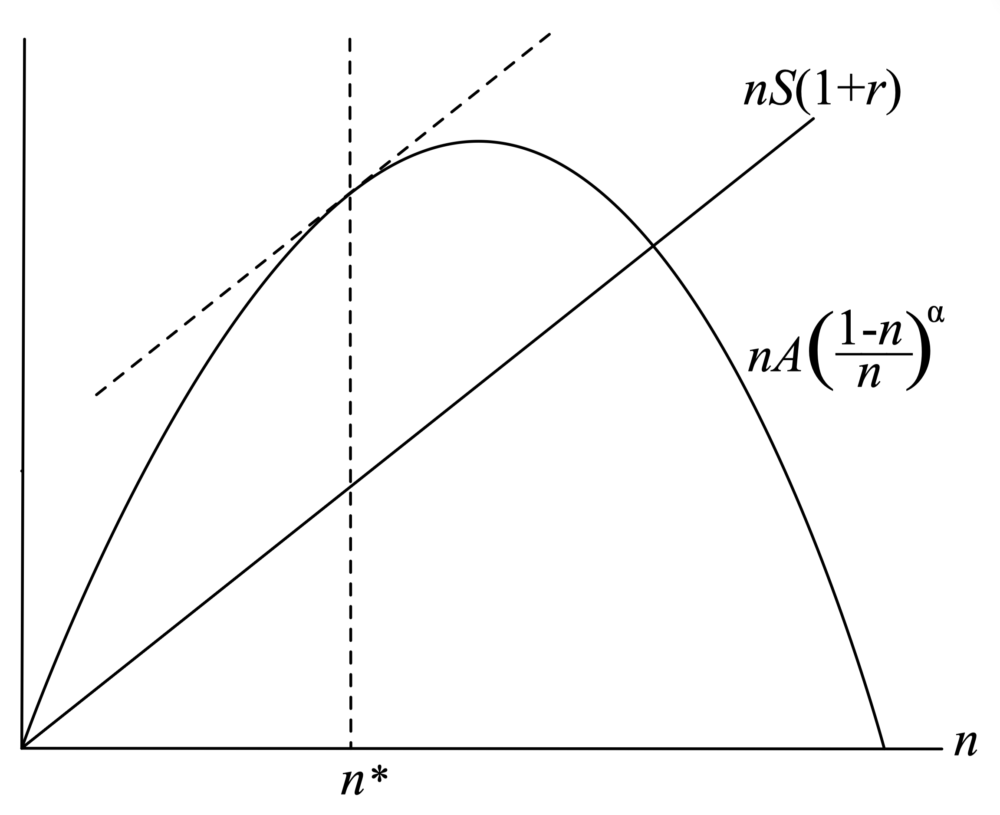
```
]
---

## Criterio de eficiencia a nivel de la sociedad

.pull-left[
- **Condición de primer orden** para la maximización del producto neto:

$$A\left(\frac{1-n^{*}}{n^{*}}\right)^{\alpha}-\frac{\alpha}{n^{*}} A\left(\frac{1-n^{*}}{n^{*}}\right)^{\alpha-1}=S(1+r)$$

- ¿Esta solución puede alcanzarse de forma **descentralizada**? **Si, si los mercados de crédito son perfectos**.
]

.pull-right[
```{r fig2, echo=FALSE, out.width="95%"}
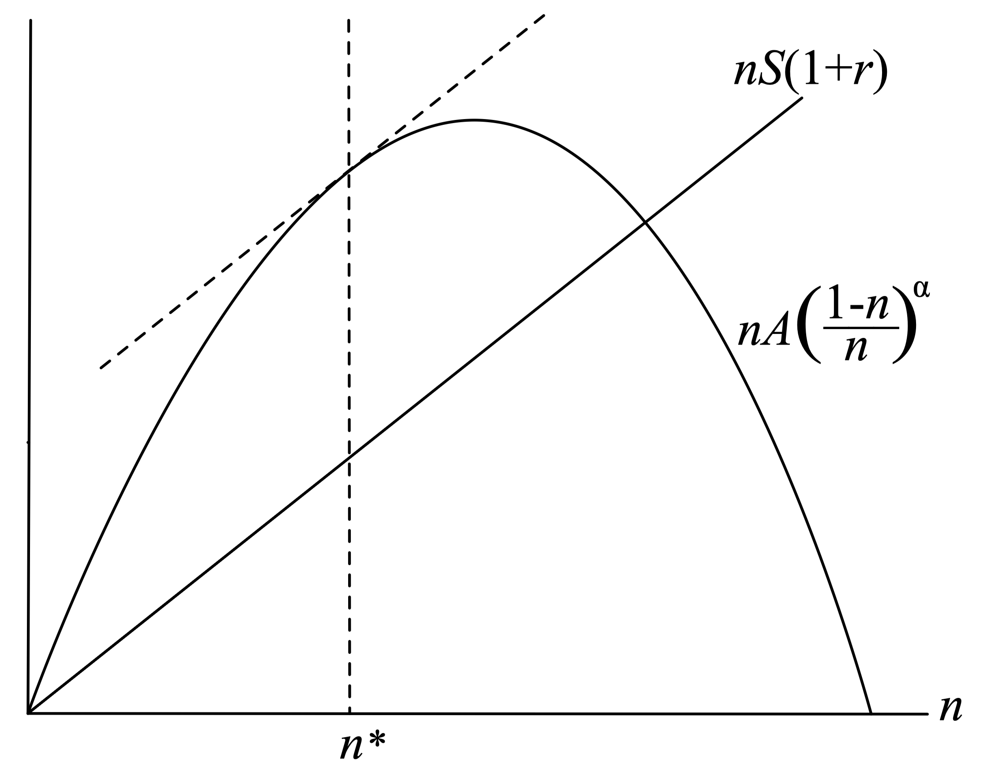
```
]


---

## Equilibrio descentralizado bajo mercado de crédito perfectos (primer mejor)

- **Equilibrio de mercado** con $n$ emprendedores y salario $w$:

  - Como los mercados de crédito son perfectos, los beneficios se igualan a los salarios:
$$A\left(\frac{1-n}{n}\right)^{\alpha}-w \frac{1-n}{n}-S(1+r)=w$$

- Los salarios a su vez se igualan a la productividad marginal del trabajo:
$$w=\alpha A\left(\frac{1-n}{n}\right)^{\alpha-1}$$

- Sustituyendo:
$$A\left(\frac{1-n}{n}\right)^{\alpha}-\frac{\alpha}{n} A\left(\frac{1-n}{n}\right)^{\alpha-1}=S(1+r)$$

- **Comparando** el equilibrio del planificador con el descentralizado tenemos que $n$ es igual a $n^{*}$.

---

## Equilibrio descentralizado bajo mercados de capitales imperfectos

- Recordemos que el **acceso al crédito** está determinado por el salario y la riqueza. El valor crítico está definido por:
$$W(w)=S-\frac{F+\lambda\{f(\ell)-w \ell\}}{1+r}$$

```{r fig3, echo=FALSE, out.width="80%"}
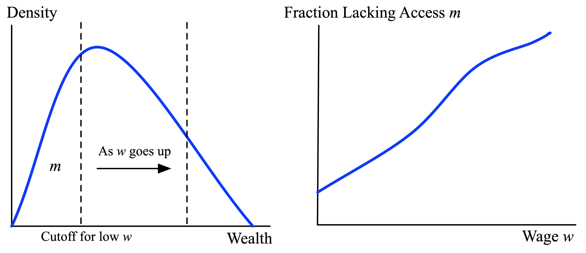
```

---

## Equilibrio descentralizado bajo mercados de capitales imperfectos

- Así generamos las **curvas de oferta y demanda de trabajo**:

```{r fig4, echo=FALSE, out.width="50%"}
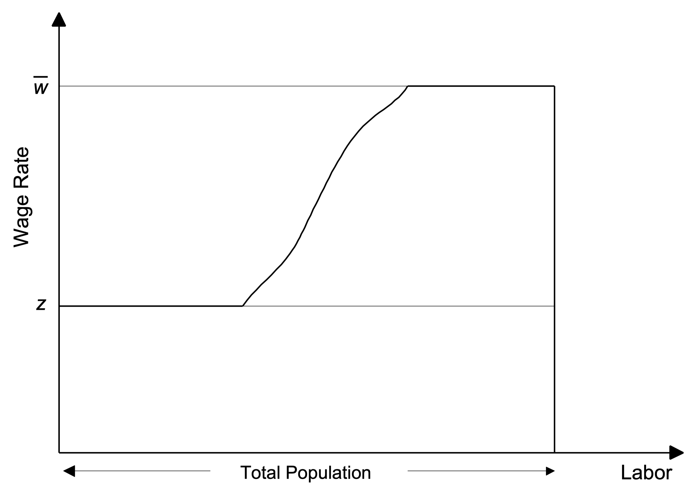
```

- *La curva de oferta es un espejo del diagrama de "falta de acceso"*.

---

## Equilibrio descentralizado bajo mercados de capitales imperfectos

- Así generamos las **curvas de oferta y demanda de trabajo**:

```{r fig5, echo=FALSE, out.width="50%"}
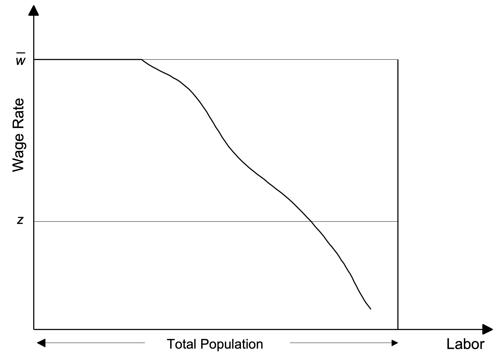
```

- *La curva de demanda refleja el acceso y la demanda de trabajo de la empresa*.

---

## Equilibrio descentralizado bajo mercados de capitales imperfectos

- Así generamos las **curvas de oferta y demanda de trabajo**:

```{r fig6, echo=FALSE, out.width="90%"}
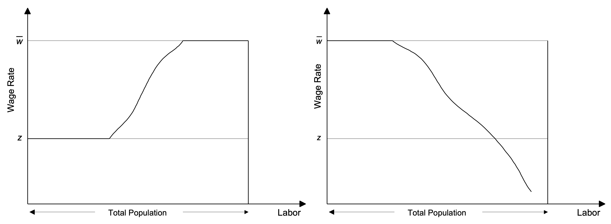
```

- La curva de oferta es un espejo del diagrama de "falta de acceso".

- La curva de demanda refleja el acceso y la demanda de trabajo de la empresa.

---

## Equilibrio descentralizado bajo mercados de capitales imperfectos

- **Tres escenarios**:

```{r fig7, echo=FALSE, out.width="90%"}
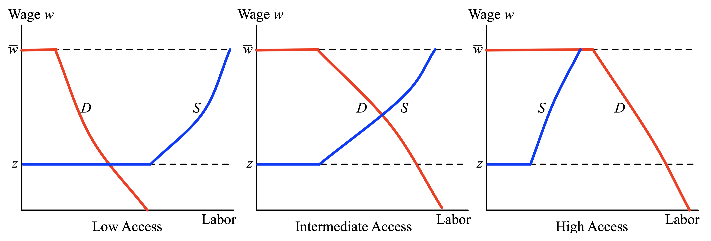
```

- **Ineficiencia** en paneles A y B (en comparación con el planificador).

- **Eficiencia** en panel C.

---

## Desigualdad e ineficiencia

- **¿La desigualdad obstaculiza la eficiencia o mueve el sistema hacia ella?**

  - Depende de lo pobre que sea la economía.

```{r fig8, echo=FALSE, out.width="45%"}
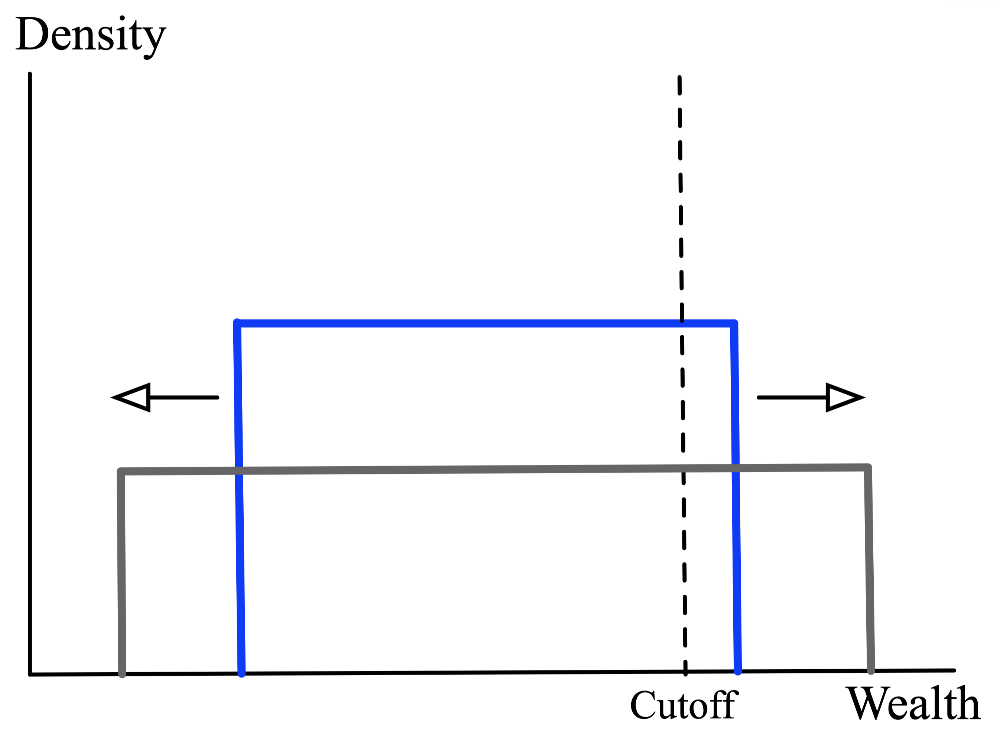
```

- La desigualdad ayuda cuando los niveles medios de riqueza son relativamente bajos.

---

## Desigualdad e ineficiencia

- **¿La desigualdad obstaculiza la eficiencia o mueve el sistema hacia ella?**

  - Depende de lo pobre que sea la economía.

```{r fig9, echo=FALSE, out.width="45%"}
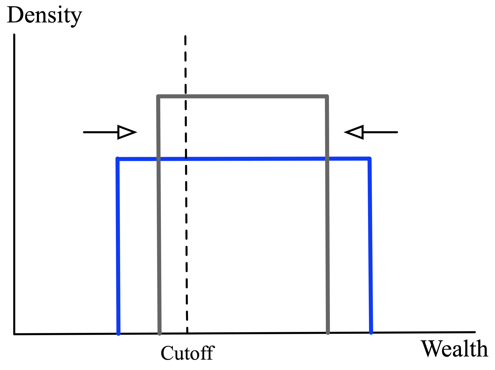
```

- La desigualdad es dañina cuando los niveles medios de riqueza son relativamente altos.

---

class: separator-blue, middle

# Endogeneidad de la distribución de riqueza

---

## Endogeneidad de la distribución de riqueza

- **Hasta ahora no hemos tenido en cuenta la acumulación de riqueza**:

  - Será impulsada por la desigualdad en el mercado.

  - Las personas que ganan salarios bajos son incapaces de adquirir/acumular riqueza.

  - Los empresarios ricos obtienen grandes ganancias porque la mano de obra es barata.

  - Entonces existe la tendencia a replicar la desigualdad de partida, sea esta alta o baja.

- **Entonces, la desigualdad puede engendrar desigualdad**

  - Ver Anexo 3 del capítulo "Desigualdad y Desarrollo".

---

## Estado Estacionario en la elección ocupacional

- Suponga **dos tipos de ocupaciones**, trabajos calificados $s$ y trabajos no calificados $u$.

  - Salarios: $w_{s}$ y $w_{u}$, endógenos.
  
  - Asignación de la población: $(n, 1-n)$, endógena.

- **1 padre, 1 hijo en cada generación**.

  - Costo de adquirir habilidades para los trabajos calificados: $X$, pagado por el padre.

  - Utilidad del padre:
$$\sum_{s=t}^{\infty} \delta^{s-t} u\left(c_{s}\right)$$

---

## Estado Estacionario en la elección ocupacional

- **Función de producción**: $F(s, u)$, con retornos constates a escala.

- Salario de trabajos calificados: $w_{s}(n)=F_{1}(n, 1-n)$.

- Salario de trabajos no calificados: $w_{u}(n)=F_{2}(n, 1-n)$.

```{r fig10, echo=FALSE, out.width="45%"}
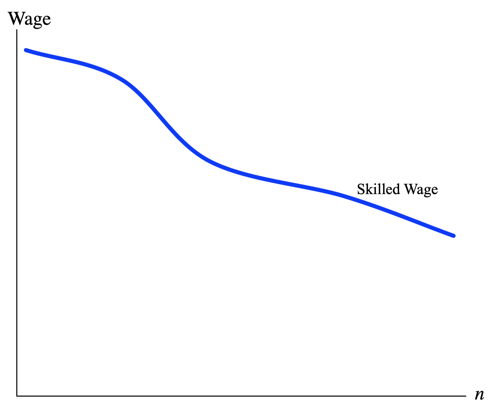
```

---

## Estado Estacionario en la elección ocupacional

- **Función de producción**: $F(s, u)$, con retornos constates a escala.

- Salario de trabajos calificados: $w_{s}(n)=F_{1}(n, 1-n)$.

- Salario de trabajos no calificados: $w_{u}(n)=F_{2}(n, 1-n)$.

```{r fig11, echo=FALSE, out.width="45%"}
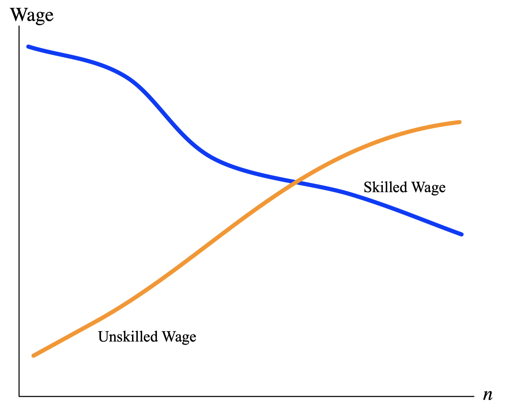
```

---

## Estado Estacionario en la elección ocupacional

- **Estado estacionario**:

  - Una fracción constante $n$ son trabajadores calificados.

  - Los salarios son constantes y satisfacen: $w_{s}=F_{1}(n, 1-n)$ y $w_{u}=F_{2}(n, 1-n)$

  - Todos los padres replican su estatus laboral con sus hijos.

- Condiciones para que $n$ esté en estado estacionario:

  - **Padre calificado**: 
  $$\frac{u\left(w_{s}-X\right)}{1-\delta} \geq u\left(w_{s}\right)+\frac{\delta}{1-\delta} u\left(w_{u}\right)$$

  - **Padre no calificado**: 
  $$\frac{u\left(w_{u}\right)}{1-\delta} \geq u\left(w_{u}-X\right)+\frac{\delta}{1-\delta} u\left(w_{s}-X\right)$$


---

## Estado Estacionario en la elección ocupacional

- Condiciones para que $n$ esté en estado estacionario:

  - **Padre calificado**: $\frac{u\left(w_{s}-X\right)}{1-\delta} \geq u\left(w_{s}\right)+\frac{\delta}{1-\delta} u\left(w_{u}\right)$

  - **Padre no calificado**: $\frac{u\left(w_{u}\right)}{1-\delta} \geq u\left(w_{u}-X\right)+\frac{\delta}{1-\delta} u\left(w_{s}-X\right)$

.content-box-red[
**Teorema 1**: Cada $n$ con $w_{s}=F_{1}(n, 1-n)$ y $w_{u}=F_{2}(n, 1-n)$ tal que

$$\underbrace{u\left(w_{u}\right)-u\left(w_{u}-X\right)}_{\text {Unskilled Cost }} \geq \underbrace{\frac{\delta}{1-\delta}\left[u\left(w_{s}-X\right)-u\left(w_{u}\right)\right]}_{\text {Future Benefit }} \geq \underbrace{u\left(w_{s}\right)-u\left(w_{s}-X\right)}_{\text {Skilled cost }}$$

debe ser un equilibrio de estado estacionario. 
]
---

## Estado Estacionario en la elección ocupacional

$$\underbrace{u\left(w_{u}\right)-u\left(w_{u}-X\right)}_{\text {Unskilled cost }} \geq \underbrace{\frac{\delta}{1-\delta}\left[u\left(w_{s}-X\right)-u\left(w_{u}\right)\right]}_{\text {Future Beneft }} \geq \underbrace{u\left(w_{s}\right)-u\left(w_{s}-X\right)}_{\text {Skilled cost }}$$

```{r fig12, echo=FALSE, out.width="45%"}
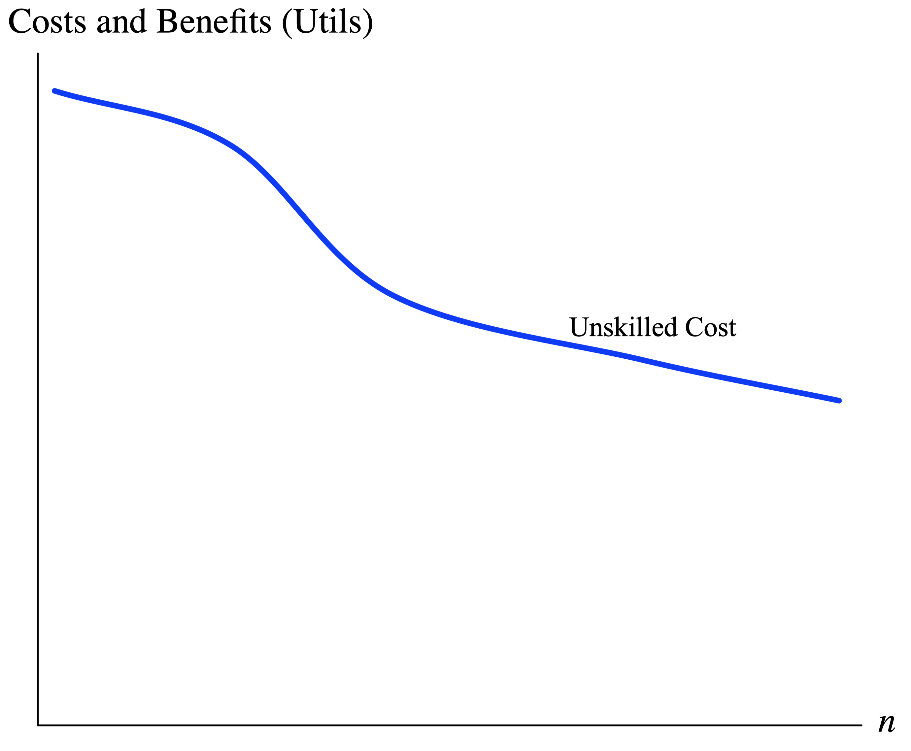
```

---

## Estado Estacionario en la elección ocupacional

$$\underbrace{u\left(w_{u}\right)-u\left(w_{u}-X\right)}_{\text {Unskilled cost }} \geq \underbrace{\frac{\delta}{1-\delta}\left[u\left(w_{s}-X\right)-u\left(w_{u}\right)\right]}_{\text {Future Beneft }} \geq \underbrace{u\left(w_{s}\right)-u\left(w_{s}-X\right)}_{\text {Skilled cost }}$$

```{r fig13, echo=FALSE, out.width="45%"}
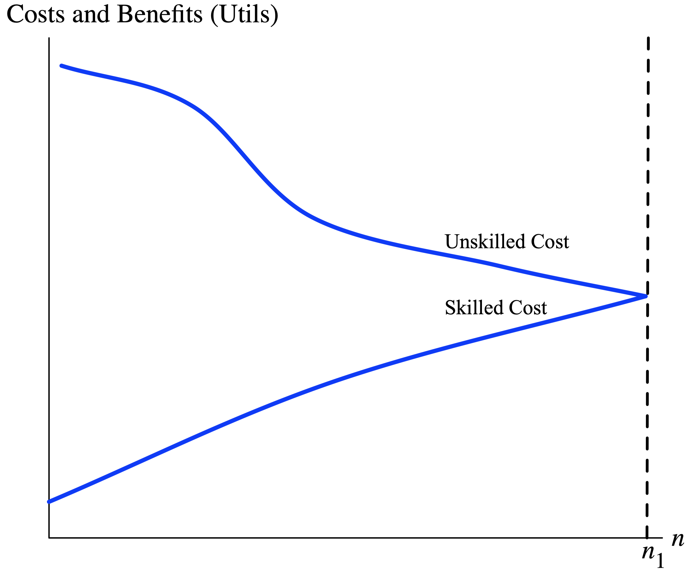
```

---

## Estado Estacionario en la elección ocupacional

$$\underbrace{u\left(w_{u}\right)-u\left(w_{u}-X\right)}_{\text {Unskilled cost }} \geq \underbrace{\frac{\delta}{1-\delta}\left[u\left(w_{s}-X\right)-u\left(w_{u}\right)\right]}_{\text {Future Beneft }} \geq \underbrace{u\left(w_{s}\right)-u\left(w_{s}-X\right)}_{\text {Skilled cost }}$$

```{r fig14, echo=FALSE, out.width="45%"}

```

---

## Estado Estacionario en la elección ocupacional

.pull-left[
- **Observaciones**:

  [1] Existen equilibrios de estado estacionario. El primero (de derecha a izquierda) está en $n_{3}$.
  
  [2] Hay muchos equilibrios de estado estacionario, una infinidad de ellos.
  
  [3] Todo equilibrio de estado estacionario muestra una desigualdad persistente.
]

.pull-right[
```{r fig15, echo=FALSE, out.width="90%"}
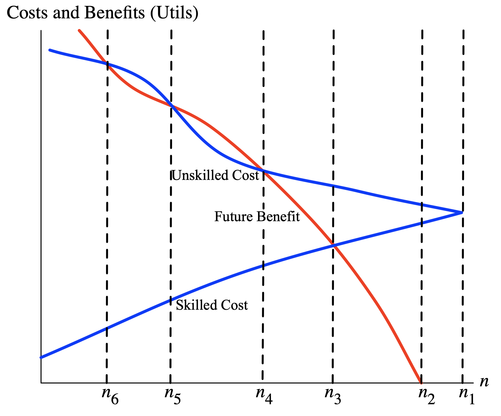
```
]
---

## Estado Estacionario en la elección ocupacional

- **Observaciones** (cont ...):

 [4] Cada equilibrio de estado estacionario es ineficiente..
 
 .pull-left[
 - La asignación eficiente maximiza 
 $$F(n, 1-n)-n X$$

- Condición de primer orden:
$$F_{1}\left(n^{*}, 1-n^{*}\right)-F_{2}\left(n^{*}, 1-n^{*}\right)=X$$
$$\Rightarrow w_{s}^{*}-X=w_{u}^{*} \Rightarrow n^{*}=n_{2}$$

- Pero todo estado estacionario está a la izquierda de $n_{3}$ 

]

.pull-right[
```{r fig16, echo=FALSE, out.width="85%"}
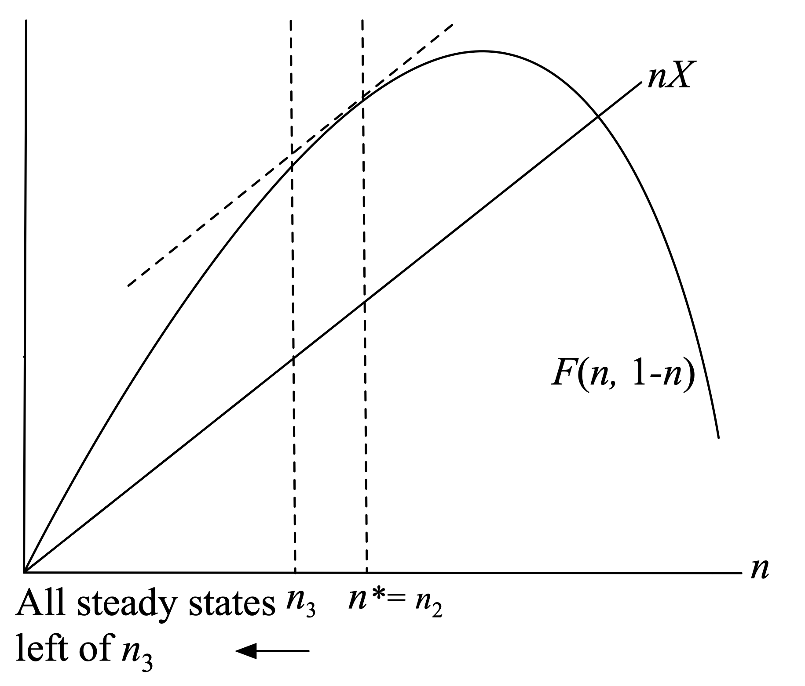
```
]


---

## Estado Estacionario en la elección ocupacional

- **Observaciones** (cont ...):

  [5] El modelo de emprendimiento puede integrarse fácilmente aquí.

  - Reinterprete $s$ como emprendedor/empresario y $u$ como trabajador asalariado.

   - $X=S(1+r)$ es el costo de puesta en marcha.

   - Función de producción $F(s, u)=s f\left(\frac{u}{s}\right)$

   - Luego:

   - $F_{2}(s, u)=f^{\prime}\left(\frac{u}{s}\right)=w$, y

   - $F_{1}(s, u)=f\left(\frac{u}{s}\right)-\frac{u}{s} f^{\prime}\left(\frac{u} {s}\right)=f\left(\frac{u}{s}\right)-\frac{u}{s} w=$ es el beneficio.