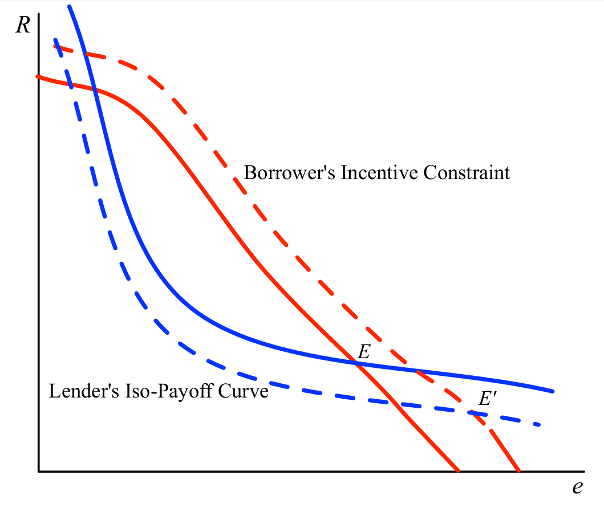
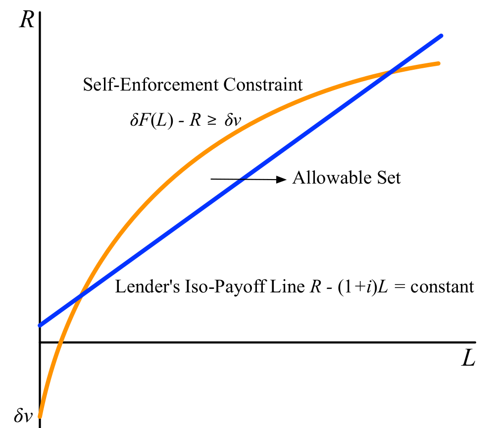

layout: true

<div class="my-footer"></div> 

---

```{r setup, include=FALSE}
knitr::opts_chunk$set(echo = FALSE, fig.align = "center",
                      message = FALSE, warning = FALSE)
knitr::opts_chunk$set(fig.dim=c(9, 6), fig.retina=2, out.width="100%")
```

```{r xaringan-themer, include=FALSE, warning=FALSE}
library(xaringanthemer)
library(readxl)

style_duo_accent(primary_color = "#3d5a80", 
                 secondary_color = "#dedede",
                 text_bold_color = "#ee6c4d",
                 text_font_family = "Droid Serif",
                 text_font_url = "https://fonts.googleapis.com/css?family=Droid+Serif:400,700,400italic",
                 header_font_google = google_font("Yanone Kaffeesatz"),
                 base_font_size = "20px",
                 code_font_size = "0.9rem")

```


class: separator-blue, middle

# Introducción

---

## Mercados de crédito

**Sector Formal**:

- Bancos estatales o comerciales.

- Requieren garantía/colateral y plan de negocios.

- Por lo general otorgan créditos a empresas registradas o a pequeñas empresas.

- Usualmente cobran las tasas de interés más bajas.

- Suelen dar crédito dirigido a "sectores prioritarios": exportaciones, agricultura, pequeñas empresas.

---

## Mercados de crédito

**Sector informal**:

- Prestamistas, comerciantes, terratenientes, tiendas de barrio, etc.

- Mejor información, mejores capacidades para hacer cumplir las obligaciones (multimercado).

- Habilidades específicas para tomar ciertos tipos de garantías/colaterales.

- Puede descontar las distorsiones a través del contacto multimercado

**Organizaciones cuasi-formales**:

- ONGs de microfinanzas.

- A veces utilizan la responsabilidad del grupo para evitar incumplimientos/default.

- Cronogramas de pago rígidos.

- En general usados para financiar capital de trabajo en lugar de préstamos para capital fijo.

---

## Imperfecciones en los mrcados de crédito

- **Garantía limitada implica responsabilidad limitada**.

  - Afecta a quien busca crédito (**selección adversa**).

  - Afecta cómo se usa el crédito (**riesgo moral**).

  - Afecta los incentivos de pago (**default estratégico**).

  - Afecta a las combinaciones prestamista-prestatario (**segmentación**).

- **Un ejemplo** concreto:

  - Suponga dos proyectos $A$ y $B$, costo inicial 100.000.

  - Tasas de rendimiento 15% y 20% (ingresos 115.000 y 120.000).

  - Tasa de interés bancaria 10%.

  - Perfecta coincidencia de intereses entre banco y prestatario (ambos quedan felices con el proyecto $B$).

---

## Imperfecciones en los mrcados de crédito

- Ejemplo, cont...

  - Ahora cambiemos el proyecto $A$: 230.000 con prob. $1/2$ y 0 con prob $1/2$.

  - El rendimiento esperado es el mismo que antes: 15%.

  - Asumir responsabilidad limitada (efectivamente lo mismo que garantía limitada).

  - Ahora el banco prefiere estrictamente el Proyecto $B$.

  - ¡Pero el prestatario prefiere estrictamente el Proyecto $A!$ (¿Por qué?)

  - El problema desaparece si el prestatario paga completamente en cada contingencia.

- Dos **interpretaciones** del ejemplo:

  - El banco atrae prestatarios tipo $A$ (**selección adversa**)

  - El prestatario desvía dinero para proyectos tipo $A$ (**riesgo moral**)

---

## Premio por riesgo

- **¿Qué sucede si el banco cobra tasas de interés más altas para compensar el riesgo?**

  - Suponga que $p$ es la prob. pagar, $r$ es la tasa de interés, e $i$ es la tasa libre de riesgo:

  - Entonces $p(1+r)=1+i$, o
$$r=\frac{1+i}{p}-1.$$
¡El problema es que $r$ afecta la probabilidad de pago!

- **Discusión**: ¿Podría ser una estrategia deliberada por parte del prestamista?

  - Algunas definiciones: Valoración de la garantía por parte del prestamista  $V_{\ell}$, valoración de la garantía por parte del prestatario $V_{b}$.

  - El prestatario prefiere pagar si $$L(1+i)<V_{b}+F$$
  donde $L=$ es el préstamo, $i=$ tasa de interés, $F=$ es el costo fijo.

---

## Premio por riesgo

- **Discusión** cont...

- El prestamista quiere que le devuelvan su dinero si:
$$L(1+i)>V_{\ell}$$

- Por lo tanto, el reembolso del préstamo es de interés de ambas partes si:
$$V_{b}+F>V_{\ell}$$

- Por otro lado, si se cumple que:
$$V_{b}+F<V_{\ell}$$
entonces la tasa de interés puede ajustarse para facilitar la incautación de la garantía/colateral.

- **La elección de la tasa de interés afecta el default**.

---

class: separator-blue, middle

# Selección adversa

---

## Selección adversa y los proyectos de los prestatarios

- Suponga que los prestatarios difieren en el nivel de "riesgo" que están dispuestos a asumir.

  - El retorno del proyecto $R$ varía según el riesgo del mismo; en promedio no existe diferencia en retornos.

- Costo inicial del proyecto: $B$, préstamo a tasa $r$, garantía $C$.

  - **Responsabilidad limitada** en el pago de préstamos; pagar si:
$$R+C \geq(1+r) B$$

  - Entonces, el **rendimiento del prestatario** si el proyecto paga $R$ está dado por
$$\pi(R, r) \equiv \max \{R-(1+r) B,-C\}$$

  - y el **rendimiento del prestamista** está dado por
$$\rho(R, r) \equiv \min \{R+C, B(1+r)\}$$

---

## Selección adversa y los proyectos de los prestatarios

- El pago esperado del prestatario aumenta con el riesgo, lo opuesto sucede para el prestamista.

```{r fig1, echo=FALSE, out.width="80%"}

```

- Si el nivel de riesgo no es observable, la calidad del prestatario cae con $r$.

---

## Selección adversa y los proyectos de los prestatarios

- El retorno del prestatario es típicamente no monotónico in $r$.

```{r fig2, echo=FALSE, out.width="55%"}

```

- La tasa de interés está acotada por $r^{*}$, aún cuando los prestamistas estuvieran dispuestos a pagar más.

---

class: separator-blue, middle

# Riego moral

---

## Resgo moral en la selección de proyectos por parte de prestatarios

- Los **prestatarios** son todos del **mismo tipo**, pero eligen entre **diferentes proyectos**.

  - Proyectos indexados por $\theta$, riesgo del proyecto.

  - El proyecto renta $R(\theta)$ con prob $p(\theta)$, Y  $0$ con prob $1-p(\theta)$.

  - Ordenamos los proyectos de manera que $R(\theta)$ aumente y $p(\theta)$ disminuya.

  - Cada proyecto requiere el mismo monto de préstamo de $B$.

- Un prestatario con garantía $C$, que enfrenta $r$ y elige $\theta$ para maximizar
$$\underbrace{p(\theta)[R(\theta)-B(1+r)]}_{\text {Éxito}} \underbrace{-[1-p(\theta)] C}_{\text {Falla }}$$
donde $R(\theta)$ excede $B(1+r)$, de lo contrario no hay préstamo.

- Este problema determina el riesgo $\theta(C, r)$ en función de $C$ y $r$.

---

## Resgo moral en la selección de proyectos por parte de prestatarios

.content-box-red[
**Teorema 1** $\theta(C, r)$ is decreciente en $C$ y creciente en $r$. Esto es: la garantía/colateral induce un comportamiento seguro; la tasa de interés induce un comportamiento riesgoso.
]

- Sea $Z=B(1+r)-C$, entonces $\theta$ maximiza
$$p(\theta)[R(\theta)-Z]-C,$$

- Sea $Z_{1}>Z_{2}$ y sean $\theta_{1}$ y $\theta_{2}$ dos máximos únicos para $Z_1$ y $Z_2$:

  - Entonces $p\left(\theta_{1}\right)\left[R\left(\theta_{1}\right)-Z_{1}\right]-C_{1}>p\left(\theta_{2}\right)\left[R\left(\theta_{2}\right)-Z_{1}\right]-C_{1}$,

  - mientras que $p\left(\theta_{2}\right)\left[R\left(\theta_{2}\right)-Z_{2}\right]-C_{2}>p\left(\theta_{1}\right)\left[R\left(\theta_{1}\right)-Z_{2}\right]-C_{2}$.

- Sumando estas dos desigualdades tenemos que:
$$\left[p\left(\theta_{1}\right)-p\left(\theta_{2}\right)\right]\left(Z_{1}-Z_{2}\right)<0$$

- Por tanto $p(\theta)$ es decrecientes (el riesgo aumenta) con $Z$. 

---

## Resgo moral en la selección de proyectos por parte de prestatarios

```{r fig3, echo=FALSE, out.width="75%"}

```

- Como antes, mientras $r$ cambia, el retorno de los prestamistas se mueve de forma no monotónica.

---

## Resgo moral en la selección de proyectos por parte de prestatarios

```{r fig4, echo=FALSE, out.width="75%"}

```

- Podría no existir mercado de crédito activo (racionamiento del crédito). 

---

## Resgo moral en la selección de proyectos por parte de prestatarios 

```{r fig5, echo=FALSE, out.width="75%"}

```

- El equilibro se dará en la intersección más baja $r^{*}$.

---

## Resgo moral en la selección de proyectos por parte de prestatarios 

```{r fig6, echo=FALSE, out.width="75%"}

```

- La tasa de interés de equilibrio caerá a medida que el colateral aumente.

- Esto no ocurrirá en el caso de poder de mercado por parte de los prestatarios. 

---

## Riesgo moral y sobrendeudamiento

- El **esfuerzo**, que es costoso, puede influir en las probabilidades de éxito.

  - Costo inicial $B$, el resultado es $Q$ (bueno) o 0 (malo).

  - La probabilidad de un buen resultado es $p(e)$, donde $e=$ esfuerzo del agente.

- **Si el agente se autofinancia**, elije $e$ para maximizar
$$\text{Rentabilidad Privada = Excedente Social }=p(e) Q-e-B(1+i)$$
donde $B$ es el costo inicial e $i$ es la tasa de retorno libre de riesgo.

- Asuma elección única $e^{*}$ descrita por la condición de primer orden
$$p^{\prime}\left(e^{*}\right)=\frac{1}{Q}$$

- Este es el nivel de esfuerzo eficiente u óptimo.

---

## Riesgo moral y sobrendeudamiento

- Financiamiento vía deuda: $R=(1+r) B$ es deuda total, $C<B$ es la garantía.

  - La elección del esfuerzo óptimo del prestatario frente a una deuda $R$ está dado por:
$$\max _{e} p(e)(Q-R)-[1-p(e)] C-e$$

- La elección óptima $\hat{e}$ está definida por la condición de primer orden:
$$p^{\prime}(e)=\frac{1}{Q+C-R}$$

  - Note que $\hat{e}<e^{*}$.

  - Además, $\hat{e}$ es decreciente en $R$ y creciente en $C$.

- Este es el **sobreendeudamiento**.

  - El rendimiento del prestamista está dado por $\pi=p(e) R+[1-p(e)] C-B(1+i)$, donde $i$ es la tasa libre de riesgo.

---

## Dueda y esfuerzo en equilibrrio

```{r fig7, echo=FALSE, out.width="40%"}
knitr::include_graphics("img/figura_7.png")
```

.content-box-red[
**Teorema 2**: Los equilibrios con ganancias más altas para los prestamistas involucraban tasas de interés más altas (incluso con un tope en el caso del monopolio) pero niveles más bajos de esfuerzo y excedente social, este último dado por $p(e) Q-B(1+i)-e$.
]

---

## Efecto de un incremento en el colateral

- Evaluando en el mismo nivel de pago del prestamista:

```{r fig8, echo=FALSE, out.width="55%"}

```

- Bajo competencia: mejores términos, esfuerzo más alto. 

---

class: separator-blue, middle

# Default estratégico

---

## Default estratégico y el mercado de créditos


- En esta sección no enfocamos en: opciones alternativas y préstamos de tamaño variable

  - Función de producción: $Q=F(L)$.

  - Pedir prestado $L$ repetidamente para financiar capital de trabajo.

  - Contrato estacionario $(L, R)$.

- ¿Pagar o no pagar?

  - Si paga, obtiene $[F(L)-R] /(1-\delta)$.

  - Si existe default, obtiene $F(L)$ hoy y $v$ por período a partir de mañana.
$$F(L)+\delta \frac{v}{1-\delta}$$

---

## Default estratégico y el mercado de créditos

- La **restricción de no default**:
$$\frac{F(L)-R}{1-\delta} \geq F(L)+\delta \frac{v}{1-\delta}$$

- la que se puede simplificar a
$$\delta F(L)-R \geq \delta v, \text { or } R \leq \delta[F(L)-v]$$

- **Interpretaciones para $v$**:

  - Pago de la alternativa una vez incluido en la lista negra del mercado de crédito:
$$v=F(\hat{L})-\hat{R} \text { para algunos otros valores }(\hat{L}, \hat{R}) .$$

   - Operaciones sin financiamiento:
$$v=F(0)$$

---

## Pago del prestamista y restricción de no default

- Si el prestamista obtiene un retorno libre de riesgo de $i$, su pago neto es $R=-(1+i)L$.

```{r fig9, echo=FALSE, out.width="48%"}

```

---

## Pago del prestamista y restricción de no default

- Superponiendo la restricción de no default:

```{r fig10, echo=FALSE, out.width="48%"}

```

---

## Pago del prestamista y restricción de no default

- Superponiendo la restricción de no default:

```{r fig11, echo=FALSE, out.width="48%"}

```

---

## El excedente social y el equilibrio del segundo mejor

- El pago del prestatario es $F(L)-R$, el pago del prestamista es $R-(1+i) L$,

  - donde $i$ es la tasa de interés libre de riesgo.

- Por tanto el **excedente total** es $=F(L)-(1+i) L$.

  - El mismo que se maximiza cuando $L=L^{*}$, donde $F^{\prime}\left(L^{*}\right)=1+i$.

- Suponemos que $L^{*}$ es demasiado alto para cumplir automáticamente la restricción de no default.

  - Es decir, $\delta F\left(L^{*}\right)-(1+i) L^{*}<\delta v$.

  - Idealmente, nos gustaría acercarnos lo más posible a $L^{*}$.

---

## El excedente social y el equilibrio del segundo mejor

```{r fig12, echo=FALSE, out.width="48%"}

```

---

## El excedente social y el equilibrio del segundo mejor

```{r fig13, echo=FALSE, out.width="48%"}
knitr::include_graphics("img/figura_13.png")
```

---

## El excedente social y el equilibrio del segundo mejor

```{r fig14, echo=FALSE, out.width="40%"}
knitr::include_graphics("img/figura_14.png")
```

.content-box-red[
**Teorema 3**: Los equilibrios con mayores ganancias del prestamista implican tasas de interés más altas, préstamos más bajos y un excedente social más bajo.
]
---

## El excedente social y el equilibrio del segundo mejor

Efecto de una caída en la **opción alternativa** $v$.

- Competencia: tipo de interés $\downarrow, L \uparrow$.

```{r fig15, echo=FALSE, out.width="40%"}

```

---

## El excedente social y el equilibrio del segundo mejor

Efecto de una caída en la **opción alternativa** $v$.

- Monopolio: tipo de interés $\uparrow, L$ sin cambios.

```{r fig16, echo=FALSE, out.width="40%"}

```

---

class: separator-blue, middle

# Mercados de crédito en economía en desarrollo

---

## Dos variantes de créditos especiales en países en desarrollo

**Microfinanciamiento**

- Todas nuestras ideas se aplican a las microfinanzas:

  - selección adversa, riesgo moral, incumplimiento estratégico.

- Las Organizaciones de Microcrédito utilizan varios dispositivos para sortear estos problemas:

  - Préstamos grupales para averiguar a quién prestar.

  - Reuniones y reembolsos frecuentes.

  - Restringir los préstamos para capital de trabajo para evitar el incumplimiento estratégico.

---

## Dos variantes de créditos especiales en países en desarrollo

Contratos interrelacionados.

- Segmentación de mercado:

  - El propietario prestan al arrendatario, el comerciante le presta a los agricultores, etc.

- Razones para la interconexión:

  - Garantía/Colateral no negociable en el mercado: Más fácil de aceptar si coincide con la ocupación.

  - Cumplimiento de contrato: Amenaza doble ... eliminar relación principal + préstamos futuros.

  - Cobertura de Costos Fijos. La promesa de que las ventas cubren los costos comerciales fijos.

  - Eliminación de Distorsiones. Precios multidimensionales.

---

## Préstamos comerciales: Ejemplo de precio multidimensional

- El prestatario pide prestado $L$ y produce arroz según $Q=F(L)$.

  - El precio de mercado del arroz es $p$.

- El prestamista cobra una tasa de interés $r$ e $i$ es su tasa alternativa asegurada.

  - El prestatario elige $L$ (un tipo diferente de riesgo moral).

  - El prestamista no puede "obligar" al prestatario a pedir prestado más de lo que quiere.

---

## Préstamos comerciales: Ejemplo de precio multidimensional

¿Porqué créditos en efectivo son ineficientes?

```{r fig17, echo=FALSE, out.width="85%"}

```

---

## Préstamos comerciales: Ejemplo de precio multidimensional

```{r fig18, echo=FALSE, out.width="75%"}

```
- El prestamista elige $r$ para maximizar $(r-i)L$

  - El prestatario elige $L$ para maximizar $pF(L)-(1+r)L$
  
  - **Existe subendeudamiento con respecto a $L^*$**.
---

## Contrato óptimo interrelacionado

- **Relación comerciante-prestamista**

  - Puede comprar la cosecha a precio $q$ y cobra una tasa $r$.

  - Elige $(q, r)$ para maximizar $(p-q) F(L)+(r-i) L$

  - Sabiendo que el prestatario elegirá $L$ para maximizar $q F(L)-(1+r) L$.

  - Debe respetar la opción externa del prestatario: $q F(L)-(1+r) L \geq B_0$.

- **Solución**: imagine un "impuesto sobre las ganancias" $t$ para un agricultor que accede a préstamos a una tasa de $i$

  - $t\left[p F\left(L^{*}\right)-(1+i) L^{*}\right]=$ pago del prestamista, con

  - $(1-t)\left[p F\left(L^{*}\right)-(1+i) L^{*}\right]=$ pago del prestatario $=B_0$.

- Debe ser óptimo si es implementable:

  - ¡Pero es implementable si $q=t p$ y $(1+r)=t(1+i) !$

---

## Contrato óptimo interrelacionado

```{r fig19, echo=FALSE, out.width="85%"}

```

---

## Contrato óptimo interrelacionado

```{r fig20, echo=FALSE, out.width="85%"}

```

